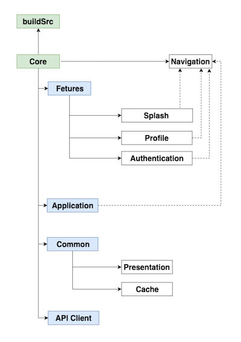
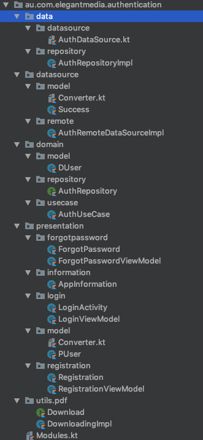
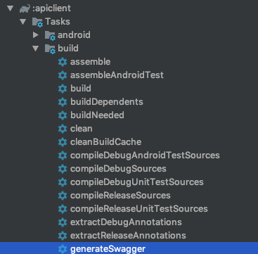

# eDroid | Android Common Platform

Android Common Platform contain different modules/projects with specific features such as authentication, Google Map and Place API integrations, Chat etc.

## Architecture



## Modules


| Module   |  Description |
|---|---|
| [core](https://bitbucket.org/elegantmedia/core)  | Empty Application module that only launches features.  |
| [buildSrc](https://bitbucket.org/elegantmedia/buildsrc)   |  Module which contain all dependencies and versions. |
| [authentication](https://bitbucket.org/elegantmedia/features-authentication)  | All authentication functionalities implemented here such as Login, Registration, Forgot Password etc.  |
| [network](https://bitbucket.org/elegantmedia/common-network)  | network related implementation such as Retrofit client , OkHttp and WebSocket.  |
|  [presentation](https://bitbucket.org/elegantmedia/common-presentation) |  This module contains all common presentation implementations such as kotlin extensions, LiveData and Custom View etc. |
|  [apiclient](https://bitbucket.org/elegantmedia/apiclient) | With this module you can generate Retrofit 2 API SDK using swagger json.  |
|[splash](https://bitbucket.org/elegantmedia/features-splash)|Module which contain flash screen or and app guidlines, intro etc.|


### Feature Modules: Keep It Clean

All of these Feature Modules are user-facing functionality. The same way we don’t have package names like **activities, fragments, adapters** we shouldn’t fall into the same mistake when creating these modules. Each module should contain its own presentation, domain, data & data sources layers (if they require it).



### How to deal with multiple build.gradle files?

With App Modularization we want to gain fine-grained dependency control but we also need to make sure we don’t end up maintaining multiple configuration files.

The following `common-android-library.gradle` is applied to every feature module I create with apply from: `"$rootDir/common-android-library.gradle"`.

**See**:
[common-android-dynamic-feature.gradle](common-android-dynamic-feature.gradle)
[common-android-library.gradle](common-android-library.gradle)
[common-kotlin-library.gradle](common-kotlin-library.gradle)

### Koin

A pragmatic lightweight DSL dependency injection framework for Kotlin. 

* `get()` is used inside constructors to resolve needed instances. I advise using named parameters to achieve a better definition & improve readability.
* `factory` is used to indicate that a new instance must be created each time it is injected.
* `single` indicates that a unique instance will be created at the beginning and shared on every future injection.
* `repositoryModule` contains examples of binding interfaces (domain’s repo interface with its actual implementation) you can read more [here](https://insert-koin.io/docs/2.0/documentation/reference/index.html#_definition_binding_an_interface).
* `name =` is used to name definitions. This is required when you want to have multiple instances of the same class with different types.

Koin allows late init module definition load so libraries/features can use this quite easily. Just call the method `loadKoinModules` on your library and call that method inside your app’s `onCreate`.

Remember, all of the modules (where you define the components) are injected lazily by default. This means that if you never get to open X screen it will never actually inject X ViewModel/Presenter.

### How to create Android Project from boilerplate

1. Clone the project
    ```sh
    git clone git@bitbucket.org:elegantmedia/edroid.git <YOUR_PROJECT_NAME>
    ```
2. Init submodule and update the modules
    ```sh

    cd <YOUR_PROJECT_NAME>

    git submodule init

    git submodule update --remote
    ```
3. Update/Generate the API SDK

   * Replace Swagger.json with the latest located in [apiclient](https://bitbucket.org/elegantmedia/apiclient/src/master/swagger.json)
   * Generate the API SDK using either
   ```sh
   ./gradlew generateSwagger
   ```
   or click on generateSwagger in Gradle pane in Android Studio.

   

4. Check Manifest issues

```sh
./gradlew processDebugManifest --stacktrace
```

### How to change Application ID

You must change existing application id with the new application id bellow mentioned

1. Module buildSrc -> `Deps.kt` -> Application ID
2. Module Core ->  `AndroidManifiret.xml`'s package name
3. Module Navigation -> IntentLoader.kt ->  `PACKAGE_NAME`


### How to build APK from bundle (APKs)

1. Download latest bundle tool from  (latest version is 1.0.0)
2. 
    `https://github.com/google/bundletool/releases/download/1.0.0/bundletool-all-1.0.0.jar`

3. Build Bundle or Generate Signed Bundle (APKs) of the project project
4. Execute bellow command to generate the APKs from android bundle file (.aab).

    `java -jar bundletool-all-1.0.0.jar build-apks --bundle={PATH_TO_BUNDLE} --output={PATH_TO_OUTPUT/FILE_NAME.apks} --mode=universal`

    Example:

    `java -jar bundletool-all-1.0.0.jar build-apks --bundle=core/build/outputs/bundle/debug/core.aab --output=core/build/outputs/bundle/debug/core.apks --mode=universal`

5. Change the generated file type (**.apks**) to **.zip**


    `mv {PATH_TO_OUTPUT/FILE_NAME.apks} {PATH_TO_OUTPUT/FILE_NAME.zip} `

    Example:

    ` mv core/build/outputs/bundle/debug/core.apks core/build/outputs/bundle/debug/core.zip `

6. Unzip (un compress) the ZIP file, this will generate an Android APK from the bundle file (.aab)


    ` unzip {PATH_TO_OUTPUT/FILE_NAME.zip}  -d {PATH_TO_OUTPUT/} `

    Example:

    ` unzip core/build/outputs/bundle/debug/core.zip  -d core/build/outputs/bundle/debug/ `

7. Delete Android bundle and compressed file

    ` rm -rf {PATH_TO_OUTPUT/FILE_NAME.zip}

      rm -rf {PATH_TO_OUTPUT/FILE_NAME.aab} `