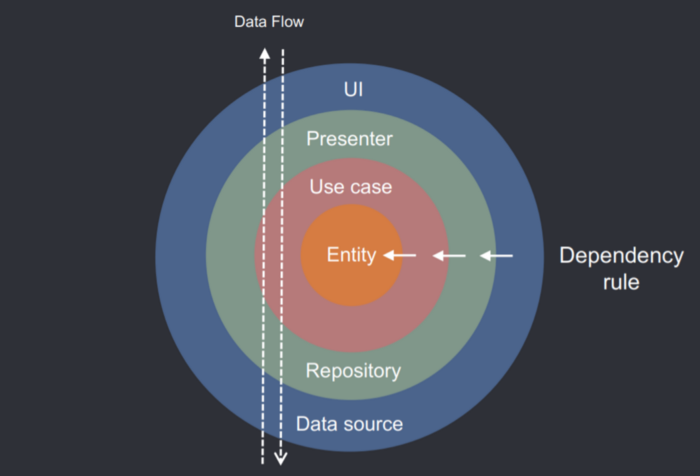
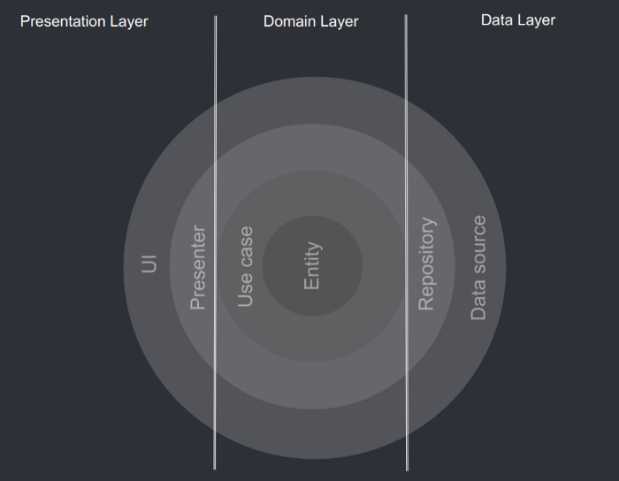
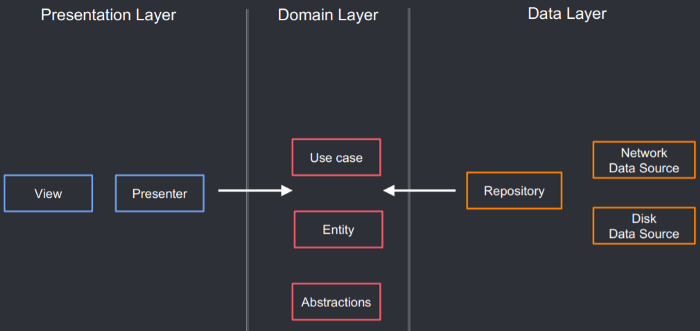

# eDroid Data Flow and Dependency Rule

## Data Flow

Let’s start explaining Data Flow in eDroid.

Imagine opening an app that loads a list of posts which contains additional user information. The Data Flow would be:

1. UI calls method from Presenter/ViewModel.
2. Presenter/ViewModel executes Use case.
3. Use case combines data from User and Post Repositories.
4. Each Repository returns data from a Data Source (Cached or Remote).
5. Information flows back to the UI where we display the list of posts.

From the example above we can see how the user action flows from the UI all the way up to the Data Source and then flows back down. This Data Flow is not the same flow as the Dependency Rule.

## Dependency Rules

Dependency Rule is the relationship that exists between the different layers.

### Presentation Layer

Presentation Layer contains UI (Activities & Fragments) that are coordinated by Presenters/ViewModels which execute 1 or multiple Use cases. Presentation Layer depends on Domain Layer.

### Domain Layer

Domain Layer is the most INNER part of the onion (no dependencies with other layers) and it contains Entities, Use cases & Repository Interfaces. Use cases combine data from 1 or multiple Repository Interfaces.

#### Domain (with business rules) is the most important Layer

Domain is at the center of the onion which means it is the core of our program. This is one of the main reasons why it shouldn’t have any dependencies with other layers.

Presentation and Data Layers are less important since they are only implementations that can be easily replaced. The list of posts could be displayed in Android, iOS, Web or even Terminal if your code is properly decoupled. The same happens with a Database or any kind of Data Source, it can be easily switched.

The outer you go on the onion the most likely things are prone to change. One of the most common mistakes is to have your app driven by your data layer/specific data system. Making it hard to replace or bridge with different data sources down the line.

#### Domain Layer does NOT depend on Data Layer

Having modules with the correct dependency rules means that our Domain doesn’t have any dependency on any other layer. Due to no dependencies to any Android Library the Domain Layer should be a Kotlin Module. This is an extra boundary that will prevent polluting our most valuable layer with framework related classes. It also promotes reusability across platforms in case we switch over the Framework as our Domain Layer is completely agnostic.

### Data Layer 

Data Layer contains Repository Implementations and 1 or multiple Data Sources. Repositories are responsible to coordinate data from the different Data Sources. Data Layer depends on Domain Layer.

