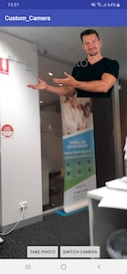

# Android video player with alpha channel (chroma key) support

Android app, while a camera is on, play video overlay with a transparent background (apha channel) and takes picture of it.

## Similar Concept

## Sample Project

Sample project [Alpha Channel Video Player](../assets/projects/alpha_channel_video_player.zip) implemented using [Alpha Movie library](https://github.com/pavelsemak/alpha-movie)

