# How to implement In-App purchase

1. Introduction
2. An Overview of Google Play’s Billing System
3. In-app Product
4. Subscription
5. Android Implementation
6. Testing
7. FAQ

# 1. Introduction #
Google Play in-app purchases are the simplest solution to selling digital products or content on Android apps. So many app developers who want to sell digital goods or offer premium membership to users can simply use the Google Play in-app billing process for smooth and easy checkouts.

# 2. An Overview of Google Play’s Billing System #
let’s get a basic idea of the billing system. One of the important things to know is what kind of products we can sell to users. Google Play’s billing system helps us sell the following types of digital content:

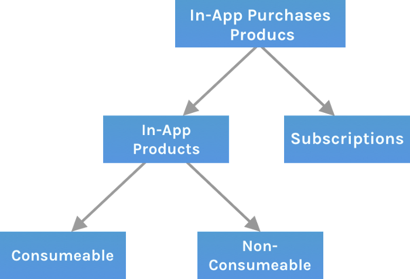

The in-app purchases mainly consist of two types of items: one-time products and subscriptions.

## In-App products ##

An in-App product is an item that users can purchase with a single, nonrecurring charge. And again, this In-app product has two different categories, as shown above:
- A consumable product is one that a user can purchase repeatedly to get access to in-app content. For example, this could be purchasing currency in a game that’ll run out in due time, and users can again purchase the consumable product to get currency, food, etc.
- A non-consumable product is one in which a user can purchase a permanent benefit without the need of buying it again and again. Mainly, we use this kind of product to offer premium membership to users for removing ads, gaining access to a certain level in a game, etc.

## Subscription ##
A subscription is an item that users need to recurring purchase to gain access to the app content. Subscriptions get renewed automatically until they’re canceled by users, meaning users get billed until they cancel the subscription on a recurring period of time — like one month, six months, one year, etc. For example, these subscriptions are mainly used in the case of music streaming services, online magazines, etc.

# 3. In-app Product #


# 4. Subscription #
After creating the app, switch to your developer account and choose the app.

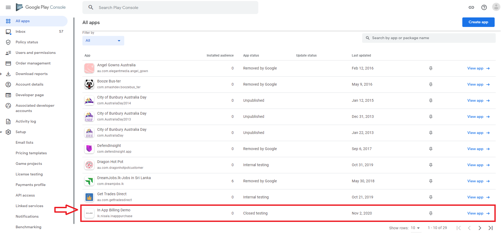

Then, in the menu on the left, find the _Products_ section, select _Subscriptions_, and click _Create Subscription_. 

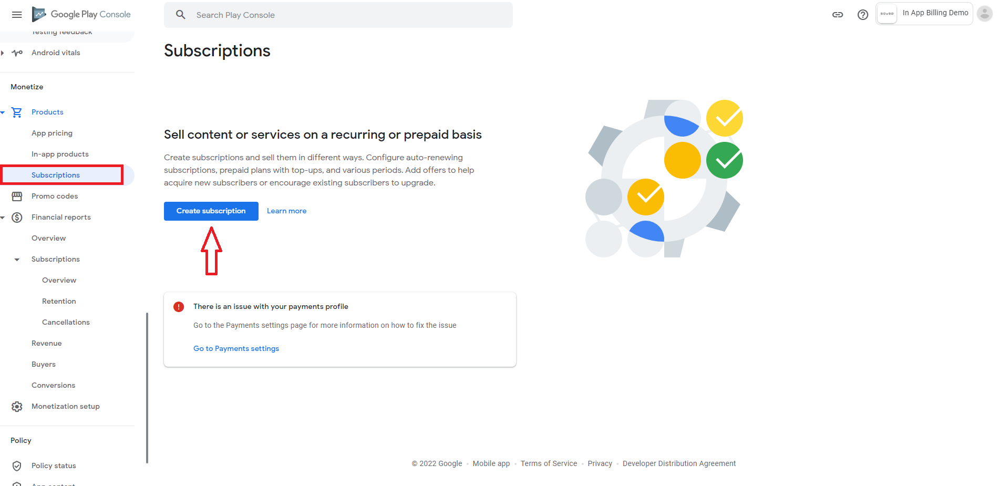

Then, we’ll see the main subscription configurations. Here are some important points.   
 
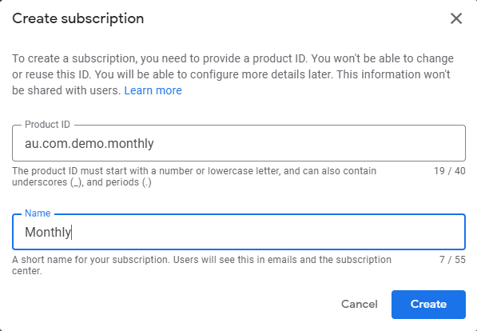


1.	Create the _Product ID_ that will be used in the app. It’s a good idea to add a subscription period or some other useful information to ID, thus, you can create products in one style, and make analyzing the sales statistics easier.
2.	The _Name_ of the subscription that the user will see in the store.

### Add Base Plan ###
Scroll down and choose _Add Base Plan_ under the _Base plans and offers_ section. 
 
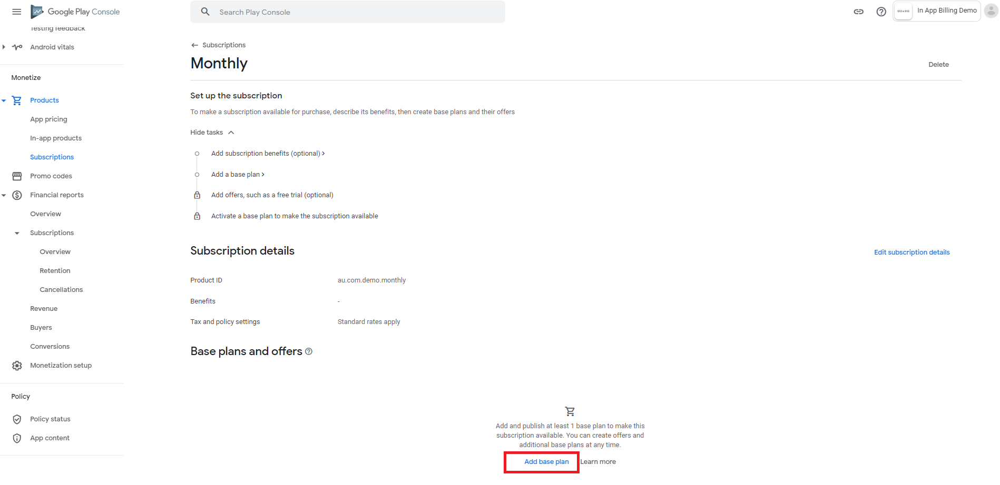
 
Then set up the base plan for the subscription

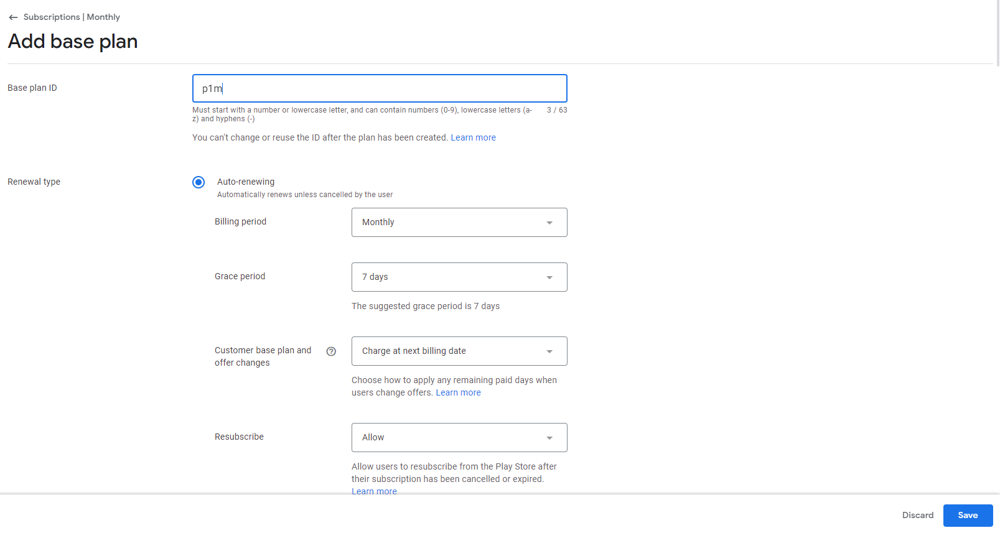

For Basic Plan, add a unique _Basic Plan ID_ and there are two types of renewals. __Auto-Renewal__ will auto-renew unless canceled by the user and __Prepaid__ will not auto-renew. Users will need to make another payment to extend their plan. Here our type is auto-renewal. In our case Subscription period is monthly. Finally set the price and _activate_ it.

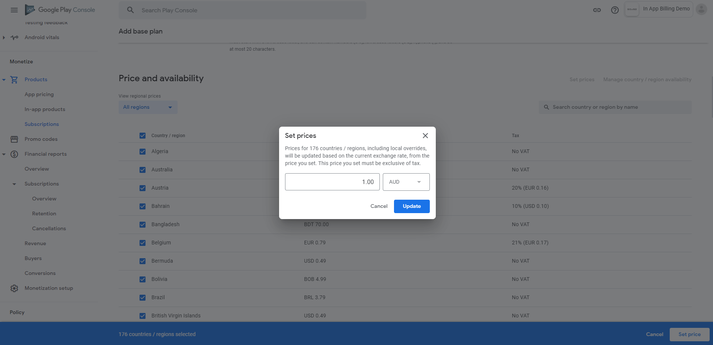

Usually, you set the price in the basic account currency, and the system converts the price automatically. But you can also edit the price for a specific country manually.  Google shows the tax for every country. 

### Add Offer(Free Trial) ###
An offer provides a discount on a specific basic plan.

After adding the basic plan, now you can see _Add offer_ button on the right side of the _Base plan and offers_ section

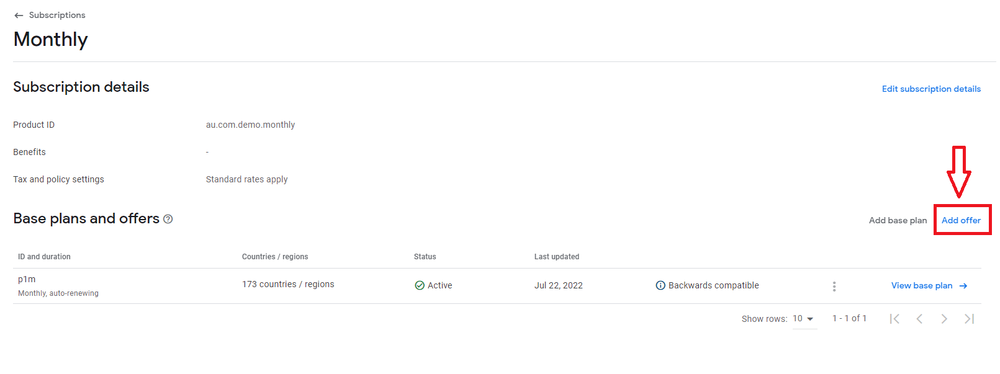

Click on _Add offer_ and you will see a dialog to select the base plan. Then select the base plan you want to set up the offer on.

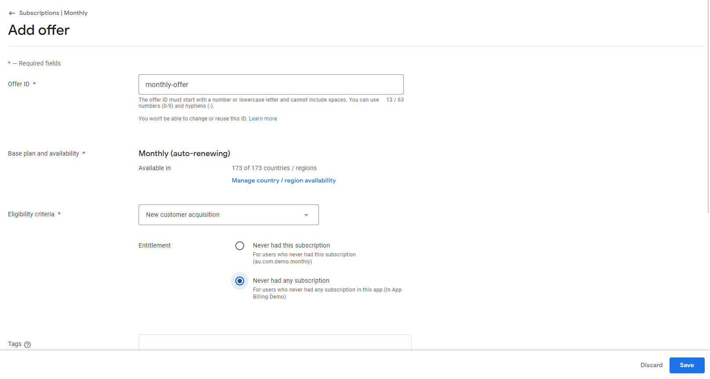
 
Here we have to fill in the basic details of the offer: 
 1.	_Offer ID_ should be a unique one
 2.	There are two eligibility criteria. Select one of them according to the requirement
    *	Never Had this subscription 
    * 	Never had any subscription

Next Scroll down and click on the _Add Phase_. Select type and duration. In our case, it is a Free trail

 
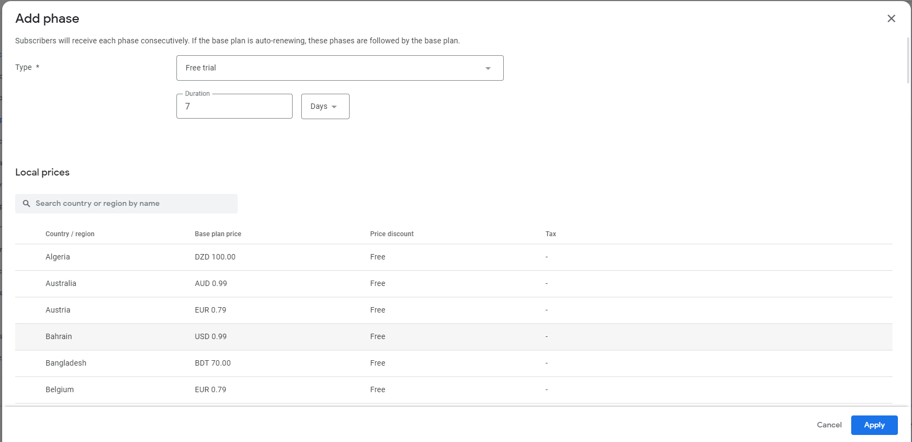


Apply the free trial and activate it.

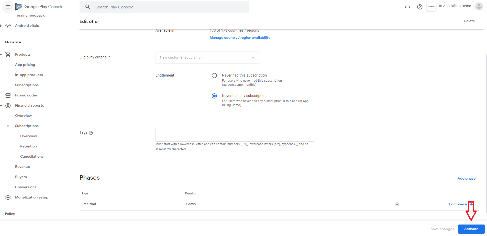


After creating a subscription, the item will be displayed inside _Subscriptions_.

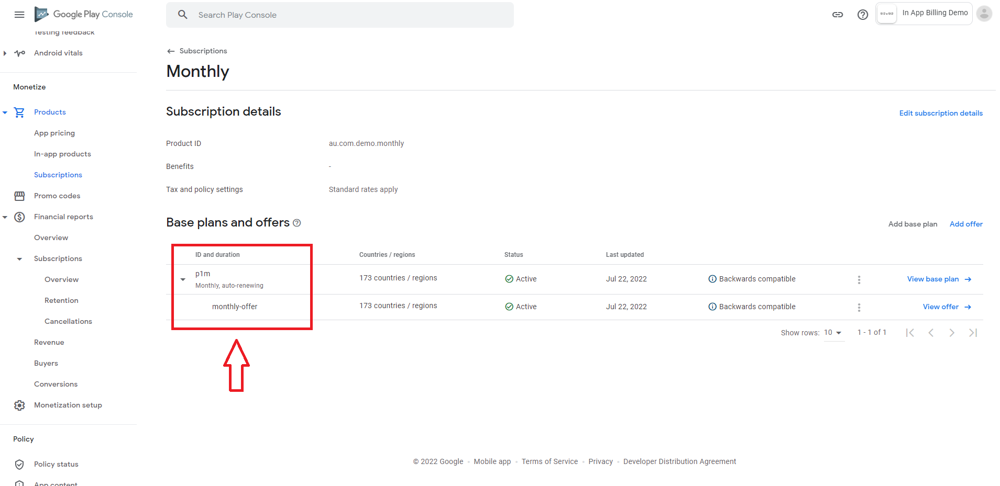

# 5. Android Implementation


## Add the Google Play Billing Library dependency ##

```kotlin
dependencies {
    val billing_version = "5.0.0"
    implementation("com.android.billingclient:billing:$billing_version")
}
```

## Initialize a BillingClient ##

```kotlin
private var billingClient: BillingClient? = null

billingClient = BillingClient.newBuilder(this)
   .setListener(purchasesUpdatedListener)
   .enablePendingPurchases()
   .build()
```

## Connect to Google Play ##

```kotlin
billingClient.startConnection(object : BillingClientStateListener {
    override fun onBillingSetupFinished(billingResult: BillingResult) {
        if (billingResult.responseCode ==  BillingResponseCode.OK) {
           
        }
    }
    override fun onBillingServiceDisconnected() {
       
    }
})
```


## Show products available to buy ##

```kotlin
var getProductDetailsQuery = SkuDetailsParams
   .newBuilder()
   .setSkusList(productList)
   .setType(BillingClient.SkuType.SUBS)
   .build()
```

When querying for product details, pass an instance of _getProductDetailsQuery_ that specifies a list of product ID strings created in Google Play Console along with a ProductType. The ProductType can be either **_ProductType.INAPP_** for one-time products or **_ProductType.SUBS_** for subscriptions.

```kotlin
billingClient.querySkuDetailsAsync(getProductDetailsQuery,
   SkuDetailsResponseListener { billingResult, mutableList ->
       if (billingResult.responseCode == BillingClient.BillingResponseCode.OK && mutableList != null) {
      
       }

   })
```

## Launch the purchase flow ##

```kotlin
billingClient.launchBillingFlow(this@SubscriptionPlanActivity,
   BillingFlowParams.newBuilder().setSkuDetails(mutableList[0])
       .build()
)
```

## Verify payment ##

Once you've verified the purchase, your app is ready to grant entitlement to the user. After granting entitlement, your app must then acknowledge the purchase. This acknowledgement communicates to Google Play that you have granted entitlement for the purchase. If you do not acknowledge a purchase within three days, the user automatically receives a refund, and Google Play revokes the purchase.

```kotlin
var ackPurchase = AcknowledgePurchaseResponseListener { billingResult ->
   if (billingResult.responseCode == BillingClient.BillingResponseCode.OK){
       //if purchase is acknowledged Grant entitlement to the user. and restart activity
   }
}
```


```kotlin
var purchasesUpdatedListener = PurchasesUpdatedListener { billingResult, purchases ->
    if (billingResult.responseCode =BillingClient.BillingResponseCode.OK && purchases != null) {
           for (purchase in purchases) {
               if (purchase.purchaseState == Purchase.PurchaseState.PURCHASED && !purchase.isAcknowledged){

                    val acknowledgePurchaseParams =AcknowledgePurchaseParams.newBuilder()
                       .setPurchaseToken(purchase.purchaseToken)
                       .build()

                    billingClient?.acknowledgePurchase(
                       acknowledgePurchaseParams,
                       ackPurchase
                    )

                    //get purchase token for every purchase and sent to backend server
                    vm.subscriptionVerification(product_id, purchase.purchaseToken)          
                }
           }
       } else if (billingResult.responseCode == BillingClient.BillingResponseCode.USER_CANCELED) {
            //Handle an error caused by a user cancelling the purchase flow.
       } else {
            //Handle any other error codes.
       }
   }
```

> Document - <https://developer.android.com/google/play/billing/integrate>

# 6. Testing
Testers can make in-app purchases without being charged, using test payment methods. 

In the root menu on the left, find the _Setup_ section, select _License testing_, Next add tester email address. 

Then Select the license response that testers receive to verify your in-app billing integrations.

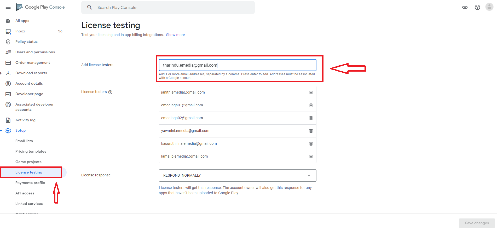

After you add the email address that you used to access the Play Store on the phone, you can see the email address below, then save the changes

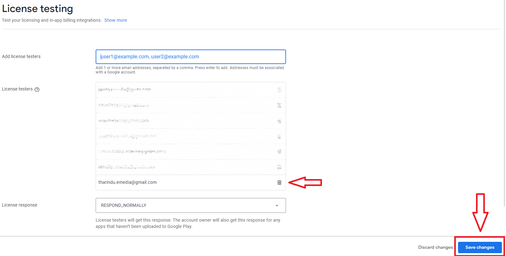

> Document : https://developer.android.com/google/play/billing/test

# 7. FAQ