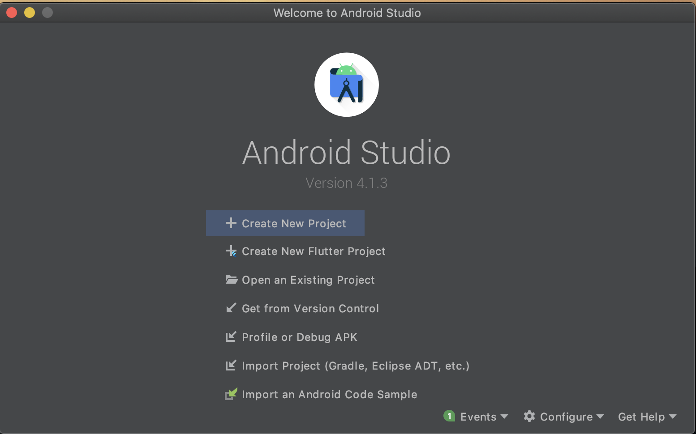
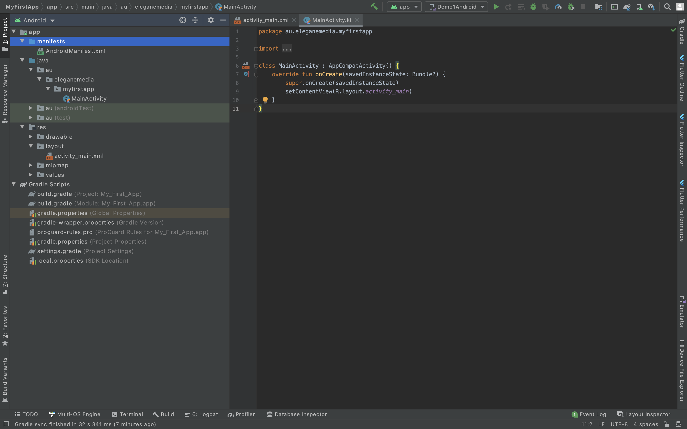
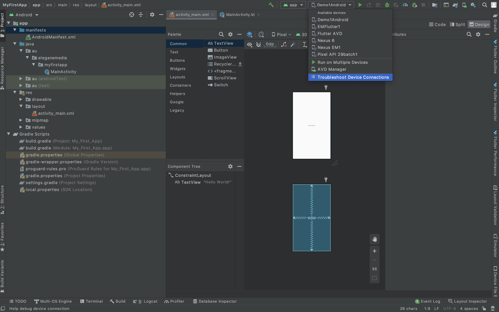

# Introduction

Android apps are built as a combination of components that can be invoked individually. For example, an activity is a type of app component that provides a user interface (UI).

The "main" activity starts when the user taps your app's icon. You can also direct the user to an activity from elsewhere, such as from a notification or even from a different app.

Other components, such as WorkManager, allow your app to perform background tasks without a UI.

## Apps adapt to different devices
Android allows you to provide different resources for different devices. For example, you can create different layouts for different screen sizes. The system determines which layout to use based on the screen size of the current device.

If any of your app's features need specific hardware, such as a camera, you can query at runtime whether the device has that hardware or not, and then disable the corresponding features if it doesn't. You can specify that your app requires certain hardware so that Google Play won't allow the app to be installed on devices without them.

## Create an Android project

To create your new Android project, follow these steps:

* Install the latest version of [Android Studio](https://developer.android.com/studio/)
* In the Welcome to Android Studio window, click Create New Project.

If you have a project already opened, select File > New > New Project.

* In the Select a Project Template window, select Empty Activity and click Next.

* In the Configure your project window, complete the following:
  Enter "My First App" in the Name field.
  Enter "au.eleganemedia.myfirstapp" in the Package name field.
  If you'd like to place the project in a different folder, change its Save location.
  Select either Java or Kotlin from the Language drop-down menu.
  Select the lowest version of Android you want your app to support in the Minimum SDK field.
 If your app will require legacy library support, mark the Use legacy android.support libraries checkbox.
 Leave the other options as they are.
 
 * Click Finish.
 
 

Now take a moment to review the most important files.

First, be sure the Project window is open (select View > Tool Windows > Project) and the Android view is selected from the drop-down list at the top of that window. You can then see the following files:

 * app > java > au.eleganemedia.myfirstapp > MainActivity
    This is the main activity. It's the entry point for your app. When you build and run your app, the system launches an instance of this Activity and loads its layout.
* app > res > layout > activity_main.xml
    This XML file defines the layout for the activity's user interface (UI). It contains a TextView element with the text "Hello, World!"
* app > manifests > AndroidManifest.xml
   The manifest file describes the fundamental characteristics of the app and defines each of its components.
* Gradle Scripts > build.gradle
   There are two files with this name: one for the project, "Project: My_First_App," and one for the app module, "Module: My_First_App.app." Each module has its own build.gradle file, but this
   project currently has just one module. Use each module's build.gradle file to control how the Gradle plugin builds your app.

  Now you can run the app on a real device or an emulator.
  
## Run the app

### Run on a real device

Set up your device as follows : 

* Connect your device to your development machine with a USB cable. If you developed on Windows, you might need to [install the appropriate USB driver](https://developer.android.com/studio/run/oem-usb) for your device.

* Perform the following steps to enable USB debugging in the Developer options window:
  a. Open the Settings app.
  b. If your device uses Android v8.0 or higher, select System. Otherwise, proceed to the next step.
  c. Scroll to the bottom and select About phone.
  d. Scroll to the bottom and tap Build number seven times.
  e. Return to the previous screen, scroll to the bottom, and tap Developer options.
  f. In the Developer options window, scroll down to find and enable USB debugging.

#### Run the app on your device as follows:

* In Android Studio, select your app from the run/debug configurations drop-down menu in the toolbar.
* In the toolbar, select the device that you want to run your app on from the target device drop-down menu.

* Click Run

Android Studio installs your app on your connected device and starts it. You now see "Hello, World!" displayed in the app on your device.

### Run on an emulator

* In Android Studio, [Create an Android Virtual Device (AVD) ](https://www.dropbox.com/s/ape8lq035z1vr0v/CreatVirtualDevice.mov?dl=0) that the emulator can use to install and run your app.
* In the toolbar, select your app from the run/debug configurations drop-down menu.
* From the target device drop-down menu, select the AVD that you want to run your app on.

* Click Run
