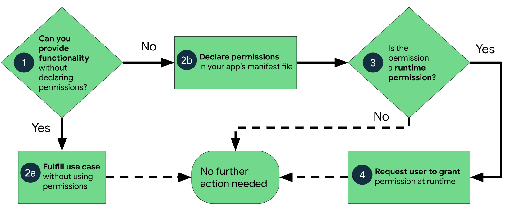
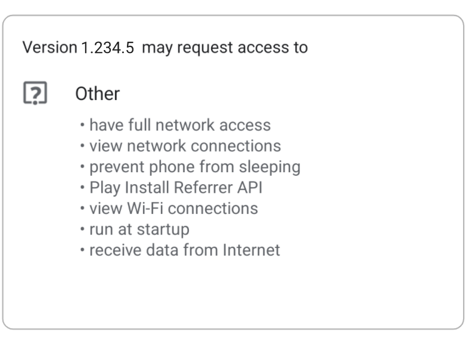
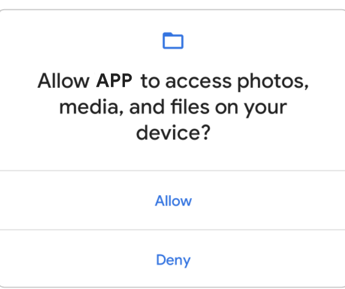
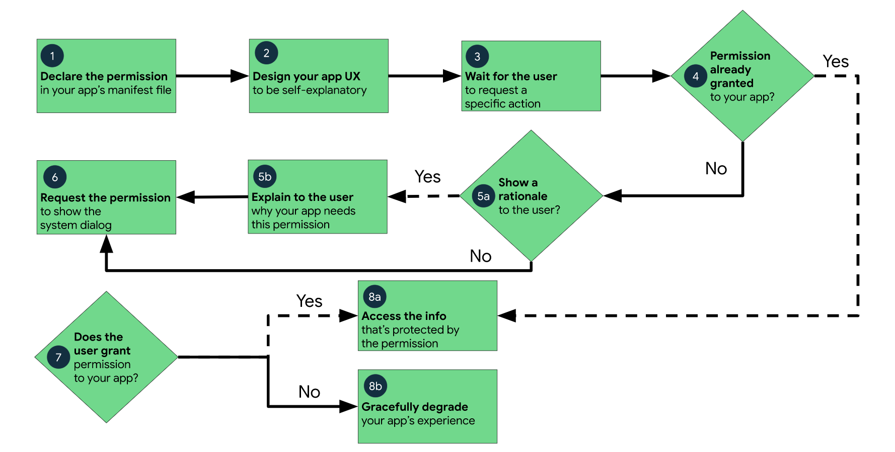
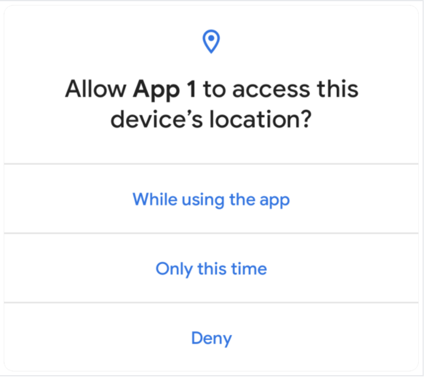

# Permissions on Android

App permissions help support user privacy by protecting access to the following:

* Restricted data, such as system state and a user's contact information.
* Restricted actions, such as connecting to a paired device and recording audio.

### Workflow for using permissions

If your app offers functionality that might require access to restricted data or restricted actions, determine whether you can get the information or perform the actions without needing to declare permissions. You can fulfill many use cases in your app, such as taking photos, pausing media playback, and displaying relevant ads, without needing to declare any permissions.

If you decide that your app must access restricted data or perform restricted actions to fulfill a use case, declare the appropriate permissions. Some permissions, known as install-time permissions, are automatically granted when your app is installed. Other permissions, known as runtime permissions, require your app to go a step further and request the permission at runtime.

The workflow for using app permissions:



### Types of permissions

Android categorizes permissions into different types, including install-time permissions, runtime permissions, and special permissions. Each permission's type indicates the scope of restricted data that your app can access, and the scope of restricted actions that your app can perform, when the system grants your app that permission.

#### Install-time permissions

Install-time permissions give your app limited access to restricted data, and they allow your app to perform restricted actions that minimally affect the system or other apps. When you declare install-time permissions in your app, the system automatically grants your app the permissions when the user installs your app. An app store presents an install-time permission notice to the user when they view an app's details page.



Android includes several sub-types of install-time permissions, including normal permissions and signature permissions.

* Normal permissions : These permissions allow access to data and actions that extend beyond your app's sandbox. However, the data and actions present very little risk to the user's privacy, and the operation of other apps.The system assigns the "normal" protection level to normal permissions.

* Signature permissions : If the app declares a signature permission that another app has defined, and if the two apps are signed by the same certificate, then the system grants the permission to the first app at install time. Otherwise, that first app cannot be granted the permission.The system assigns the "signature" protection level to signature permissions.

Note: Some signature permissions aren't for use by third-party apps.


#### Runtime permissions

Runtime permissions, also known as dangerous permissions, give your app additional access to restricted data, and they allow your app to perform restricted actions that more substantially affect the system and other apps. Therefore, you need to request runtime permissions in your app before you can access the restricted data or perform restricted actions. When your app requests a runtime permission, the system presents a runtime permission prompt.



Many runtime permissions access private user data, a special type of restricted data that includes potentially sensitive information. Examples of private user data include location and contact information.The system assigns the "dangerous" protection level to runtime permissions.


#### Special permissions
Special permissions correspond to particular app operations. Only the platform and OEMs can define special permissions. Additionally, the platform and OEMs usually define special permissions when they want to protect access to particularly powerful actions, such as drawing over other apps.

The Special app access page in system settings contains a set of user-toggleable operations. Many of these operations are implemented as special permissions.The system assigns the "appop" protection level to special permissions.

### Best practices

App permissions build upon system security features and help Android support the following goals related to user privacy:

* Control: The user has control over the data that they share with apps.
* Transparency: The user understands what data an app uses, and why the app accesses this data.
* Data minimization: An app accesses and uses only the data that's required for a specific task or action that the user invokes.


### Request a minimal number of permissions
When the user requests a particular action in your app, your app should request only the permissions that it needs to complete that action. Depending on how you are using the permissions, there might be an alternative way to fulfill your app's use case without relying on access to sensitive information.

### Associate runtime permissions with specific actions
Request permissions as late into the flow of your app's use cases as possible. For example, if your app allows users to send audio messages to others, wait until the user has navigated to the messaging screen and has pressed the Send audio message button. After the user presses the button, your app can then request access to the microphone.

### Consider your app's dependencies
When you include a library, you also inherit its permission requirements. Be aware of the permissions that each dependency requires, and what those permissions are used for.

### Be transparent
When you make a permissions request, be clear about what you're accessing, and why, so users can make informed decisions.

### Make system accesses explicit
When you access sensitive data or hardware, such as the camera or microphone, provide a continuous indication in your app if the system doesn't already provide these indicators. This reminder helps users understand exactly when your app accesses restricted data or performs restricted actions.

### Permissions in system components
Permissions aren't only for requesting system functionality. Your app's system components can restrict which other apps can interact with your app.

## Evaluate whether your app needs to declare permissions 

Before you declare permissions in your app, consider whether you need to do so. Every time the user tries an app feature that requires a runtime permission, your app has to interrupt the user's work with a permission request. The user then must make a decision. If the user doesn't understand why your app requests a particular permission, they could deny the permission or even uninstall your app.

Consider whether another installed app might be able to perform the functionality on your app's behalf. In these cases, you should delegate the task to another app using an intent. In doing so, you don't need to declare the necessary permissions because the other app declares the permission instead.

### Alternatives to declaring permissions

* Show nearby places : 
Your app might need to know the user's approximate location. This is useful for showing location-aware information, such as nearby restaurants.

Some use cases require a rough estimate of a device's location, to within about 1.25 miles (2 km). In these situations, you can declare the ACCESS_COARSE_LOCATION permission. It's better to not declare the permission, and instead ask the user to enter an address or a postal code.

Other use cases require a more precise estimate of a device's location. Only in those situations, it's OK to declare the ACCESS_FINE_LOCATION permission.

* Take a photo : 
Users might take pictures in your app, using the pre-installed system camera app.

In this situation, don't declare the CAMERA permission. Instead, invoke the ACTION_IMAGE_CAPTURE intent action.

* Record a video : 
Users might record videos in your app, using the pre-installed system camera app.

In this situation, don't declare the CAMERA permission. Instead, invoke the ACTION_VIDEO_CAPTURE intent action.

* Open media that your app created :
Your app might show media content, such as photos or videos, that the user created while in your app. In this situation, you don't need to use the READ_EXTERNAL_STORAGE permission on devices that run Android 10 (API level 29) or higher, as long as your app targets Android 10 or higher. If your app targets Android 10, opt out of scoped storage.

For compatibility with older devices, declare the READ_EXTERNAL_STORAGE permission, and set the android:maxSdkVersion to 28.

Look for the file in one of the following collections, which are well-known to the media store:

MediaStore.Images
MediaStore.Video
MediaStore.Audio
Use ContentResolver to query media content directly from the media store, rather than attempting to discover media content on your own.

Note: On Android 11 (API level 30) and higher, you can access media files using direct file paths instead of the media store.

* Open documents
Your app might show documents that the user created, either in your app or in another app. A common example is a text file.

In this situation, you don't need to use the READ_EXTERNAL_STORAGE permission on devices that run Android 10 or higher, as long as your app targets Android 10 or higher. If your app targets Android 10, opt out of scoped storage.

For compatibility with older devices, declare the READ_EXTERNAL_STORAGE permission, and set the android:maxSdkVersion to 28.

Depending on which app created the document, do one of the following:

If the user created the document in your app, access it directly.
If the user created the document in another app, use the Storage Access Framework.

* Identify the device that is running an instance of your app : 
A particular instance of your app might need to know which device it's running on. This is useful for apps that have device-specific preferences or messaging, such as different playlists for TV devices and wearable devices.

In this situation, don't access the device's IMEI directly. In fact, as of Android 10, you cannot do so. Instead, do one of the following:

Get a unique device identifier for your app's instance using the Instance ID library.
Create your own identifier that's scoped to your app's storage. Use basic system functions, such as randomUUID().


* Pair with a device over Bluetooth : 
Your app might offer an enhanced experience by transferring data to another device over Bluetooth.

To support this functionality, don't declare the ACCESS_FINE_LOCATION, ACCESS_COARSE_LOCATIION, or BLUETOOTH_ADMIN permissions. Instead, use companion device pairing.

* Pause media when your app is interrupted
If the user receives a phone call, or if a user-configured alarm occurs, your app should pause any media playback until your app regains audio focus.

To support this functionality, don't declare the READ_PHONE_STATE permission. Instead, implement the onAudioFocusChange() event handler, which runs automatically when the system shifts its audio focus.

* Filter phone calls
To minimize unnecessary interruptions for the user, your app might filter phone calls for spam.

To support this functionality, don't declare the READ_PHONE_STATE permission. Instead, use the CallScreeningService API.

### Declare app permissions

If your app requests app permissions, you must declare these permissions in your app's manifest file. These declarations help app stores and users understand the set of permissions that your app might request.

The process of performing a permission request depends on the type of permission:

If the permission is an install-time permission, such as a normal permission or a signature permission, the permission is granted automatically at install time.
If the permission is a runtime permission, and if your app is installed on a device that runs Android 6.0 (API level 23) or higher, you must request the permission yourself.

### Add declaration to app manifest
To declare a permission that your app might request, include the appropriate <uses-permission> element in your app's manifest file. For example, an app that needs to access the camera would have this line in the manifest:

```
<manifest ...>
    <uses-permission android:name="android.permission.CAMERA"/>
    <application ...>
        ...
    </application>
</manifest>

```

### Declare hardware as optional
Some permissions, such as CAMERA, allow your app to access pieces of hardware that only some Android devices have. If your app declares one of these hardware-associated permissions, consider whether your app cannot run at all on a device that doesn't have that hardware. In most cases, hardware is optional, so it's better to declare the hardware as optional by setting android:required to false in your <uses-feature> declaration, as shown in the following code snippet:


```
<manifest ...>
    <application>
        ...
    </application>
    <uses-feature android:name="android.hardware.camera"
                  android:required="false" />
<manifest>

```

Caution: If you don't set android:required to false in your <uses-feature> declaration, Android assumes that the hardware is required for your app to run. The system then prevents some devices from being able to install your app.

### Determine hardware availability
If you declare hardware as optional, it's possible for your app to run on a device that doesn't have that hardware. To check whether a device has a specific piece of hardware, use the hasSystemFeature() method, as shown in the following code snippet. If the hardware isn't available, gracefully disable that feature in your app.

```

// Check whether your app is running on a device that has a front-facing camera.
if (applicationContext.packageManager.hasSystemFeature(
        PackageManager.FEATURE_CAMERA_FRONT)) {
    // Continue with the part of your app's workflow that requires a
    // front-facing camera.
} else {
    // Gracefully degrade your app experience.
}

```

### Declare permissions by API level
To declare a permission only on devices that support runtime permissions—that is, devices that run Android 6.0 (API level 23) or higher—include the uses-permission-sdk-23 element instead of the uses-permission element.

When using either of these elements, you can set the maxSdkVersion attribute. This attribute indicates that devices running a higher version than maxSdkVersion don't need a particular permission.

## Request app permissions

Every Android app runs in a limited-access sandbox. If your app needs to use resources or information outside of its own sandbox, you can declare a permission and set up a permission request that provides this access. These steps are part of the workflow for using permissions.

If you declare any dangerous permissions, and if your app is installed on a device that runs Android 6.0 (API level 23) or higher, you must request the dangerous permissions at runtime.

If you don't declare any dangerous permissions, or if your app is installed on a device that runs Android 5.1 (API level 22) or lower, the permissions are automatically granted.

### Basic principles
The basic principles for requesting permissions at runtime are as follows:

* Ask for permissions in context, when the user starts to interact with the feature that requires it.
* Don't block the user. Always provide the option to cancel an educational UI flow related to permissions.
* If the user denies or revokes a permission that a feature needs, gracefully degrade your app so that the user can continue using your app, possibly by disabling the feature that requires the permission.
* Don't assume any system behavior. For example, don't assume that permissions appear in the same permission group. A permission group merely helps the system minimize the number of system dialogs that are presented to the user when an app requests closely-related permissions.

### Workflow for requesting permissions
Before you declare and request runtime permissions in your app, evaluate whether your app needs to do so. You can fulfill many use cases in your app, such as taking photos, pausing media playback, and displaying relevant ads, without needing to declare any permissions.

If you conclude that your app needs to declare and request runtime permissions, complete these steps:

* In your app's manifest file, declare the permissions that your app might need to request.
* Design your app's UX so that specific actions in your app are associated with specific runtime permissions. Users should know which actions might require them to grant permission for your app to access private user data.
* Wait for the user to invoke the task or action in your app that requires access to specific private user data. At that time, your app can request the runtime permission that's required for accessing that data.
* Check whether the user has already granted the runtime permission that your app requires. If so, your app can access the private user data. If not, continue to the next step.
  You must check whether you have that permission every time you perform an operation that requires that permission.
* Check whether your app should show a rationale to the user, explaining why your app needs the user to grant a particular runtime permission. If the system determines that your app shouldn't show a rationale, continue to the next step directly, without showing a UI element.

If the system determines that your app should show a rationale, however, present the rationale to the user in a UI element. This rationale should clearly explain what data your app is trying to access, and what benefits the app can provide to the user if they grant the runtime permission. After the user acknowledges the rationale, continue to the next step.

* Request the runtime permission that your app requires in order to access the private user data. The system displays a runtime permission prompt.
* Check the user's response, whether they chose to grant or deny the runtime permission.
* If the user granted the permission to your app, you can access the private user data. If the user denied the permission instead, gracefully degrade your app experience so that it provides functionality to the user, even without the information that's protected by that permission.



### Determine whether your app was already granted the permission
To check if the user has already granted your app a particular permission, pass that permission into the ContextCompat.checkSelfPermission() method. This method returns either PERMISSION_GRANTED or PERMISSION_DENIED, depending on whether your app has the permission.

### Explain why your app needs the permission
If the ContextCompat.checkSelfPermission() method returns PERMISSION_DENIED, call shouldShowRequestPermissionRationale(). If this method returns true, show an educational UI to the user. In this UI, describe why the feature, which the user wants to enable, needs a particular permission.

Additionally, if your app requests a permission related to location, microphone, or camera, consider explaining why your app needs access to this information.

### Request permissions
After the user views an educational UI, or the return value of shouldShowRequestPermissionRationale() indicates that you don't need to show an educational UI this time, request the permission. Users see a system permission dialog, where they can choose whether to grant a particular permission to your app.

Traditionally, you manage a request code yourself as part of the permission request and include this request code in your permission callback logic. Another option is to use the RequestPermission contract, included in an AndroidX library, where you allow the system to manage the permission request code for you. Because using the RequestPermission contract simplifies your logic, it's recommended that you use it when possible.

### Allow the system to manage the permission request code

To allow the system to manage the request code that's associated with a permissions request, add dependencies on the following libraries in your module's build.gradle file:

androidx.activity, version 1.2.0 or later.
androidx.fragment, version 1.3.0 or later.

You can then use one of the following classes:

* To request a single permission, use RequestPermission.
* To request multiple permissions at the same time, use RequestMultiplePermissions.

The following steps show how to use the RequestPermission contract. The process is nearly the same for the RequestMultiplePermissions contract.

* In your activity or fragment's initialization logic, pass in an implementation of ActivityResultCallback into a call to registerForActivityResult(). The ActivityResultCallback defines how your app handles the user's response to the permission request.

Keep a reference to the return value of registerForActivityResult(), which is of type ActivityResultLauncher.

* To display the system permissions dialog when necessary, call the launch() method on the instance of ActivityResultLauncher that you saved in the previous step.

After launch() is called, the system permissions dialog appears. When the user makes a choice, the system asynchronously invokes your implementation of ActivityResultCallback, which you defined in the previous step.

Note: Your app cannot customize the dialog that appears when you call launch(). To provide more information or context to the user, change your app's UI so that it's easier for users to understand why a feature in your app needs a particular permission. For example, you might change the text in the button that enables the feature.

Also, the text in the system permission dialog references the permission group associated with the permission that you requested. This permission grouping is designed for system ease-of-use, and your app shouldn't rely on permissions being within or outside of a specific permission group.

The following code snippet shows how to handle the permissions response:

```
// Register the permissions callback, which handles the user's response to the
// system permissions dialog. Save the return value, an instance of
// ActivityResultLauncher. You can use either a val, as shown in this snippet,
// or a lateinit var in your onAttach() or onCreate() method.
val requestPermissionLauncher =
    registerForActivityResult(RequestPermission()
    ) { isGranted: Boolean ->
        if (isGranted) {
            // Permission is granted. Continue the action or workflow in your
            // app.
        } else {
            // Explain to the user that the feature is unavailable because the
            // features requires a permission that the user has denied. At the
            // same time, respect the user's decision. Don't link to system
            // settings in an effort to convince the user to change their
            // decision.
        }
    }

```

And this code snippet demonstrates the recommended process of checking for a permission, and requesting a permission from the user when necessary:


```
when {
    ContextCompat.checkSelfPermission(
            CONTEXT,
            Manifest.permission.REQUESTED_PERMISSION
            ) == PackageManager.PERMISSION_GRANTED -> {
        // You can use the API that requires the permission.
    }
    shouldShowRequestPermissionRationale(...) -> {
        // In an educational UI, explain to the user why your app requires this
        // permission for a specific feature to behave as expected. In this UI,
        // include a "cancel" or "no thanks" button that allows the user to
        // continue using your app without granting the permission.
        showInContextUI(...)
    }
    else -> {
        // You can directly ask for the permission.
        // The registered ActivityResultCallback gets the result of this request.
        requestPermissionLauncher.launch(
                Manifest.permission.REQUESTED_PERMISSION)
    }
}

```

### Manage the permission request code yourself

As an alternative to allowing the system to manage the permission request code, you can manage the permission request code yourself. To do so, include the request code in a call to requestPermissions().


The following code snippet demonstrates how to request a permission using a request code:

```

when {
    ContextCompat.checkSelfPermission(
            CONTEXT,
            Manifest.permission.REQUESTED_PERMISSION
            ) == PackageManager.PERMISSION_GRANTED -> {
        // You can use the API that requires the permission.
        performAction(...)
    }
    shouldShowRequestPermissionRationale(...) -> {
        // In an educational UI, explain to the user why your app requires this
        // permission for a specific feature to behave as expected. In this UI,
        // include a "cancel" or "no thanks" button that allows the user to
        // continue using your app without granting the permission.
        showInContextUI(...)
    }
    else -> {
        // You can directly ask for the permission.
        requestPermissions(CONTEXT,
                arrayOf(Manifest.permission.REQUESTED_PERMISSION),
                REQUEST_CODE)
    }
}

```

After the user responds to the system permissions dialog, the system then invokes your app's implementation of onRequestPermissionsResult(). The system passes in the user response to the permission dialog, as well as the request code that you defined, as shown in the following code snippet:


```
override fun onRequestPermissionsResult(requestCode: Int,
        permissions: Array<String>, grantResults: IntArray) {
    when (requestCode) {
        PERMISSION_REQUEST_CODE -> {
            // If request is cancelled, the result arrays are empty.
            if ((grantResults.isNotEmpty() &&
                    grantResults[0] == PackageManager.PERMISSION_GRANTED)) {
                // Permission is granted. Continue the action or workflow
                // in your app.
            } else {
                // Explain to the user that the feature is unavailable because
                // the features requires a permission that the user has denied.
                // At the same time, respect the user's decision. Don't link to
                // system settings in an effort to convince the user to change
                // their decision.
            }
            return
        }

        // Add other 'when' lines to check for other
        // permissions this app might request.
        else -> {
            // Ignore all other requests.
        }
    }
}


```

### Handle permission denial

If the user denies a permission request, your app should help users understand the implications of denying the permission. In particular, your app should make users aware of the features that don't work because of the missing permission. When you do so, keep the following best practices in mind:

* Guide the user's attention. Highlight a specific part of your app's UI where there's limited functionality because your app doesn't have the necessary permission. Several examples of what you could do include the following:

Show a message where the feature's results or data would have appeared.
Display a different button that contains an error icon and color.

* Be specific. Don't display a generic message; instead, mention which features are unavailable because your app doesn't have the necessary permission.

* Don't block the user interface. In other words, don't display a full-screen warning message that prevents users from continuing to use your app at all.

At the same time, your app should respect the user's decision to deny a permission. Starting in Android 11 (API level 30), if the user taps Deny for a specific permission more than once during your app's lifetime of installation on a device, the user doesn't see the system permissions dialog if your app requests that permission again. The user's action implies "don't ask again." On previous versions, users would see the system permissions dialog each time your app requested a permission, unless the user had previously selected a "don't ask again" checkbox or option.

In certain situations, the permission might be denied automatically, without the user taking any action. (Similarly, a permission might be granted automatically as well.) It's important to not assume anything about automatic behavior. Each time your app needs to access functionality that requires a permission, you should check that your app is still granted that permission.

### One-time permissions

Starting in Android 11 (API level 30), whenever your app requests a permission related to location, microphone, or camera, the user-facing permissions dialog contains an option called Only this time. If the user selects this option in the dialog, your app is granted a temporary one-time permission.



Your app can then access the related data for a period of time that depends on your app's behavior and the user's actions:

* While your app's activity is visible, your app can access the data.
* If the user sends your app to the background, your app can continue to access the data for a short period of time.
* If you launch a foreground service while the activity is visible, and the user then moves your app to the background, your app can continue to access the data until that foreground service stops.
* If the user revokes the one-time permission, such as in system settings, your app cannot access the data, regardless of whether you launched a foreground service. As with any permission, if the user revokes your app's one-time permission, your app's process terminates.

When the user next opens your app and a feature in your app requests access to location, microphone, or camera, the user is prompted for the permission again.

Note: If your app already follows best practices when it requests runtime permissions, you don't need to add or change any logic in your app to support one-time permissions.

### Android auto-resets permissions of unused apps

If your app targets Android 11 (API level 30) or higher and isn't used for a few months, the system protects user data by automatically resetting the sensitive runtime permissions that the user had granted your app.

### Request to become the default handler if necessary

Some apps depend on access to sensitive user information related to call logs and SMS messages. If you want to request the permissions specific to call logs and SMS messages and publish your app to the Play Store, you must prompt the user to set your app as the default handler for a core system function before requesting these runtime permissions.

### Grant all runtime permissions for testing purposes
To grant all runtime permissions automatically when you install an app on an emulator or test device, use the -g option for the adb shell install command, as demonstrated in the following code snippet:

```

adb shell install -g PATH_TO_APK_FILE

```


