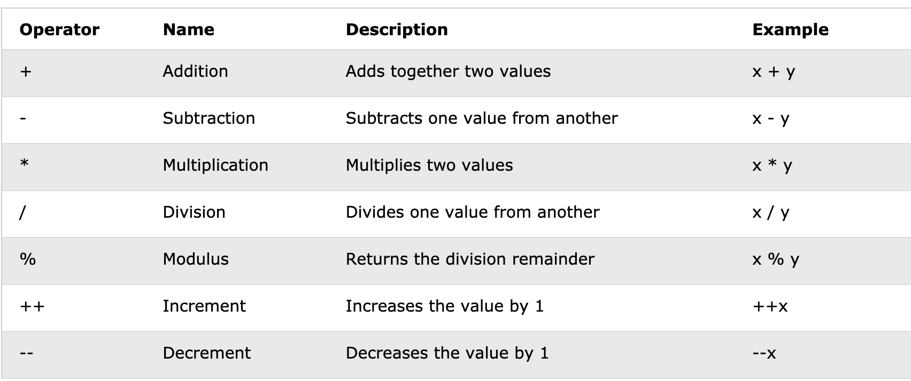
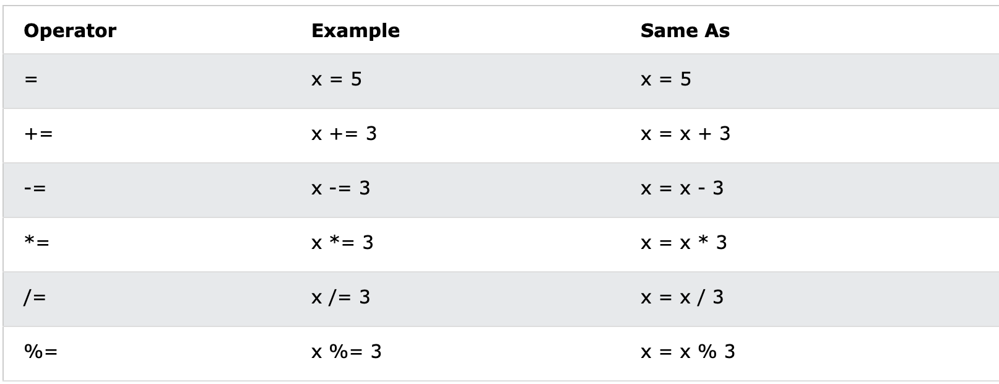
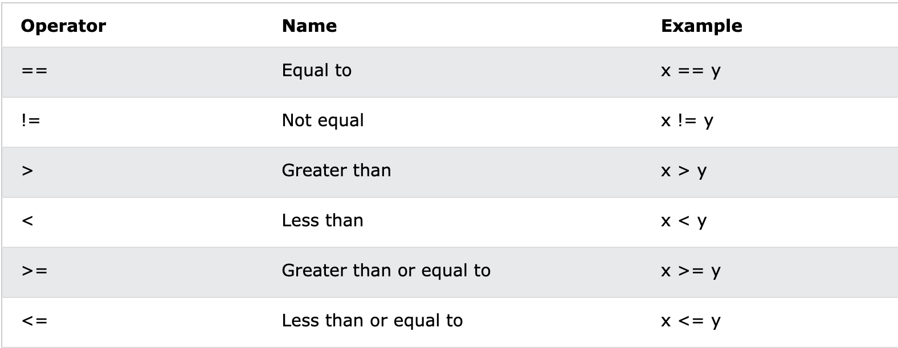
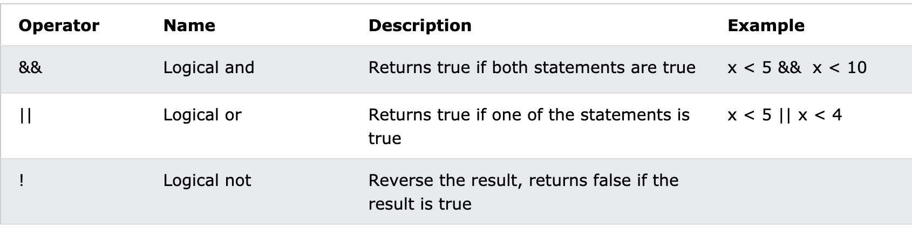

# Kotlin

### What is Kotlin?

Kotlin is a modern, trending programming language that was released in 2016 by JetBrains.

It has become very popular since it is compatible with Java (one of the most popular programming languages out there), which means that Java code (and libraries) can be used in Kotlin programs.

### Kotlin is used for:
* Mobile applications (specially Android apps)
* Web development
* Server side applications
* Data science

### Why Use Kotlin?
* Kotlin is fully compatible with Java
* Kotlin works on different platforms (Windows, Mac, Linux, Raspberry Pi, etc.)
* Kotlin is concise and safe
* Kotlin is easy to learn, especially if you already know Java
* Kotlin is free to use
* Big community/support

### Kotlin Syntax

```
fun main() {
  println("Hello World")
}
```

The fun keyword is used to declare a function. A function is a block of code designed to perform a particular task. In the example above, it declares the main() function.

The main() function is something you will see in every Kotlin program. This function is used to execute code. Any code inside the main() function's curly brackets {} will be executed.

For example, the println() function is inside the main() function, meaning that this will be executed. The println() function is used to output/print text, and in our example it will output "Hello World".

You can add as many println() functions as you want. Note that it will add a new line for each function.

There is also a print() function, which is similar to println(). The only difference is that it does not insert a new line at the end of the output.

Note : In Kotlin, code statements do not have to end with a semicolon (;) (which is often required for other programming languages.

## Kotlin Comments
Comments can be used to explain Kotlin code, and to make it more readable. It can also be used to prevent execution when testing alternative code.

### Single-line Comments

Single-line comments starts with two forward slashes (//).
Any text between // and the end of the line is ignored by Kotlin (will not be executed).

```
// This is a comment
println("Hello World")   // This is a comment

```
### Multi-line Comments

Multi-line comments start with /* and ends with */.
Any text between /* and */ will be ignored by Kotlin.

```
/* The code below will print the words Hello World
to the screen */
println("Hello World") 

```

### Kotlin Variables

Variables are containers for storing data values.

To create a variable, use var or val, and assign a value to it with the equal sign (=):

```
var name = "Nisala"
val birthyear = 1989

println(name)          // Print the value of name
println(birthyear)     // Print the value of birthyear    

```

The difference between var and val is that variables declared with the var keyword can be changed/modified, while val variables cannot.

### Variable Type
Unlike many other programming languages, variables in Kotlin do not need to be declared with a specified type (like "String" for text or "Int" for numbers, if you are familiar with those).

```

var name = "Nisala"      // String (text)
val birthyear = 1989   // Int (number)

println(name)          // Print the value of name
println(birthyear)     // Print the value of birthyear

```

Kotlin is smart enough to understand that "Nisala" is a String (text), and that 1989 is an Int (number) variable.

However, it is possible to specify the type.

You can also declare a variable without assigning the value, and assign the value later. However, this is only possible when you specify the type:

```
var name: String
name = "Nisala"
println(name)
```

Note : The val keyword is useful when you want a variable to always store the same value.

### Variable Names
A variable can have a short name (like x and y) or more descriptive names (age, sum, totalVolume).

The general rule for Kotlin variables are:

* Names can contain letters, digits, underscores, and dollar signs
* Names should start with a letter
* Names can also begin with $ and _ 
* Names are case sensitive ("myVar" and "myvar" are different variables)
* Names should start with a lowercase letter and it cannot contain whitespace
* Reserved words (like Kotlin keywords, such as var or String) cannot be used as names

## camelCase variables

```

val firstName = "Nisala"
val lastName - "Thalagala"
```

Did you notice that I used firstName and lastName as variable names in the example above, instead of firstname and lastname. This is called "camelCase", and it is considered as good practice as it makes it easier to read when you have a variable name with different words in it, for example "myFavoriteFood", "rateActionMovies" etc.

## Kotlin Data Types

In Kotlin, the type of a variable is decided by its value:

```
val myNum = 5             // Int
val myDoubleNum = 5.99    // Double
val myLetter = 'D'        // Char
val myBoolean = true      // Boolean
val myText = "Hello"      // String
```

However, it is possible to specify the type if you want:

```
val myNum: Int = 5                // Int
val myDoubleNum: Double = 5.99    // Double
val myLetter: Char = 'D'          // Char
val myBoolean: Boolean = true     // Boolean
val myText: String = "Hello"      // String
```

Data types are divided into different groups:

* Numbers
* Characters
* Booleans
* Strings
* Arrays

### Numbers

Number types are divided into two groups:

* Integer types store whole numbers, positive or negative (such as 123 or -456), without decimals. Valid types are Byte, Short, Int and Long.

* Floating point types represent numbers with a fractional part, containing one or more decimals. There are two types: Float and Double.

If you don't specify the type for a numeric variable, it is most often returned as Int for whole numbers and Double for floating point numbers.

## Integer Types

Byte
The Byte data type can store whole numbers from -128 to 127. This can be used instead of Int or other integer types to save memory when you are certain that the value will be within -128 and 127:

```

val myNum: Byte = 100
println(myNum)
```

Short
The Short data type can store whole numbers from -32768 to 32767:

```
val myNum: Short = 5000
println(myNum)
```

Int
The Int data type can store whole numbers from -2147483648 to 2147483647:

```
val myNum: Int = 100000
println(myNum)
```

Long
The Long data type can store whole numbers from -9223372036854775808 to 9223372036854775808. This is used when Int is not large enough to store the value. Optionally, you can end the value with an "L":

```
val myNum: Long = 15000000000L
println(myNum)
```

Floating Point Types
Floating point types represent numbers with a decimal, such as 9.99 or 3.14515.

Float
The Float data type can store fractional numbers from 3.4e−038 to 3.4e+038. Note that you should end the value with an "F":

```
val myNum: Float = 5.75F
println(myNum)
```

Double
The Double data type can store fractional numbers from 1.7e−308 to 1.7e+038:

```
val myNum: Double = 19.99
println(myNum)
```

Use Float or Double?

The precision of a floating point value indicates how many digits the value can have after the decimal point. The precision of Float is only six or seven decimal digits, while Double variables have a precision of about 15 digits. Therefore it is safer to use Double for most calculations.

Scientific Numbers

A floating point number can also be a scientific number with an "e" or "E" to indicate the power of 10:

```
val myNum1: Float = 35E3F
val myNum2: Double = 12E4
println(myNum1)
println(myNum2)
```

Booleans
The Boolean data type and can only take the values true or false:

```
val isKotlinFun: Boolean = true
val isFishTasty: Boolean = false
println(isKotlinFun)   // Outputs true
println(isFishTasty)   // Outputs false
```

Characters
The Char data type is used to store a single character. A char value must be surrounded by single quotes, like 'A' or 'c':

```
val myGrade: Char = 'B'
println(myGrade)
```

Note : Unlike Java, you cannot use ASCII values to display certain characters. The value 66 would output a "B" in Java, but will generate an error in Kotlin:

Strings
The String data type is used to store a sequence of characters (text). String values must be surrounded by double quotes:

```
val myText: String = "Hello World"
println(myText)
```

Arrays
Arrays are used to store multiple values in a single variable, instead of declaring separate variables for each value.

Type Conversion
Type conversion is when you convert the value of one data type to another type.

To convert a numeric data type to another type, you must use one of the following functions: toByte(), toShort(), toInt(), toLong(), toFloat(), toDouble() or toChar():

```
val x: Int = 5
val y: Long = x.toLong()
println(y)
```
## Kotlin Operators
Operators are used to perform operations on variables and values.

The value is called an operand, while the operation (to be performed between the two operands) is defined by an operator:

```
var x = 100 + 50
```

In the example above, the numbers 100 and 50 are operands, and the + sign is an operator:

Kotlin divides the operators into the following groups:

* Arithmetic operators
* Assignment operators
* Comparison operators
* Logical operators

### Arithmetic Operators
Arithmetic operators are used to perform common mathematical operations.



### Assignment Operators
Assignment operators are used to assign values to variables.



### Comparison Operators
Comparison operators are used to compare two values, and returns a Boolean value: either true or false.



### Logical Operators
Logical operators are used to determine the logic between variables or values:



## Kotlin Strings
Strings are used for storing text.

A string contains a collection of characters surrounded by double quotes:

```
var greeting = "Hello"
```

or 

```
var greeting: String = "Hello"

```

Note: If you want to create a String without assigning the value (and assign the value later), you must specify the type while declaring the variable:

```
var name: String
name = "John"
println(name)
```

To access the characters (elements) of a string, you must refer to the index number inside square brackets.

To access the characters (elements) of a string, you must refer to the index number inside square brackets.

```
var txt = "Hello World"
println(txt[0]) // first element (H)
println(txt[2]) // third element (l)
```
String Length

A String in Kotlin is an object, which contain properties and functions that can perform certain operations on strings, by writing a dot character (.) after the specific string variable.

var txt = "Elegant Media"
println("The length of the txt string is: " + txt.length)

String Functions

There are many string functions available, for example toUpperCase() and toLowerCase():

```
var txt = "Hello World"
println(txt.toUpperCase())   // Outputs "HELLO WORLD"
println(txt.toLowerCase())   // Outputs "hello world"
```
Comparing Strings

The compareTo(string) function compares two strings and returns 0 if both are equal:

```
var txt1 = "Hello World"
var txt2 = "Hello World"
println(txt1.compareTo(txt2))  // Outputs 0 (they are equal)
```

Finding a String in a String
The indexOf() function returns the index (the position) of the first occurrence of a specified text in a string (including whitespace):

```
var txt = "Please locate where 'locate' occurs!"
println(txt.indexOf("locate"))  // Outputs 7
```

Quotes Inside a String
To use quotes inside a string, use single quotes ('):

```
var txt1 = "It's alright"
var txt2 = "That's great"
```

String Concatenation
The + operator can be used between strings to add them together to make a new string. This is called concatenation:

```
var firstName = "Nisala"
var lastName = "Thalagala"
println(firstName + " " + lastName)
```

You can also use the plus() function to concatenate two strings:

```
var firstName = "Nisala "
var lastName = "Thalagala"
println(firstName.plus(lastName))
```

String Templates/Interpolation
Instead of concatenation, you can also use "string templates", which is an easy way to add variables and expressions inside a string.

Just refer to the variable with the $ symbol:

```
var firstName = "John"
var lastName = "Doe"
println("My name is $firstName $lastName")
```

### Kotlin If ... Else

Kotlin has the following conditionals:

* Use ' if ' to specify a block of code to be executed, if a specified condition is true
* Use ' else ' to specify a block of code to be executed, if the same condition is false
* Use ' else if ' to specify a new condition to test, if the first condition is false
* Use ' when ' to specify many alternative blocks of code to be executed

```
val x = 20
val y = 18
if (x > y) {
  println("x is greater than y")
}
```

```
val time = 20
if (time < 18) {
  println("Good day.")
} else {
  println("Good evening.")
}
// Outputs "Good evening."
```

```
val time = 22
if (time < 10) {
  println("Good morning.")
} else if (time < 20) {
  println("Good day.")
} else {
  println("Good evening.")
}
```

### Kotlin If..Else Expressions

In Kotlin, you can also use if..else statements as expressions (assign a value to a variable and return it):

```
val time = 20
val greeting = if (time < 18) {
  "Good day."
} else {
  "Good evening."
}
println(greeting)
```

You can ommit the curly braces {} when if has only one statement:

```
fun main() {
  val time = 20
  val greeting = if (time < 18) "Good day." else "Good evening."
  println(greeting)
}
```

### Kotlin when
Instead of writing many if..else expressions, you can use the when expression, which is much easier to read.

It is used to select one of many code blocks to be executed:

```
val day = 4

val result = when (day) {
  1 -> "Monday"
  2 -> "Tuesday"
  3 -> "Wednesday"
  4 -> "Thursday"
  5 -> "Friday"
  6 -> "Saturday"
  7 -> "Sunday"
  else -> "Invalid day."
}
println(result)

// Outputs "Thursday" (day 4)
```

The when variable (day) is evaluated once
The value of the day variable is compared with the values of each "branch"
Each branch starts with a value, followed by an arrow (->) and a result
If there is a match, the associated block of code is executed
else is used to specify some code to run if there is no match
In the example above, the value of day is 4, meaning "Thursday" will be printed


### While Loop
Loops can execute a block of code as long as a specified condition is reached.
Loops are handy because they save time, reduce errors, and they make code more readable.

The While Loop
The while loop loops through a block of code as long as a specified condition is true:

```
var i = 0
while (i < 5) {
  println(i)
  i++
}
```

The Do..While Loop
The do..while loop is a variant of the while loop. This loop will execute the code block once, before checking if the condition is true, then it will repeat the loop as long as the condition is true.

```
var i = 0
do {
  println(i)
  i++
}
while (i < 5)
```

### Break and Continue

Break
The break statement is used to jump out of a loop.

```
var i = 0
while (i < 10) {
  println(i)
  i++
  if (i == 4) {
    break
  }
}
```

Continue
The continue statement breaks one iteration (in the loop), if a specified condition occurs, and continues with the next iteration in the loop.

```
var i = 0
while (i < 10) {
  if (i == 4) {
    i++
    continue
  }
  println(i)
  i++
}
```

### Kotlin Arrays

Arrays are used to store multiple values in a single variable, instead of creating separate variables for each value.

To create an array, use the arrayOf() function, and place the values in a comma-separated list inside it:

```
val cars = arrayOf("Volvo", "BMW", "Ford", "Mazda")
println(cars[0])
```

Note : Just like with Strings, Array indexes start with 0: [0] is the first element. [1] is the second element, etc.

Change an Array Element
To change the value of a specific element, refer to the index number:

```
val cars = arrayOf("Volvo", "BMW", "Ford", "Mazda")
cars[0] = "Opel"
println(cars[0])
// Now outputs Opel instead of Volvo
```

Array Length / Size
To find out how many elements an array have, use the size property:

```
val cars = arrayOf("Volvo", "BMW", "Ford", "Mazda")
println(cars.size)
```

Check if an Element Exists
You can use the in operator to check if an element exists in an array:

val cars = arrayOf("Volvo", "BMW", "Ford", "Mazda")
if ("Volvo" in cars) {
  println("It exists!")
} else {
  println("It does not exist.")
}

Loop Through an Array
Often when you work with arrays, you need to loop through all of the elements.

```
val cars = arrayOf("Volvo", "BMW", "Ford", "Mazda")
for (x in cars) {
  println(x)
}
```

### Kotlin For Loop
Often when you work with arrays, you need to loop through all of the elements.

To loop through array elements, use the for loop together with the in operator:

```
val cars = arrayOf("Volvo", "BMW", "Ford", "Mazda")
for (x in cars) {
  println(x)
}
```

### Kotlin Ranges
With the for loop, you can also create ranges of values with "..":

```
for (nums in 5..15) {
  println(nums)
}
```
Check if a Value Exists
You can also use the in operator to check if a value exists in a range:

```
val nums = arrayOf(2, 4, 6, 8)
if (2 in nums) {
  println("It exists!")
} else {
  println("It does not exist.")
}
```

### Kotlin Functions
A function is a block of code which only runs when it is called.

You can pass data, known as parameters, into a function.

Functions are used to perform certain actions, and they are also known as methods.

Create Your Own Functions
To create your own function, use the fun keyword, and write the name of the function, followed by parantheses ():

```
fun myFunction() {
  println("I just got executed!")
}
```
Call a Function

Now that you have created a function, you can execute it by calling it.

To call a function in Kotlin, write the name of the function followed by two parantheses ().

```
fun main() {
  myFunction() // Call myFunction
}

// Outputs "I just got executed!"
```

Function Parameters
Information can be passed to functions as parameter.

Parameters are specified after the function name, inside the parentheses. You can add as many parameters as you want, just separate them with a comma. Just note that you must specify the type of each parameter (Int, String, etc).

```
fun myFunction(fname: String) {
  println(fname + " Doe")
}

fun main() {
  myFunction("John")
  myFunction("Jane")
  myFunction("George")
}

// John Doe
// Jane Doe
// George Doe
```

Return Values

To return a value, use the return keyword, and specify the return type after the function's parantheses

```
fun myFunction(x: Int): Int {
  return (x + 5)
}

fun main() {
  var result = myFunction(3)
  println(result)
}

// 8 (3 + 5)
```

Shorter Syntax for Return Values
There is also a shorter syntax for returning values. You can use the = operator instead of return without specifying the return type. Kotlin is smart enough to automatically find out what it is:

```
fun myFunction(x: Int, y: Int) = x + y

fun main() {
  var result = myFunction(3, 5)
  println(result)
}

// 8 (3 + 5)
```

## Kotlin OOP
Kotlin - What is OOP?

OOP stands for Object-Oriented Programming.

Procedural programming is about writing procedures or methods that perform operations on the data, while object-oriented programming is about creating objects that contain both data and methods.

Object-oriented programming has several advantages over procedural programming:

OOP is faster and easier to execute
OOP provides a clear structure for the programs
OOP helps to keep the Kotlin code DRY "Don't Repeat Yourself", and makes the code easier to maintain, modify and debug
OOP makes it possible to create full reusable applications with less code and shorter development time

Kotlin - What are Classes and Objects?
Classes and objects are the two main aspects of object-oriented programming.
So, a class is a template for objects, and an object is an instance of a class.

When the individual objects are created, they inherit all the variables and methods from the class.

Kotlin Classes/Objects

Everything in Kotlin is associated with classes and objects, along with its properties and functions. For example: in real life, a car is an object. The car has properties, such as brand, weight and color, and functions, such as drive and brake.

A Class is like an object constructor, or a "blueprint" for creating objects.

Create a Class
To create a class, use the class keyword, and specify the name of the class:

```
class Car {
  var brand = ""
  var model = ""
  var year = 0
}
```

Create an Object

Now we can use the class named Car to create objects.

In the example below, we create an object of Car called c1, and then we access the properties of c1 by using the dot syntax (.), just like we did to access array and string properties:

```
// Create a c1 object of the Car class
val c1 = Car()

// Access the properties and add some values to it
c1.brand = "Ford"
c1.model = "Mustang"
c1.year = 1969

println(c1.brand)   // Outputs Ford
println(c1.model)   // Outputs Mustang
println(c1.year)    // Outputs 1969
```

### Kotlin Constructors
A constructor is like a special function, and it is defined by using two parantheses () after the class name. You can specify the properties inside of the parantheses (like passing parameters into a regular function).

The constructor will initialize the properties when you create an object of a class. Just remember to specify the type of the property/variable:

```
class Car(var brand: String, var model: String, var year: Int)

fun main() {
  val c1 = Car("Ford", "Mustang", 1969)
}
```

### Kotlin Class Functions

You can also use functions inside a class, to perfom certain actions:

```

class Car(var brand: String, var model: String, var year: Int) {
  // Class function
  fun drive() {
    println("Wrooom!")
  }
}

fun main() {
  val c1 = Car("Ford", "Mustang", 1969)

  // Call the function
  c1.drive() 
}
```
When a function is declared inside a class, it is known as a class function, or member function.
When an object of the class is created, it has access to all of the class functions.

### Class Function Parameters

Just like with regular functions, you can pass parameters to a class function:

```
class Car(var brand: String, var model: String, var year: Int) {
  // Class function
  fun drive() {
    println("Wrooom!")
  }

  // Class function with parameters
  fun speed(maxSpeed: Int) {
    println("Max speed is: " + maxSpeed)
  }
}

fun main() {
  val c1 = Car("Ford", "Mustang", 1969)

  // Call the functions
  c1.drive()
  c1.speed(200)
}
```

### Kotlin Inheritance (Subclass and Superclass)
In Kotlin, it is possible to inherit class properties and functions from one class to another. We group the "inheritance concept" into two categories:

subclass (child) - the class that inherits from another class
superclass (parent) - the class being inherited from
In the example below, MyChildClass (subclass) inherits the properties from the MyParentClass class (superclass):

```
// Superclass
open class MyParentClass {
  val x = 5
}

// Subclass
class MyChildClass: MyParentClass() {
  fun myFunction() {
    println(x) // x is now inherited from the superclass
  }
}

// Create an object of MyChildClass and call myFunction
fun main() {
  val myObj = MyChildClass()
  myObj.myFunction()
}
```
Use the open keyword in front of the superclass/parent, to make this the class other classes should inherit properties and functions from.

To inherit from a class, specify the name of the subclass, followed by a colon :, and then the name of the superclass.
