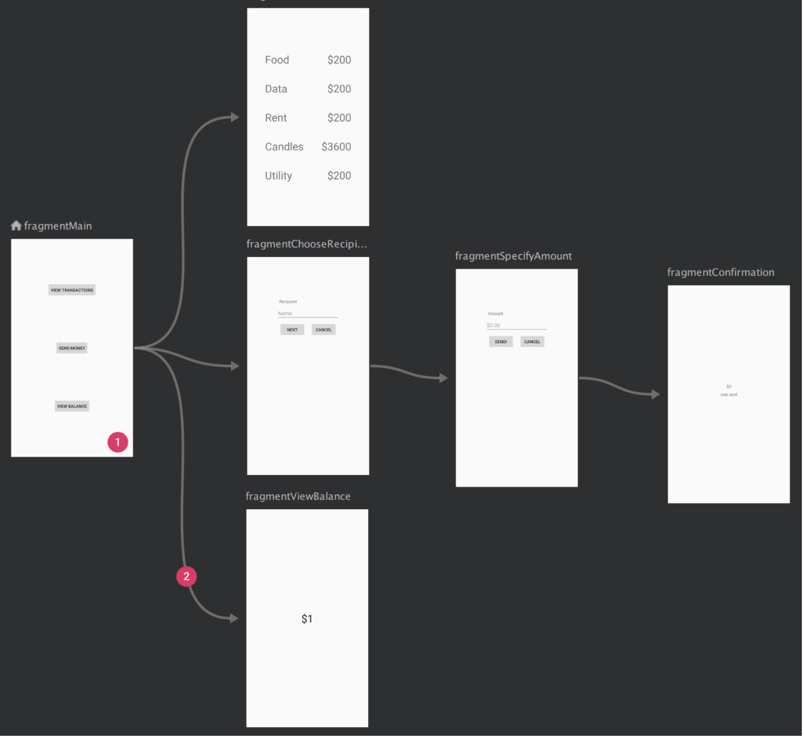
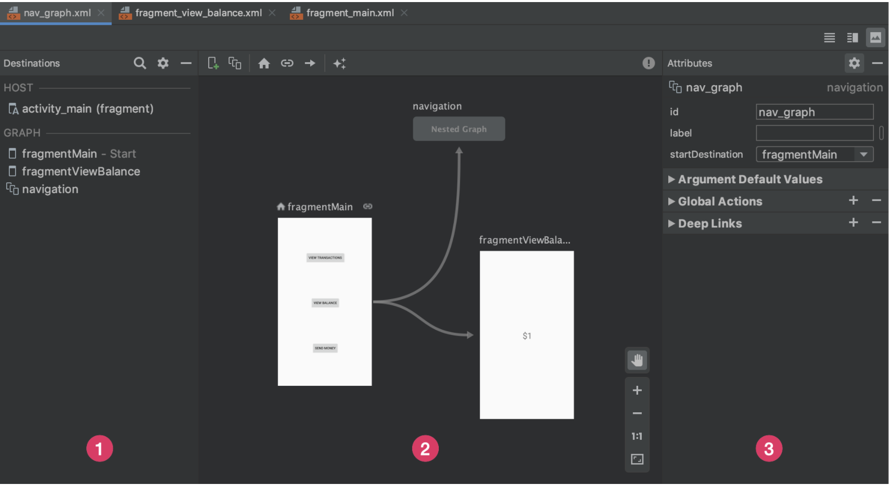
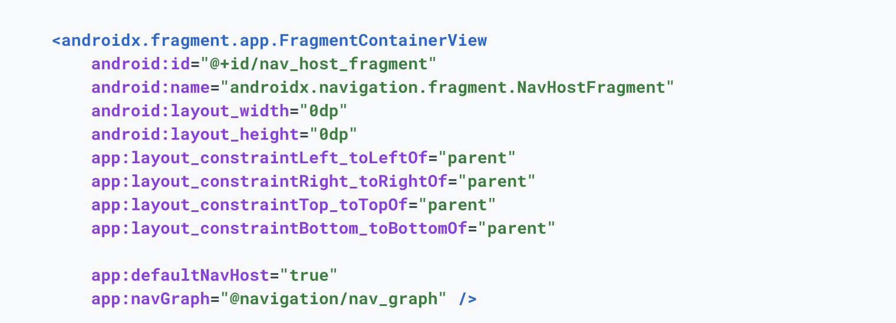
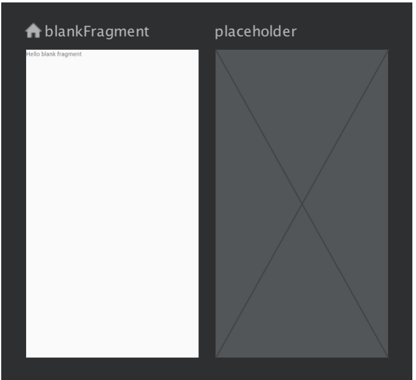
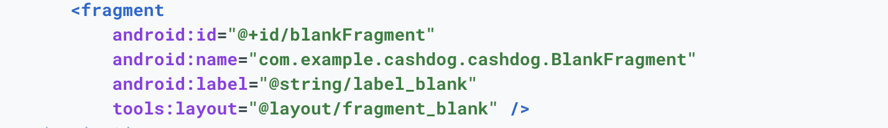
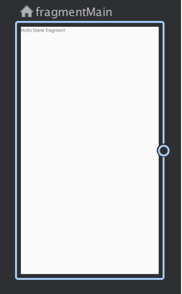
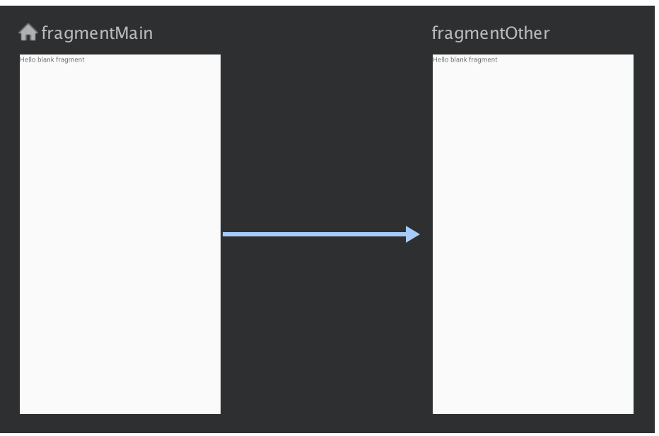

# Navigation Component

Navigation refers to the interactions that allow users to navigate across, into, and back out from the different pieces of content within your app. Android Jetpack's Navigation component helps you implement navigation, from simple button clicks to more complex patterns, such as app bars and the navigation drawer. The Navigation component also ensures a consistent and predictable user experience by adhering to an established set of principles.

The Navigation component consists of three key parts that are described below:

* Navigation graph: An XML resource that contains all navigation-related information in one centralized location. This includes all of the individual content areas within your app, called destinations, as well as the possible paths that a user can take through your app.
* NavHost: An empty container that displays destinations from your navigation graph. The Navigation component contains a default NavHost implementation, NavHostFragment, that displays fragment destinations.
* NavController: An object that manages app navigation within a NavHost. The NavController orchestrates the swapping of destination content in the NavHost as users move throughout your app.

As you navigate through your app, you tell the NavController that you want to navigate either along a specific path in your navigation graph or directly to a specific destination. The NavController then shows the appropriate destination in the NavHost.

The Navigation component provides a number of other benefits, including the following:

* Handling fragment transactions.
* Handling Up and Back actions correctly by default.
* Providing standardized resources for animations and transitions.
* Implementing and handling deep linking.
* Including Navigation UI patterns, such as navigation drawers and bottom navigation, with minimal additional work.
* Safe Args - a Gradle plugin that provides type safety when navigating and passing data between destinations.
* ViewModel support - you can scope a ViewModel to a navigation graph to share UI-related data between the graph's destinations.
* Use Android Studio's Navigation Editor to view and edit your navigation graphs.

## Get started with the Navigation component

### Set up your environment

```
dependencies {
  val nav_version = "2.3.5"

  // Java language implementation
  implementation("androidx.navigation:navigation-fragment:$nav_version")
  implementation("androidx.navigation:navigation-ui:$nav_version")

  // Kotlin
  implementation("androidx.navigation:navigation-fragment-ktx:$nav_version")
  implementation("androidx.navigation:navigation-ui-ktx:$nav_version")

  // Feature module Support
  implementation("androidx.navigation:navigation-dynamic-features-fragment:$nav_version")

  // Testing Navigation
  androidTestImplementation("androidx.navigation:navigation-testing:$nav_version")

  // Jetpack Compose Integration
  implementation("androidx.navigation:navigation-compose:2.4.0-alpha06")
}
```

### Create a navigation graph

Navigation occurs between your app's destinations that is, anywhere in your app to which users can navigate. These destinations are connected via actions.

A navigation graph is a resource file that contains all of your destinations and actions. The graph represents all of your app's navigation paths.

Below shows a visual representation of a navigation graph for a sample app containing six destinations connected by five actions. Each destination is represented by a preview thumbnail, and connecting actions are represented by arrows that show how users can navigate from one destination to another.



Destinations are the different content areas in your app.
Actions are logical connections between your destinations that represent paths that users can take.
To add a navigation graph to your project, do the following:

* In the Project window, right-click on the res directory and select New > Android Resource File. The New Resource File dialog appears.
* Type a name in the File name field, such as "nav_graph".
* Select Navigation from the Resource type drop-down list, and then click OK.
When you add your first navigation graph, Android Studio creates a navigation resource directory within the res directory. This directory contains your navigation graph resource file (nav_graph.xml, for example).

## Navigation Editor

After adding a graph, Android Studio opens the graph in the Navigation Editor. In the Navigation Editor, you can visually edit navigation graphs or directly edit the underlying XML.



Destinations panel: Lists your navigation host and all destinations currently in the Graph Editor.
Graph Editor: Contains a visual representation of your navigation graph. You can switch between Design view and the underlying XML representation in the Text view.
Attributes: Shows attributes for the currently-selected item in the navigation graph.

Click the Text tab to see the corresponding XML, which should look similar to the following snippet:

```
<?xml version="1.0" encoding="utf-8"?>
<navigation xmlns:android="http://schemas.android.com/apk/res/android"
            xmlns:app="http://schemas.android.com/apk/res-auto"
            android:id="@+id/nav_graph">

</navigation>
```

The <navigation> element is the root element of a navigation graph. As you add destinations and connecting actions to your graph, you can see the corresponding <destination> and <action> elements here as child elements. If you have nested graphs, they appear as child <navigation> elements.

## Add a NavHost to an activity

One of the core parts of the Navigation component is the navigation host. The navigation host is an empty container where destinations are swapped in and out as a user navigates through your app.

A navigation host must derive from NavHost. The Navigation component's default NavHost implementation, NavHostFragment, handles swapping fragment destinations.

Note: The Navigation component is designed for apps that have one main activity with multiple fragment destinations. The main activity is associated with a navigation graph and contains a NavHostFragment that is responsible for swapping destinations as needed. In an app with multiple activity destinations, each activity has its own navigation graph.

The XML example below shows a NavHostFragment as part of an app's main activity:



* The android:name attribute contains the class name of your NavHost implementation.
* The app:navGraph attribute associates the NavHostFragment with a navigation graph. The navigation graph specifies all of the destinations in this NavHostFragment to which users can navigate.
* The app:defaultNavHost="true" attribute ensures that your NavHostFragment intercepts the system Back button. Note that only one NavHost can be the default. If you have multiple hosts in the same layout (two-pane layouts, for example), be sure to specify only one default NavHost.

### You can also use the Layout Editor to add a NavHostFragment to an activity by doing the following:

* In your list of project files, double-click on your activity's layout XML file to open it in the Layout Editor.
* Within the Palette pane, choose the Containers category, or alternatively search for "NavHostFragment".
* Drag the NavHostFragment view onto your activity.
* Next, in the Navigation Graphs dialog that appears, choose the corresponding navigation graph to associate with this NavHostFragment, and then click OK.

### Add destinations to the navigation graph

You can create a destination from an existing fragment or activity. You can also use the Navigation Editor to create a new destination or create a placeholder to later replace with a fragment or activity.

In this example, let's create a new destination. To add a new destination using the Navigation Editor, do the following:

* In the Navigation Editor, click the New Destination icon , and then click Create new destination.
* In the New Android Component dialog that appears, create your fragment. For more information on fragments.
Back in the Navigation Editor, notice that Android Studio has added this destination to the graph.




### Anatomy of a destination
Click on a destination to select it, and note the following attributes in the Attributes panel:

* The Type field indicates whether the destination is implemented as a fragment, activity, or other custom class in your source code.
* The Label field contains the user-readable name of the destination. This might be surfaced to the UI—for example, if you connect the NavGraph to a Toolbar using setupWithNavController(). For this reason, it is recommended that you use resource strings for this value.
* The ID field contains the ID of the destination which is used to refer to the destination in code.
* The Class dropdown shows the name of the class that is associated with the destination. You can click this dropdown to change the associated class to another destination type.

Click the Text tab to show the XML view of your navigation graph. The XML contains the same id, name, label, and layout attributes for the destination, as shown below:



### Designate a screen as the start destination

The start destination is the first screen users see when opening your app, and it's the last screen users see when exiting your app. The Navigation editor uses a house icon  to indicate the start destination.

Once you have all of your destinations in place, you can choose a start destination by doing the following:

* In the Design tab, click on the destination to highlight it.

* Click the Assign start destination button . Alternatively, you can right-click on the destination and click Set as Start Destination.

### Connect destinations

An action is a logical connection between destinations. Actions are represented in the navigation graph as arrows. Actions usually connect one destination to another, though you can also create global actions that take you to a specific destination from anywhere in your app.

With actions, you're representing the different paths that users can take through your app. Note that to actually navigate to destinations, you still need to write the code to perform the navigation.

You can use the Navigation Editor to connect two destinations by doing the following:

In the Design tab, hover over the right side of the destination that you want users to navigate from. A circle appears over the right side of the destination, as shown in below screeshot.



Click and drag your cursor over the destination you want users to navigate to, and release. The resulting line between the two destinations represents an action, as shown in screenshot.



Click on the arrow to highlight the action. The following attributes appear in the Attributes panel:

The Type field contains “Action”.
The ID field contains the ID for the action.
The Destination field contains the ID for the destination fragment or activity.

Click the Text tab to toggle to the XML view. An action element is now added to the source destination. The action has an ID and a destination attribute that contains the ID of the next destination, as shown in the example below:

```
<?xml version="1.0" encoding="utf-8"?>
<navigation xmlns:app="http://schemas.android.com/apk/res-auto"
    xmlns:tools="http://schemas.android.com/tools"
    xmlns:android="http://schemas.android.com/apk/res/android"
    app:startDestination="@id/blankFragment">
    <fragment
        android:id="@+id/blankFragment"
        android:name="com.example.cashdog.cashdog.BlankFragment"
        android:label="@string/label_blank"
        tools:layout="@layout/fragment_blank" >
        <action
            android:id="@+id/action_blankFragment_to_blankFragment2"
            app:destination="@id/blankFragment2" />
    </fragment>
    <fragment
        android:id="@+id/blankFragment2"
        android:name="com.example.cashdog.cashdog.BlankFragment2"
        android:label="@string/label_blank_2"
        tools:layout="@layout/fragment_blank_fragment2" />
</navigation>
```

In your navigation graph, actions are represented by <action> elements. At a minimum, an action contains its own ID and the ID of the destination to which a user should be taken.

### Navigate to a destination

Navigating to a destination is done using a NavController, an object that manages app navigation within a NavHost. Each NavHost has its own corresponding NavController. You can retrieve a NavController by using one of the following methods:

Kotlin:

* Fragment.findNavController()
* View.findNavController()
* Activity.findNavController(viewId: Int)

Java:

* NavHostFragment.findNavController(Fragment)
* Navigation.findNavController(Activity, @IdRes int viewId)
* Navigation.findNavController(View)

 When creating the NavHostFragment using FragmentContainerView or if manually adding the NavHostFragment to your activity via a FragmentTransaction, attempting to retrieve the NavController in onCreate() of an Activity via Navigation.findNavController(Activity, @IdRes int) will fail. You should retrieve the NavController directly from the NavHostFragment instead.

```
val navHostFragment =
        supportFragmentManager.findFragmentById(R.id.nav_host_fragment) as NavHostFragment
val navController = navHostFragment.navController
```
### Ensure type-safety by using Safe Args

The recommended way to navigate between destinations is to use the Safe Args Gradle plugin. This plugin generates simple object and builder classes that enable type-safe navigation and argument passing between destinations.

```
buildscript {
    repositories {
        google()
    }
    dependencies {
        val nav_version = "2.3.5"
        classpath("androidx.navigation:navigation-safe-args-gradle-plugin:$nav_version")
    }
}
```

You must also apply one of two available plugins.

To generate Java language code suitable for Java or mixed Java and Kotlin modules, add this line to your app or module's build.gradle file:

```
plugins {
    id("androidx.navigation.safeargs")
}
```

```
plugins {
    id("androidx.navigation.safeargs.kotlin")
}
```

You must have android.useAndroidX=true in your gradle.properties file as per Migrating to AndroidX.

After you enable Safe Args, the plugin generates code that contains classes and methods for each action you've defined. For each action, Safe Args also generates a class for each originating destination, which is the destination from which the action originates. The generated class name is a combination of the originating destination class name and the word "Directions". For example, if the destination is named SpecifyAmountFragment, the generated class is named SpecifyAmountFragmentDirections. The generated class contains a static method for each action defined in the originating destination. This method takes any defined action parameters as arguments and returns a NavDirections object that you can pass to navigate().

As an example, assume we have a navigation graph with a single action that connects the originating destination, SpecifyAmountFragment, to a receiving destination, ConfirmationFragment.

Safe Args generates a SpecifyAmountFragmentDirections class with a single method, actionSpecifyAmountFragmentToConfirmationFragment() that returns a NavDirections object. This returned NavDirections object can then be passed directly to navigate(), as shown in the following example:

```
override fun onClick(view: View) {
    val action =
        SpecifyAmountFragmentDirections
            .actionSpecifyAmountFragmentToConfirmationFragment()
    view.findNavController().navigate(action)
}
```
