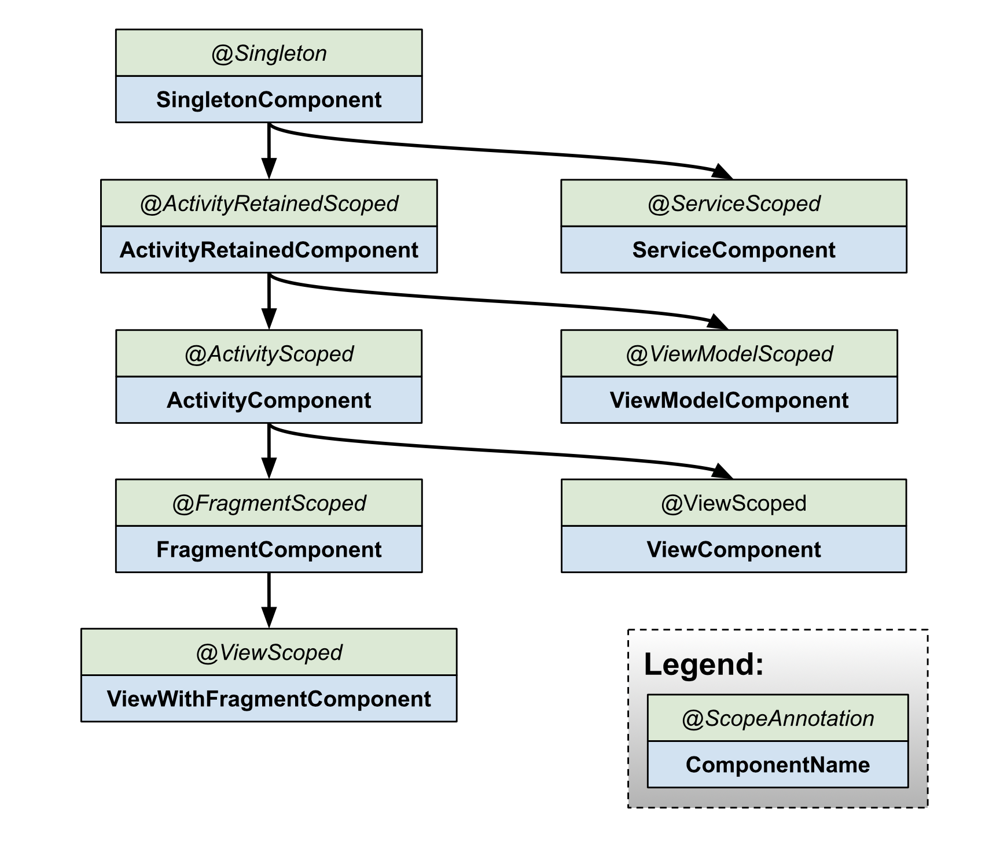

# Dependency Injection

Dependency injection (DI) is a technique widely used in programming and well suited to Android development. By following the principles of DI, you lay the groundwork for good app architecture.

Implementing dependency injection provides you with the following advantages:

* Reusability of code
* Ease of refactoring
* Ease of testing

## Fundamentals of dependency injection

### What is dependency injection?
Classes often require references to other classes. For example, a Car class might need a reference to an Engine class. These required classes are called dependencies, and in this example the Car class is dependent on having an instance of the Engine class to run.

There are three ways for a class to get an object it needs:

*  The class constructs the dependency it needs. In the example above, Car would create and initialize its own instance of Engine.
*  Grab it from somewhere else. Some Android APIs, such as Context getters and getSystemService(), work this way.
*  Have it supplied as a parameter. The app can provide these dependencies when the class is constructed or pass them in to the functions that need each dependency. In the example above, the Car constructor would receive Engine as a parameter.

The third option is dependency injection! With this approach you take the dependencies of a class and provide them rather than having the class instance obtain them itself.

Here's an example. Without dependency injection, representing a Car that creates its own Engine dependency in code looks like this:


```
class Car {

    private val engine = Engine()

    fun start() {
        engine.start()
    }
}

fun main(args: Array) {
    val car = Car()
    car.start()
}

```


This is not an example of dependency injection because the Car class is constructing its own Engine. This can be problematic because:

* Car and Engine are tightly coupled - an instance of Car uses one type of Engine, and no subclasses or alternative implementations can easily be used. If the Car were to construct its own Engine, you would have to create two types of Car instead of just reusing the same Car for engines of type Gas and Electric.
* The hard dependency on Engine makes testing more difficult. Car uses a real instance of Engine, thus preventing you from using a test double to modify Engine for different test cases.

What does the code look like with dependency injection? Instead of each instance of Car constructing its own Engine object on initialization, it receives an Engine object as a parameter in its constructor:

```

class Car(private val engine: Engine) {
    fun start() {
        engine.start()
    }
}

fun main(args: Array) {
    val engine = Engine()
    val car = Car(engine)
    car.start()
}

```


The main function uses Car. Because Car depends on Engine, the app creates an instance of Engine and then uses it to construct an instance of Car. The benefits of this DI-based approach are:

* Reusability of Car. You can pass in different implementations of Engine to Car. For example, you might define a new subclass of Engine called ElectricEngine that you want Car to use. If you use DI, all you need to do is pass in an instance of the updated ElectricEngine subclass, and Car still works without any further changes.
* Easy testing of Car. You can pass in test doubles to test your different scenarios. For example, you might create a test double of Engine called FakeEngine and configure it for different tests.

There are two major ways to do dependency injection in Android:

* Constructor Injection. This is the way described above. You pass the dependencies of a class to its constructor.
* Field Injection (or Setter Injection). Certain Android framework classes such as activities and fragments are instantiated by the system, so constructor injection is not possible. With field injection, dependencies are instantiated after the class is created. The code would look like this:

```

class Car {
    lateinit var engine: Engine

    fun start() {
        engine.start()
    }
}

fun main(args: Array) {
    val car = Car()
    car.engine = Engine()
    car.start()
}

```

Note: Dependency injection is based on the Inversion of Control principle in which generic code controls the execution of specific code.

## Automated dependency injection

In the previous example, you created, provided, and managed the dependencies of the different classes yourself, without relying on a library. This is called dependency injection by hand, or manual dependency injection. In the Car example, there was only one dependency, but more dependencies and classes can make manual injection of dependencies more tedious. Manual dependency injection also presents several problems:

* For big apps, taking all the dependencies and connecting them correctly can require a large amount of boilerplate code. In a multi-layered architecture, in order to create an object for a top layer, you have to provide all the dependencies of the layers below it. As a concrete example, to build a real car you might need an engine, a transmission, a chassis, and other parts; and an engine in turn needs cylinders and spark plugs.
* When you're not able to construct dependencies before passing them in — for example when using lazy initializations or scoping objects to flows of your app — you need to write and maintain a custom container (or graph of dependencies) that manages the lifetimes of your dependencies in memory.


There are libraries that solve this problem by automating the process of creating and providing dependencies. They fit into two categories:

* Reflection-based solutions that connect dependencies at runtime.
* Static solutions that generate the code to connect dependencies at compile time.

Dagger is a popular dependency injection library for Java, Kotlin, and Android that is maintained by Google. Dagger facilitates using DI in your app by creating and managing the graph of dependencies for you. It provides fully static and compile-time dependencies addressing many of the development and performance issues of reflection-based solutions such as Guice.

## Alternatives to dependency injection

```

object ServiceLocator {
    fun getEngine(): Engine = Engine()
}

class Car {
    private val engine = ServiceLocator.getEngine()

    fun start() {
        engine.start()
    }
}

fun main(args: Array) {
    val car = Car()
    car.start()
}

```

The service locator pattern is different from dependency injection in the way the elements are consumed. With the service locator pattern, classes have control and ask for objects to be injected; with dependency injection, the app has control and proactively injects the required objects.

Compared to dependency injection:

* The collection of dependencies required by a service locator makes code harder to test because all the tests have to interact with the same global service locator.
* Dependencies are encoded in the class implementation, not in the API surface. As a result, it's harder to know what a class needs from the outside. As a result, changes to Car or the dependencies available in the service locator might result in runtime or test failures by causing references to fail.
* Managing lifetimes of objects is more difficult if you want to scope to anything other than the lifetime of the entire app.

## Use Hilt in your Android app

Hilt is Jetpack's recommended library for dependency injection in Android. Hilt defines a standard way to do DI in your application by providing containers for every Android class in your project and managing their lifecycles automatically for you.
Hilt is built on top of the popular DI library Dagger to benefit from the compile time correctness, runtime performance, scalability, and Android Studio support that Dagger provides.

## Conclusion

Dependency injection provides your app with the following advantages:

* Reusability of classes and decoupling of dependencies: It's easier to swap out implementations of a dependency. Code reuse is improved because of inversion of control, and classes no longer control how their dependencies are created, but instead work with any configuration.
* Ease of refactoring: The dependencies become a verifiable part of the API surface, so they can be checked at object-creation time or at compile time rather than being hidden as implementation details.
* Ease of testing: A class doesn't manage its dependencies, so when you're testing it, you can pass in different implementations to test all of your different cases.

## Manual dependency injection

Android's recommended app architecture encourages dividing your code into classes to benefit from separation of concerns, a principle where each class of the hierarchy has a single defined responsibility. This leads to more, smaller classes that need to be connected together to fulfill each other's dependencies.


The dependencies between classes can be represented as a graph, in which each class is connected to the classes it depends on. The representation of all your classes and their dependencies makes up the application graph. In figure 1, you can see an abstraction of the application graph. When class A (ViewModel) depends on class B (Repository), there's a line that points from A to B representing that dependency.

Dependency injection helps make these connections and enables you to swap out implementations for testing. For example, when testing a ViewModel that depends on a repository, you can pass different implementations of Repository with either fakes or mocks to test the different cases.

### Basics of manual dependency injection

This section covers how to apply manual dependency injection in a real Android app scenario. It walks through an iterated approach of how you might start using dependency injection in your app. The approach improves until it reaches a point that is very similar to what Dagger would automatically generate for you.

Consider a flow to be a group of screens in your app that correspond to a feature. Login, registration, and checkout are all examples of flows.

When covering a login flow for a typical Android app, the LoginActivity depends on LoginViewModel, which in turn depends on UserRepository. Then UserRepository depends on a UserLocalDataSource and a UserRemoteDataSource, which in turn depends on a Retrofit service.


LoginActivity is the entry point to the login flow and the user interacts with the activity. Thus, LoginActivity needs to create the LoginViewModel with all its dependencies.

The Repository and DataSource classes of the flow look like this:

```
class UserRepository(
    private val localDataSource: UserLocalDataSource,
    private val remoteDataSource: UserRemoteDataSource
) { ... }

class UserLocalDataSource { ... }
class UserRemoteDataSource(
    private val loginService: LoginRetrofitService
) { ... }
```

Here's what LoginActivity looks like:

```
class LoginActivity: Activity() {

    private lateinit var loginViewModel: LoginViewModel

    override fun onCreate(savedInstanceState: Bundle?) {
        super.onCreate(savedInstanceState)

        // In order to satisfy the dependencies of LoginViewModel, you have to also
        // satisfy the dependencies of all of its dependencies recursively.
        // First, create retrofit which is the dependency of UserRemoteDataSource
        val retrofit = Retrofit.Builder()
            .baseUrl("https://example.com")
            .build()
            .create(LoginService::class.java)

        // Then, satisfy the dependencies of UserRepository
        val remoteDataSource = UserRemoteDataSource(retrofit)
        val localDataSource = UserLocalDataSource()

        // Now you can create an instance of UserRepository that LoginViewModel needs
        val userRepository = UserRepository(localDataSource, remoteDataSource)

        // Lastly, create an instance of LoginViewModel with userRepository
        loginViewModel = LoginViewModel(userRepository)
    }
}
```

There are issues with this approach:

* There's a lot of boilerplate code. If you wanted to create another instance of LoginViewModel in another part of the code, you'd have code duplication.
* Dependencies have to be declared in order. You have to instantiate UserRepository before LoginViewModel in order to create it.
* It's difficult to reuse objects. If you wanted to reuse UserRepository across multiple features, you'd have to make it follow the singleton pattern. The singleton pattern makes testing more difficult because all tests share the same singleton instance.

### Managing dependencies with a container

To solve the issue of reusing objects, you can create your own dependencies container class that you use to get dependencies. All instances provided by this container can be public. In the example, because you only need an instance of UserRepository, you can make its dependencies private with the option of making them public in the future if they need to be provided:

```

// Container of objects shared across the whole app
class AppContainer {

    // Since you want to expose userRepository out of the container, you need to satisfy
    // its dependencies as you did before
    private val retrofit = Retrofit.Builder()
                            .baseUrl("https://example.com")
                            .build()
                            .create(LoginService::class.java)

    private val remoteDataSource = UserRemoteDataSource(retrofit)
    private val localDataSource = UserLocalDataSource()

    // userRepository is not private; it'll be exposed
    val userRepository = UserRepository(localDataSource, remoteDataSource)
}

```

Because these dependencies are used across the whole application, they need to be placed in a common place all activities can use: the Application class. Create a custom Application class that contains an AppContainer instance.

```
// Custom Application class that needs to be specified
// in the AndroidManifest.xml file
class MyApplication : Application() {

    // Instance of AppContainer that will be used by all the Activities of the app
    val appContainer = AppContainer()
}
```

Note: AppContainer is just a regular class with a unique instance shared across the app placed in your Application class. However, AppContainer is not following the singleton pattern; in Kotlin, it's not an object, and in Java, it's not accessed with the typical Singleton.getInstance() method.


Now you can get the instance of the AppContainer from the application and obtain the shared of UserRepository instance:

```
class LoginActivity: Activity() {

    private lateinit var loginViewModel: LoginViewModel

    override fun onCreate(savedInstanceState: Bundle?) {
        super.onCreate(savedInstanceState)

        // Gets userRepository from the instance of AppContainer in Application
        val appContainer = (application as MyApplication).appContainer
        loginViewModel = LoginViewModel(appContainer.userRepository)
    }
}
```

In this way, you don't have a singleton UserRepository. Instead, you have an AppContainer shared across all activities that contains objects from the graph and creates instances of those objects that other classes can consume.

If LoginViewModel is needed in more places in the application, having a centralized place where you create instances of LoginViewModel makes sense. You can move the creation of LoginViewModel to the container and provide new objects of that type with a factory. The code for a LoginViewModelFactory looks like this:

```
// Definition of a Factory interface with a function to create objects of a type
interface Factory<T> {
    fun create(): T
}

// Factory for LoginViewModel.
// Since LoginViewModel depends on UserRepository, in order to create instances of
// LoginViewModel, you need an instance of UserRepository that you pass as a parameter.
class LoginViewModelFactory(private val userRepository: UserRepository) : Factory {
    override fun create(): LoginViewModel {
        return LoginViewModel(userRepository)
    }
}

```

You can include the LoginViewModelFactory in the AppContainer and make the LoginActivity consume it:

```

// AppContainer can now provide instances of LoginViewModel with LoginViewModelFactory
class AppContainer {
    ...
    val userRepository = UserRepository(localDataSource, remoteDataSource)

    val loginViewModelFactory = LoginViewModelFactory(userRepository)
}

class LoginActivity: Activity() {

    private lateinit var loginViewModel: LoginViewModel

    override fun onCreate(savedInstanceState: Bundle?) {
        super.onCreate(savedInstanceState)

        // Gets LoginViewModelFactory from the application instance of AppContainer
        // to create a new LoginViewModel instance
        val appContainer = (application as MyApplication).appContainer
        loginViewModel = appContainer.loginViewModelFactory.create()
    }
}

```
This approach is better than the previous one, but there are still some challenges to consider:

* You have to manage AppContainer yourself, creating instances for all dependencies by hand.
* There is still a lot of boilerplate code. You need to create factories or parameters by hand depending on whether you want to reuse an object or not.

### Managing dependencies in application flows

AppContainer gets complicated when you want to include more functionality in the project. When your app becomes larger and you start introducing different feature flows, there are even more problems that arise:

* When you have different flows, you might want objects to just live in the scope of that flow. For example, when creating LoginUserData (that might consist of the username and password used only in the login flow) you don't want to persist data from an old login flow from a different user. You want a new instance for every new flow. You can achieve that by creating FlowContainer objects inside the AppContainer as demonstrated in the next code example.

* Optimizing the application graph and flow containers can also be difficult. You need to remember to delete instances that you don't need, depending on the flow you're in.

Imagine you have a login flow that consists of one activity (LoginActivity) and multiple fragments (LoginUsernameFragment and LoginPasswordFragment). These views want to:

* Access the same LoginUserData instance that needs to be shared until the login flow finishes.
* Create a new instance of LoginUserData when the flow starts again.

You can achieve that with a login flow container. This container needs to be created when the login flow starts and removed from memory when the flow ends.

Let's add a LoginContainer to the example code. You want to be able to create multiple instances of LoginContainer in the app, so instead of making it a singleton, make it a class with the dependencies the login flow needs from the AppContainer.

```
class LoginContainer(val userRepository: UserRepository) {

    val loginData = LoginUserData()

    val loginViewModelFactory = LoginViewModelFactory(userRepository)
}

// AppContainer contains LoginContainer now
class AppContainer {
    ...
    val userRepository = UserRepository(localDataSource, remoteDataSource)

    // LoginContainer will be null when the user is NOT in the login flow
    var loginContainer: LoginContainer? = null
}
```

Once you have a container specific to a flow, you have to decide when to create and delete the container instance. Because your login flow is self-contained in an activity (LoginActivity), the activity is the one managing the lifecycle of that container. LoginActivity can create the instance in onCreate() and delete it in onDestroy().

```
class LoginActivity: Activity() {

    private lateinit var loginViewModel: LoginViewModel
    private lateinit var loginData: LoginUserData
    private lateinit var appContainer: AppContainer


    override fun onCreate(savedInstanceState: Bundle?) {
        super.onCreate(savedInstanceState)
        appContainer = (application as MyApplication).appContainer

        // Login flow has started. Populate loginContainer in AppContainer
        appContainer.loginContainer = LoginContainer(appContainer.userRepository)

        loginViewModel = appContainer.loginContainer.loginViewModelFactory.create()
        loginData = appContainer.loginContainer.loginData
    }

    override fun onDestroy() {
        // Login flow is finishing
        // Removing the instance of loginContainer in the AppContainer
        appContainer.loginContainer = null
        super.onDestroy()
    }
}
```

Like LoginActivity, login fragments can access the LoginContainer from AppContainer and use the shared LoginUserData instance.

Because in this case you're dealing with view lifecycle logic, using lifecycle observation makes sense.

Note: If you need the container to survive configuration changes, follow the Saving UI States guide. You need to handle it the same way you handle process death; otherwise, your app might lose state on devices with less memory.


### Conclusion

Dependency injection is a good technique for creating scalable and testable Android apps. Use containers as a way to share instances of classes in different parts of your app and as a centralized place to create instances of classes using factories.

When your application gets larger, you will start seeing that you write a lot of boilerplate code (such as factories), which can be error-prone. You also have to manage the scope and lifecycle of the containers yourself, optimizing and discarding containers that are no longer needed in order to free up memory. Doing this incorrectly can lead to subtle bugs and memory leaks in your app.


## Dependency injection with Hilt

Hilt is a dependency injection library for Android that reduces the boilerplate of doing manual dependency injection in your project. Doing manual dependency injection requires you to construct every class and its dependencies by hand, and to use containers to reuse and manage dependencies.

Hilt provides a standard way to use DI in your application by providing containers for every Android class in your project and managing their lifecycles automatically. Hilt is built on top of the popular DI library Dagger to benefit from the compile-time correctness, runtime performance, scalability, and Android Studio support that Dagger provides.

## Adding dependencies

```
buildscript {
    ...
    ext.hilt_version = '2.35'
    dependencies {
        ...
        classpath "com.google.dagger:hilt-android-gradle-plugin:$hilt_version"
    }
}
```

Then, apply the Gradle plugin and add these dependencies in your app/build.gradle file:

```
plugins {
    kotlin("kapt")
    id("dagger.hilt.android.plugin")
}

android {
    ...
}

dependencies {
    implementation("com.google.dagger:hilt-android:$hilt_version")
    kapt("com.google.dagger:hilt-android-compiler:$hilt_version")
}
```


Note: Projects that use both Hilt and data binding require Android Studio 4.0 or higher.

Hilt uses Java 8 features. To enable Java 8 in your project, add the following to the app/build.gradle file:

```
android {
    ...
    compileOptions {
        sourceCompatibility = JavaVersion.VERSION_1_8
        targetCompatibility = JavaVersion.VERSION_1_8
    }
}

```
## Hilt application class

All apps that use Hilt must contain an Application class that is annotated with @HiltAndroidApp.

@HiltAndroidApp triggers Hilt's code generation, including a base class for your application that serves as the application-level dependency container.

```

@HiltAndroidApp
class ExampleApplication : Application() { ... }

```

This generated Hilt component is attached to the Application object's lifecycle and provides dependencies to it. Additionally, it is the parent component of the app, which means that other components can access the dependencies that it provides.

## Inject dependencies into Android classes

Once Hilt is set up in your Application class and an application-level component is available, Hilt can provide dependencies to other Android classes that have the @AndroidEntryPoint annotation:

```
@AndroidEntryPoint
class ExampleActivity : AppCompatActivity() { ... }

```


Hilt currently supports the following Android classes:

* Application (by using @HiltAndroidApp)
* ViewModel (by using @HiltViewModel)
* Activity
* Fragment
* View
* Service
* BroadcastReceiver

If you annotate an Android class with @AndroidEntryPoint, then you also must annotate Android classes that depend on it. For example, if you annotate a fragment, then you must also annotate any activities where you use that fragment.

@AndroidEntryPoint generates an individual Hilt component for each Android class in your project. These components can receive dependencies from their respective parent classes.

To obtain dependencies from a component, use the @Inject annotation to perform field injection:

```
@AndroidEntryPoint
class ExampleActivity : AppCompatActivity() {

  @Inject lateinit var analytics: AnalyticsAdapter
  
}
```

Classes that Hilt injects can have other base classes that also use injection. Those classes don't need the @AndroidEntryPoint annotation if they're abstract.

## Define Hilt bindings

To perform field injection, Hilt needs to know how to provide instances of the necessary dependencies from the corresponding component. A binding contains the information necessary to provide instances of a type as a dependency.

One way to provide binding information to Hilt is constructor injection. Use the @Inject annotation on the constructor of a class to tell Hilt how to provide instances of that class:

```
class AnalyticsAdapter @Inject constructor(
  private val service: AnalyticsService
) {}

```
The parameters of an annotated constructor of a class are the dependencies of that class. In the example, AnalyticsAdapter has AnalyticsService as a dependency. Therefore, Hilt must also know how to provide instances of AnalyticsService.


## Hilt modules

Sometimes a type cannot be constructor-injected. This can happen for multiple reasons. For example, you cannot constructor-inject an interface. You also cannot constructor-inject a type that you do not own, such as a class from an external library. In these cases, you can provide Hilt with binding information by using Hilt modules.

A Hilt module is a class that is annotated with @Module. Like a Dagger module, it informs Hilt how to provide instances of certain types. Unlike Dagger modules, you must annotate Hilt modules with @InstallIn to tell Hilt which Android class each module will be used or installed in.


Dependencies that you provide in Hilt modules are available in all generated components that are associated with the Android class where you install the Hilt module.

## Inject interface instances with @Binds

Consider the AnalyticsService example. If AnalyticsService is an interface, then you cannot constructor-inject it. Instead, provide Hilt with the binding information by creating an abstract function annotated with @Binds inside a Hilt module.

The @Binds annotation tells Hilt which implementation to use when it needs to provide an instance of an interface.

The annotated function provides the following information to Hilt:

* The function return type tells Hilt what interface the function provides instances of.
* The function parameter tells Hilt which implementation to provide.

```
interface AnalyticsService {
  fun analyticsMethods()
}

// Constructor-injected, because Hilt needs to know how to
// provide instances of AnalyticsServiceImpl, too.
class AnalyticsServiceImpl @Inject constructor(

) : AnalyticsService {  }

@Module
@InstallIn(ActivityComponent::class)
abstract class AnalyticsModule {

  @Binds
  abstract fun bindAnalyticsService(
    analyticsServiceImpl: AnalyticsServiceImpl
  ): AnalyticsService
}

```

The Hilt module AnalyticsModule is annotated with @InstallIn(ActivityComponent::class) because you want Hilt to inject that dependency into ExampleActivity. This annotation means that all of the dependencies in AnalyticsModule are available in all of the app's activities.


## Inject instances with @Provides

Interfaces are not the only case where you cannot constructor-inject a type. Constructor injection is also not possible if you don't own the class because it comes from an external library (classes like Retrofit, OkHttpClient, or Room databases), or if instances must be created with the builder pattern.

Consider the previous example. If you don't directly own the AnalyticsService class, you can tell Hilt how to provide instances of this type by creating a function inside a Hilt module and annotating that function with @Provides.

The annotated function supplies the following information to Hilt:

* The function return type tells Hilt what type the function provides instances of.
* The function parameters tell Hilt the dependencies of the corresponding type.
* The function body tells Hilt how to provide an instance of the corresponding type. Hilt executes the function body every time it needs to provide an instance of that type.

```
@Module
@InstallIn(ActivityComponent::class)
object AnalyticsModule {

  @Provides
  fun provideAnalyticsService(
    // Potential dependencies of this type
  ): AnalyticsService {
      return Retrofit.Builder()
               .baseUrl("https://example.com")
               .build()
               .create(AnalyticsService::class.java)
  }
}

```

## Provide multiple bindings for the same type

In cases where you need Hilt to provide different implementations of the same type as dependencies, you must provide Hilt with multiple bindings. You can define multiple bindings for the same type with qualifiers.

A qualifier is an annotation that you use to identify a specific binding for a type when that type has multiple bindings defined.

Consider the example. If you need to intercept calls to AnalyticsService, you could use an OkHttpClient object with an interceptor. For other services, you might need to intercept calls in a different way. In that case, you need to tell Hilt how to provide two different implementations of OkHttpClient.

First, define the qualifiers that you will use to annotate the @Binds or @Provides methods:


```
@Qualifier
@Retention(AnnotationRetention.BINARY)
annotation class AuthInterceptorOkHttpClient

@Qualifier
@Retention(AnnotationRetention.BINARY)
annotation class OtherInterceptorOkHttpClient

```

Then, Hilt needs to know how to provide an instance of the type that corresponds with each qualifier. In this case, you could use a Hilt module with @Provides. Both methods have the same return type, but the qualifiers label them as two different bindings:

```

@Module
@InstallIn(SingletonComponent::class)
object NetworkModule {

  @AuthInterceptorOkHttpClient
  @Provides
  fun provideAuthInterceptorOkHttpClient(
    authInterceptor: AuthInterceptor
  ): OkHttpClient {
      return OkHttpClient.Builder()
               .addInterceptor(authInterceptor)
               .build()
  }

  @OtherInterceptorOkHttpClient
  @Provides
  fun provideOtherInterceptorOkHttpClient(
    otherInterceptor: OtherInterceptor
  ): OkHttpClient {
      return OkHttpClient.Builder()
               .addInterceptor(otherInterceptor)
               .build()
  }
}

```

You can inject the specific type that you need by annotating the field or parameter with the corresponding qualifier:

```

// As a dependency of another class.
@Module
@InstallIn(ActivityComponent::class)
object AnalyticsModule {

  @Provides
  fun provideAnalyticsService(
    @AuthInterceptorOkHttpClient okHttpClient: OkHttpClient
  ): AnalyticsService {
      return Retrofit.Builder()
               .baseUrl("https://example.com")
               .client(okHttpClient)
               .build()
               .create(AnalyticsService::class.java)
  }
}

// As a dependency of a constructor-injected class.
class ExampleServiceImpl @Inject constructor(
  @AuthInterceptorOkHttpClient private val okHttpClient: OkHttpClient
) : ...

// At field injection.
@AndroidEntryPoint
class ExampleActivity: AppCompatActivity() {

  @AuthInterceptorOkHttpClient
  @Inject lateinit var okHttpClient: OkHttpClient
}


```


As a best practice, if you add a qualifier to a type, add qualifiers to all the possible ways to provide that dependency. Leaving the base or common implementation without a qualifier is error-prone and could result in Hilt injecting the wrong dependency.

## Predefined qualifiers in Hilt

Hilt provides some predefined qualifiers. For example, as you might need the Context class from either the application or the activity, Hilt provides the @ApplicationContext and @ActivityContext qualifiers.

Suppose that the AnalyticsAdapter class from the example needs the context of the activity. The following code demonstrates how to provide the activity context to AnalyticsAdapter:


```

class AnalyticsAdapter @Inject constructor(
    @ActivityContext private val context: Context,
    private val service: AnalyticsService
) { ... }

```

### Generated components for Android classes

For each Android class in which you can perform field injection, there's an associated Hilt component that you can refer to in the @InstallIn annotation. Each Hilt component is responsible for injecting its bindings into the corresponding Android class.

The previous examples demonstrated the use of ActivityComponent in Hilt modules.

Hilt provides the following components:


Note: Hilt doesn't generate a component for broadcast receivers because Hilt injects broadcast receivers directly from SingletonComponent.

### Component lifetimes

Hilt automatically creates and destroys instances of generated component classes following the lifecycle of the corresponding Android classes.


Note: ActivityRetainedComponent lives across configuration changes, so it is created at the first Activity#onCreate() and destroyed at the last Activity#onDestroy().

### Component scopes

By default, all bindings in Hilt are unscoped. This means that each time your app requests the binding, Hilt creates a new instance of the needed type.

In the example, every time Hilt provides AnalyticsAdapter as a dependency to another type or through field injection (as in ExampleActivity), Hilt provides a new instance of AnalyticsAdapter.

However, Hilt also allows a binding to be scoped to a particular component. Hilt only creates a scoped binding once per instance of the component that the binding is scoped to, and all requests for that binding share the same instance.

The table below lists scope annotations for each generated component:


In the example, if you scope AnalyticsAdapter to the ActivityComponent using @ActivityScoped, Hilt provides the same instance of AnalyticsAdapter throughout the life of the corresponding activity:

```
@ActivityScoped
class AnalyticsAdapter @Inject constructor(
  private val service: AnalyticsService
) { ... }
```

Note: Scoping a binding to a component can be costly because the provided object stays in memory until that component is destroyed. Minimize the use of scoped bindings in your application. It is appropriate to use component-scoped bindings for bindings with an internal state that requires that same instance to be used within a certain scope, for bindings that need synchronization, or for bindings that you have measured to be expensive to create.

Suppose that AnalyticsService has an internal state that requires the same instance to be used every time—not only in ExampleActivity, but anywhere in the app. In this case, it is appropriate to scope AnalyticsService to the SingletonComponent. The result is that whenever the component needs to provide an instance of AnalyticsService, it provides the same instance every time.

The following example demonstrates how to scope a binding to a component in a Hilt module. A binding's scope must match the scope of the component where it is installed, so in this example you must install AnalyticsService in SingletonComponent instead of ActivityComponent:

```
// If AnalyticsService is an interface.
@Module
@InstallIn(SingletonComponent::class)
abstract class AnalyticsModule {

  @Singleton
  @Binds
  abstract fun bindAnalyticsService(
    analyticsServiceImpl: AnalyticsServiceImpl
  ): AnalyticsService
}

// If you don't own AnalyticsService.
@Module
@InstallIn(SingletonComponent::class)
object AnalyticsModule {

  @Singleton
  @Provides
  fun provideAnalyticsService(): AnalyticsService {
      return Retrofit.Builder()
               .baseUrl("https://example.com")
               .build()
               .create(AnalyticsService::class.java)
  }
}

```
Note: For more information about the differences between scoping with @ActivityRetainedScoped or @ViewModelScoped, see the @ViewModelScoped section in the Hilt and Jetpack integrations doc.


### Component hierarchy
Installing a module into a component allows its bindings to be accessed as a dependency of other bindings in that component or in any child component below it in the component hierarchy:




Note: By default, if you perform field injection in a view, ViewComponent can use bindings that are defined in the ActivityComponent. If you also need to use bindings that are defined in FragmentComponent and the view is part of a fragment, use the @WithFragmentBindings annotation with @AndroidEntryPoint.

### Component default bindings

Each Hilt component comes with a set of default bindings that Hilt can inject as dependencies into your own custom bindings. Note that these bindings correspond to the general activity and fragment types and not to any specific subclass. This is because Hilt uses a single activity component definition to inject all activities. Each activity has a different instance of this component.


The application context binding is also available using @ApplicationContext. For example:


```
class AnalyticsServiceImpl @Inject constructor(
  @ApplicationContext context: Context
) : AnalyticsService { ... }

// The Application binding is available without qualifiers.
class AnalyticsServiceImpl @Inject constructor(
  application: Application
) : AnalyticsService { ... }

```

The activity context binding is also available using @ActivityContext. For example:

```
class AnalyticsAdapter @Inject constructor(
  @ActivityContext context: Context
) { ... }

// The Activity binding is available without qualifiers.
class AnalyticsAdapter @Inject constructor(
  activity: FragmentActivity
) { ... }
```

Inject dependencies in classes not supported by Hilt

Hilt comes with support for the most common Android classes. However, you might need to perform field injection in classes that Hilt doesn't support.

In those cases, you can create an entry point using the @EntryPoint annotation. An entry point is the boundary between code that is managed by Hilt and code that is not. It is the point where code first enters into the graph of objects that Hilt manages. Entry points allow Hilt to use code that Hilt does not manage to provide dependencies within the dependency graph.

For example, Hilt doesn't directly support content providers. If you want a content provider to use Hilt to get some dependencies, you need to define an interface that is annotated with @EntryPoint for each binding type that you want and include qualifiers. Then add @InstallIn to specify the component in which to install the entry point as follows:

```
class ExampleContentProvider : ContentProvider() {

  @EntryPoint
  @InstallIn(SingletonComponent::class)
  interface ExampleContentProviderEntryPoint {
    fun analyticsService(): AnalyticsService
  }

  ...
}

```

To access an entry point, use the appropriate static method from EntryPointAccessors. The parameter should be either the component instance or the @AndroidEntryPoint object that acts as the component holder. Make sure that the component you pass as a parameter and the EntryPointAccessors static method both match the Android class in the @InstallIn annotation on the @EntryPoint interface:
```
class ExampleContentProvider: ContentProvider() {
    ...

  override fun query(...): Cursor {
    val appContext = context?.applicationContext ?: throw IllegalStateException()
    val hiltEntryPoint =
      EntryPointAccessors.fromApplication(appContext, ExampleContentProviderEntryPoint::class.java)

    val analyticsService = hiltEntryPoint.analyticsService()
    ...
  }
}
```

In this example, you must use the ApplicationContext to retrieve the entry point because the entry point is installed in SingletonComponent. If the binding that you wanted to retrieve were in the ActivityComponent, you would instead use the ActivityContext.


