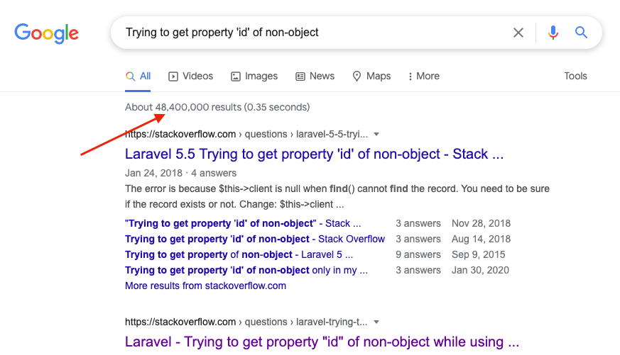
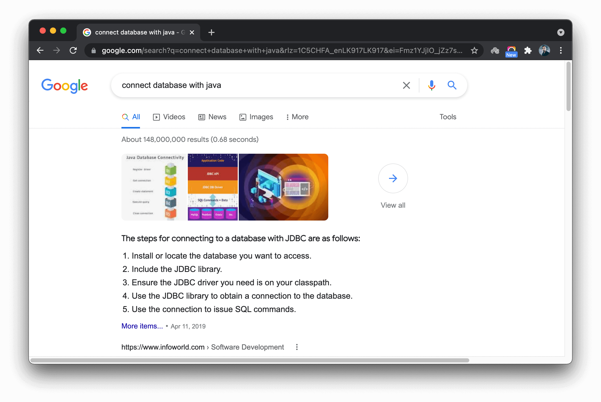
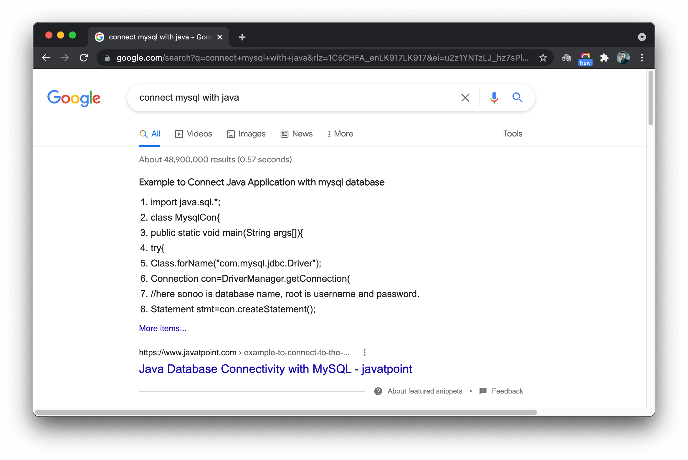
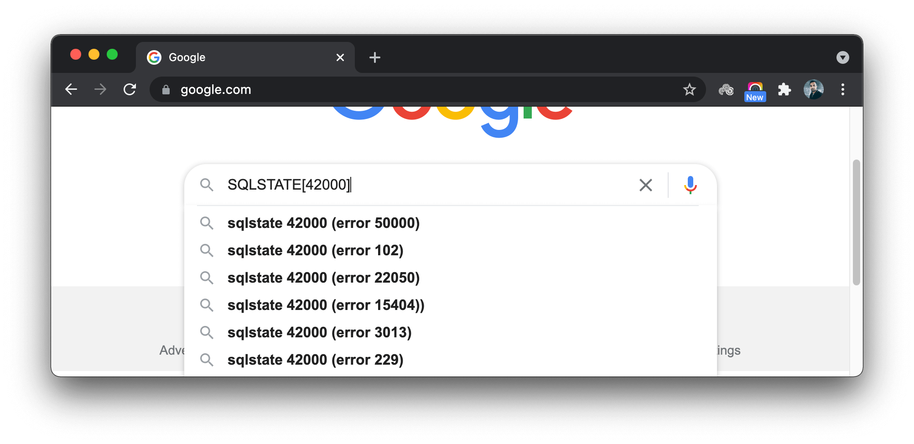
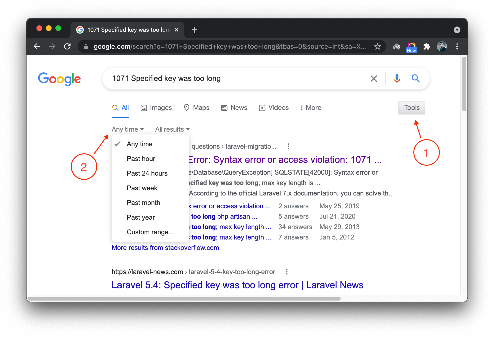
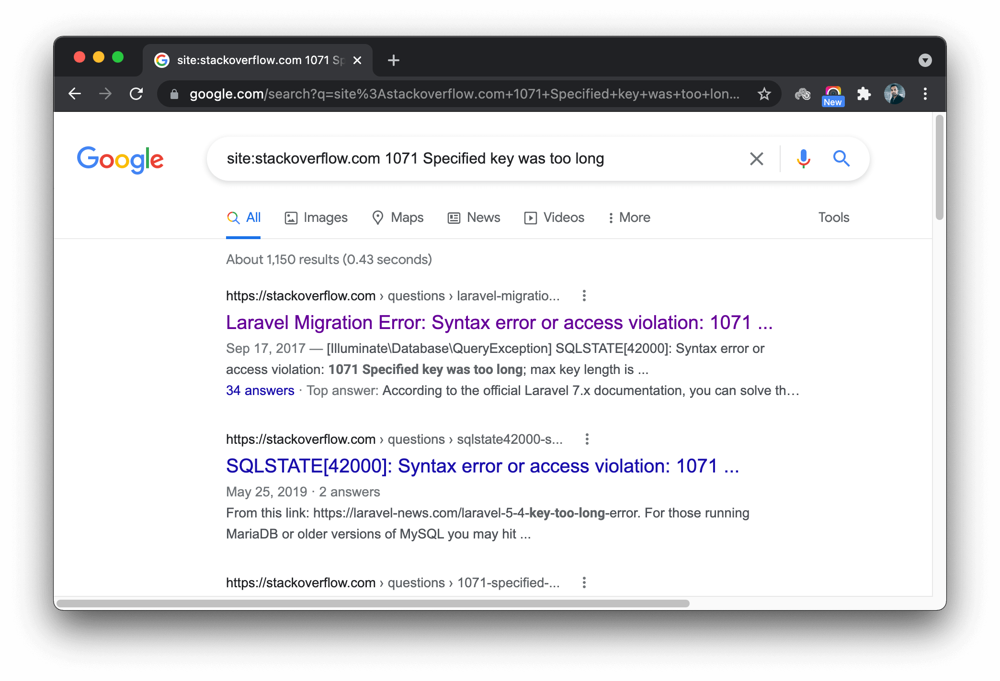

# How To Use Internet To Solve Programming Issues

An unavoidable part of every programmer's life is finding issues in their code. Most of these issues are due to the lack of knowledge required to write robust code that needs no fixing. No one is perfect, and no one knows everything. This is why you need to know how to find solutions for your coding issues.

It,s not a secret that the internet is the best source of knowledge available today. No exception for the programming too. There are many forums, blogs, journals, documentations, and communities you can access with few clicks. Though there might be enough information to solve most of your programming issues, you need to learn how to find them.

Search engines are your best friends here. You can start your quest on a search engine simply by typing your issue. But, not all queries generate results good enough to obtain proper solutions. Let's discuss few tips that would help to refine your search to make your search more effective.


## You are not the first man in the game

Most of the developers are hesitating to ask questions or seek help. When faced with a problem, they act like they are the first ones on the eath to get that kind of problem. It is necessary to get out of this mindset.

There is a 99.9% chance that the same problem is already faced by another developer somewhere in the world. So you are not alone in many situations. They must have looked for solutions. They must have asked questions related to the issue on the developer forums. Some who found the solution must have posted them on their blogs. There can be some people who have created videos on your problem. So the first step is deciding to take your issue to the internet and see how other people have tried to solve it.

Look at the following error:

```
ErrorException: Trying to get property 'id' of non-object in file /home/user/test/app/Http/Controllers/ApiController.php on line 710
```

See how many results you get simply entering `Trying to get property 'id' of non-object` in Google.




## Understand what you are searching for

Though you are at unease with a lack of options to solve your programming problem, you need to understand what you are looking for in your search. Google is intelligent enough to understand your question using natural language processing. Because of this, if you start searching with some random words, Google might get it differently and throw a bunch of non-related search results at you.

Look at the following example.

You are developing a Java application that you want to connect to a MySQL database.



Java can connect with many database management systems. Being specific about the DBMS you are trying to connect with would help Google to find more matching results for your problem.



Do a quick analysis of the problem to understand the keywords you should use in your search. Re-think the first few words that come into your mind. Check if they could mean something different from what you are thinking. Google is like a person, if you ask the right question, it will find you the right answer.


## Pick the specifics from error messages

Look at this error message generated by a PHP script while performing a database operation.

```
[Illuminate\Database\QueryException] SQLSTATE[42000]: Syntax error or access violation: 1071 Specified key was too long; max key length is 767 bytes (SQL: alter table users add unique users_email_unique(email))

[PDOException] SQLSTATE[42000]: Syntax error or access violation: 1071 Specified key was too long; max key length is 767 bytes
```

We can break the text down to 6 main parts:

  1. **Illuminate\\Database\\QueryException** : Too generic. The **Illuminate** library is throwing the exception. Illuminate is part of the popular Laravel framework. Since many developers test the code of popular libraries, there is less chance it throws a false exception.  Also, many database query issues can lead the library to throw **QueryException**. So, this might not be a good candidate keyword to start your search.

  2. **PDOException** : Same as above. Too generic.

  3. **SQLSTATE[42000]** : Too generic. But, if you are in doubt, you can search for this and see the results you get.

  

  Google suggests many error codes often used with **SQLSTATE[42000]**, which indicates that you might have to go through a lengthy set of results to get your answer.

  4. **Syntax error or access violation** : Same as above. You can guess that it is too generic just by looking at the sentence.

  5. **1071 Specified key was too long; max key length is 767 bytes** : Specific information about the failure. It already gives you a clue on the error even before you start your search. You need to look for this sort of information in every error message and start your search with it.

  6. **alter table users add unique users_email_unique(email)** : Too specific. It is probably the code written by you. There is less chance someone else has written the same combination of words in their programs.

Not only for searching, but you may also take the above explanation as a guide to understanding error messages.


## Make sure the solutions are timely valid

Some of the errors and their solutions change over time. Some errors occur only in a specific version of the software. Some solutions that solved a problem year ago might not be the solution today. Applying a timely invalid solution will make your code generate more issues instead of solving anything. You need to narrow down your search to a particular period to get timely solutions for your problems.

Enter your search words at Google. Then, click **Tools** => **Any time** to get a list of periods you can limit your search.




## Avoid using biased questions for searching

Programmers often find themselves in the quest for finding the best way to implement things. They look for the best programming language to learn, the best framework to do their next project, or the best algorithm to solve a problem. If you are also looking for information to settle an argument on which is the best or worst, do not use biased questions for searching.

For example, searching for **"why java is bad for web programming"** will give you only the results that discuss the downside of choosing Java for web programming. Google sense your intention of looking for information to avoid using Java through the words you use for searching. The same goes the other way too, searching "why java is good for web programming" will offer you pages that discuss the good side of Java as a web programming language.

For a more balanced opinion, you may search **"pros and cons of java as a web programming language"** or **"choosing java for web programming"**.


## You probably don't need to search the entire internet

Not all sites containing your search words are giving you productive solutions. Limit your search to a particular website you know there is a better chance of getting effective results.

**stackoverflow.com** is a popular question-and-answer website used by millions of programmers around the world. It contains a massive solutions base contributed by professionals in the industry. Programmers from every level visit **StackOverflow** daily to find solutions for their problems. There is a high chance you also find an answer for your programming issue on it.

Now, you can use Google to limit its search to **stackoverflow.com** or any other site by start typing **site:** followed by the URL of the website and your search words.





## Improve yourself to determine where to go for help

There can be millions of web pages on the internet related to what you are searching for.  However, a few of them actually could help you to solve your problem. Evaluate the information you find on the internet to identify sources that you can trust.

For example, when you search for something related to a library or tool, you can undoubtedly trust the information mentioned on their official documentation. Also, there can be a community forum where many developers share their experiences and information related to using those tools or libraries. The original developers of the libraries, extensions, or packages on GitHub provide help to the users on their issue lists. That might be the best place for getting some help from them to solve your issues too.

Also, for faster response, you can look for Slack or Discord channels. Many communities related to programming languages, technologies, and tools share information on Slack or Discord channels. They are full of active members who are willing to help you with most of the issues you have related to their subject. Use them as much as possible since it doesn't cost anything more than few keystrokes to ask a question.
