# How to Write Good Error Messages

Mistakes are unavoidable in our lives. When a user is working on a product, it is very likely that he may stuck somewhere in response to his actions.

Such kind of situations can be frustrating for user if not handled properly within product. It depends on the experience that product is providing to its users.

> "A product should be usable enough to handle the user's erroneous actions gracefully."

Below mentioned are few tips that when followed, error messages can also provide a pleasant experience to the user.

## 1\. Be Clear And Not Ambiguous

Write error message in clear and simple language. User should be able to understand the problem while reading an error message.

If error message is ambiguous and user is not able to find the reason of message, then it is of no use. User cannot do anything to fix the problem and it badly impacts the experience of the product.

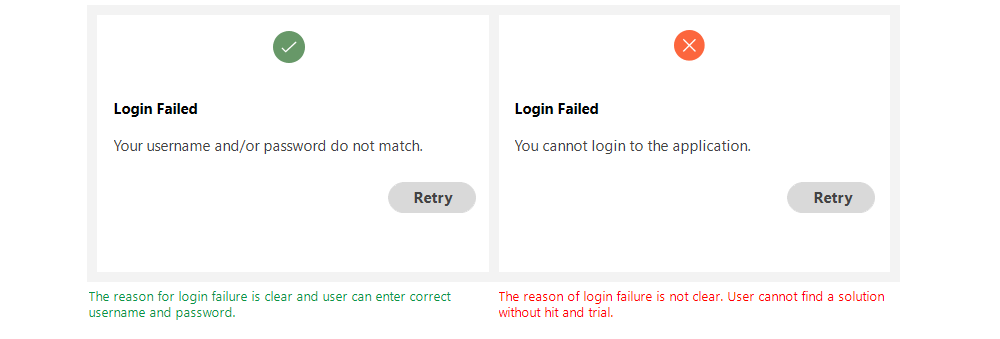

An error message should be clear and not ambiguous

Examples:

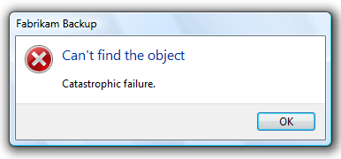

Windows error message does not give any clue about the problem and solution.

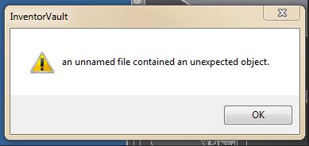

Autodesk displays an ambiguous error message that contains no useful information

## 2\. Be Short And Meaningful

Error message should contain necessary information. Most of the time user is not willing to read a long story.

Be concise and write a short description that is meaningful for user and gives him a clear idea of the problem and how to resolve it.

Avoid using redundant words and do not over communicate the problem.

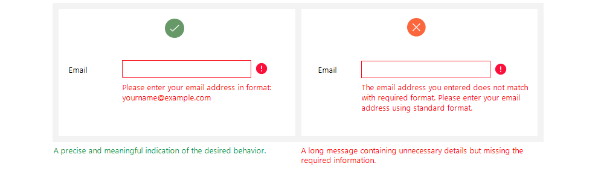

Short and meaningful error messages are more understandable

Examples:

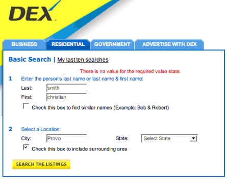

The message is not meaningful for user

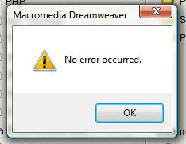

A message should not be as short as missing the useful details

## 3\. Don't Use Technical Jargons

Most of the users are not interested in technical details of the problem occurred. If a message contains technical terms or jargons, the user gets confused.

Try to use simple and plain language without referring to implementation details.

If there is a need to mention technical and complex details, then place them in a troubleshooting section and direct the user so that he can resolve the issue quickly.

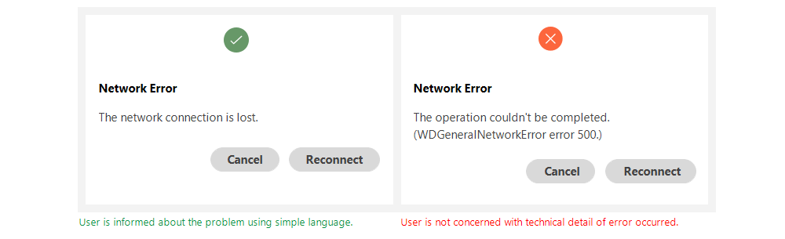

Technical details makes an error message more complex

Examples:

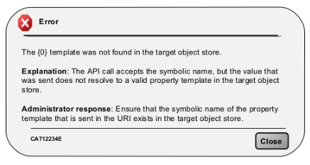

An example of technical error message

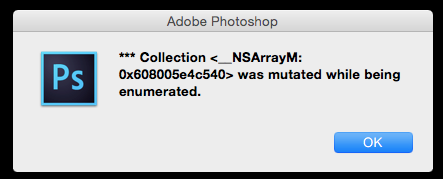

Error message contains technical information

## 4\. Be Humble --- Don't Blame User

A good error message is humble. It conveys the issues gracefully to its user without blaming him for his actions.

The user can perform an incorrect action again and again. But the design's responsibility is to inform him about his mistakes in a good way.

> "A good way to incorporate more human tone to your error messages is to think about explaining it out loud to someone. How does it sound when you speak it in conversation." --- [Sonia Gregory](https://freshsparks.com/user-experience-tips-best-error-messages/)

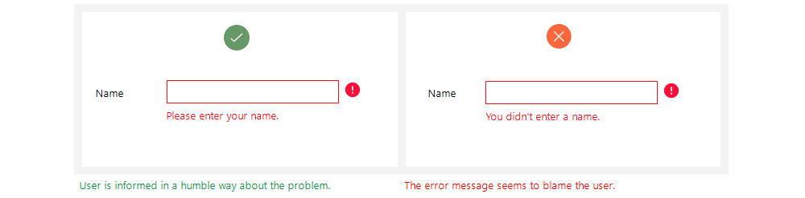

User does not feel good while reading an insulting message

Examples:

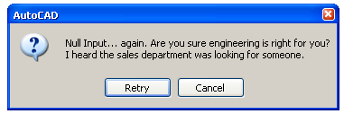

An example of an insulting message

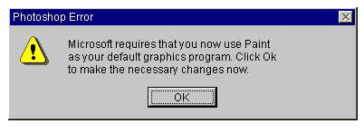

Another message that is harsh for user

## 5\. Avoid Negative Words

There are certain negative words that need to avoid on user interface. Since error messages are based on some unusual actions of user, there is a chance that system displays something disrespectful for user.

John Ekman gives a very good [example](http://uxmag.com/articles/are-you-saying-no-when-you-could-be-saying-yes-in-your-web-forms) of using "yes" and "no":

> "Some years ago, while checking in at the airport in Stockholm on my way to the U.S., I asked the woman at the counter if it would be possible to get an upgrade to business class. Her response: "I'm sorry, but that's not possible. You would have to pay extra for that." Checking in for the return flight, I tried the same thing again, but this time the answer was: "Of course, sir! How would you like to pay for that?"
>
> So even though the seat availability and possibility for an upgrade was the same, I got two completely different answers: one "yes" and one "no.""

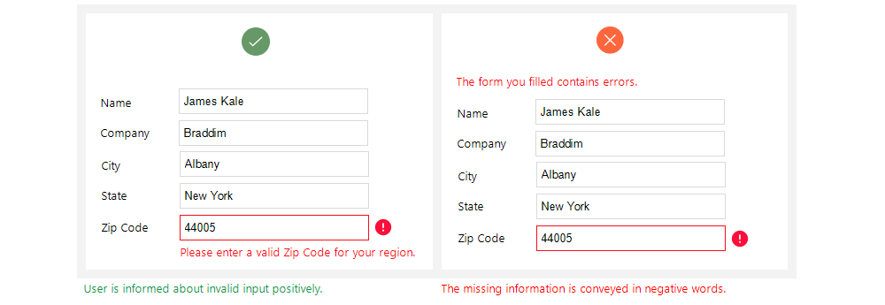

Avoid negative words if user makes a mistake

Examples:

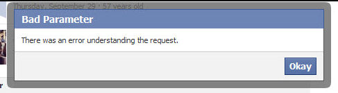

This message is neither clear, nor using positive words

## 6\. Give Direction to User

A good error message has three parts: problem identification, cause details if helpful, and a solution if possible.

Whenever an error occurs, user wants to fix it as soon as possible. The error message should have enough information for user that guides him how to get out of the erroneous situation.

The message can also direct the user to some other place or person from where he can get detailed help about the problem.

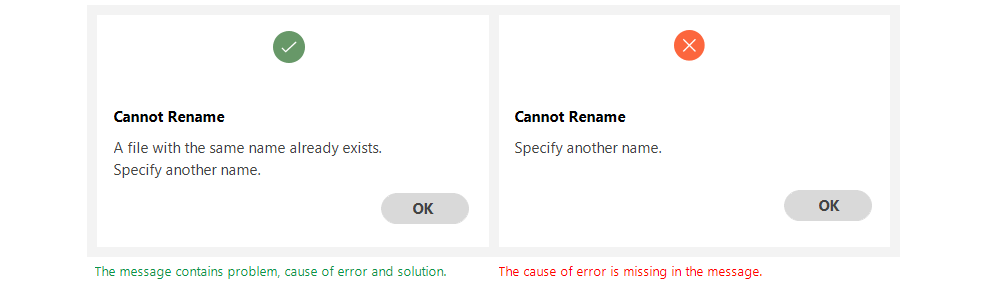

A message should display complete information

Examples:

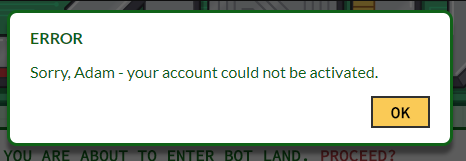

In this message, cause of error and guidance for solution is missing

## 7\. Be Specific And Relevant

The message should contain relevant information so that user can relate specified location and options easily.

Point out the exact location of problem --- where user should go and and what steps are needed to follow to resolve it.

If error message contains vague information, the user will get confused and it becomes difficult for him to remove the error.

A message should contain useful information

Examples:

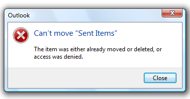

Three possible causes of error are given in this message that can be confusing for user

A message guiding the user in a precised way

## 8\. Avoid Uppercase Text

[Upper case text](https://uxdworld.com/2017/12/30/all-caps-on-ui-good-or-bad/) is difficult to read it gives an impact of shouting on user.

Error message is a place where user is informed about some critical scenario, so using upper case text can give him a feeling of discouragement.

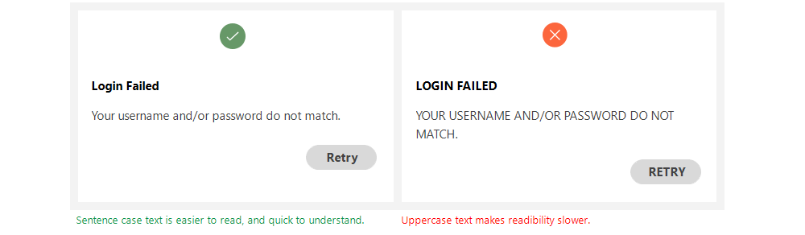

Uppercase text seems shouting on user

## 9\. Provide Appropriate Actions

Actions are important part of an error message. Appropriate actions provide guidance to user about the next step.

Actions are possible routes to solve the problem. A message can contain one or more actions for the user.

> "Give alert buttons succinct, logical titles. The best button titles consist of one or two words that describe the result of selecting the button." --- [iOS guidelines](https://developer.apple.com/ios/human-interface-guidelines/views/alerts/)

If user has to perform specific actions to remove the error, then use the same action name as button title.

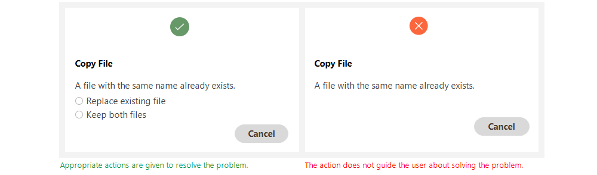

Appropriate actions are important part of an error message

Examples:

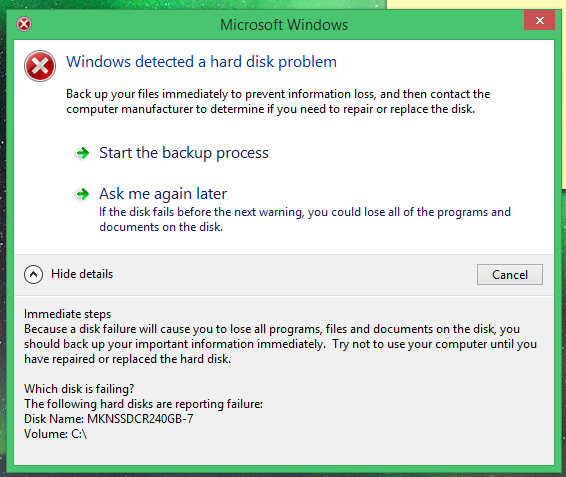

Clear and precise actions given in this error message

## 10\. Use Progressive Disclosure Approach

If there is detailed information related to a message that user may not want to see, then place it in Show/Hide section. It can be useful for an advanced user that may want to know about technical details.

Just make sure to place least needed information in these sections as most of the time user will not go to Show/Hide section.

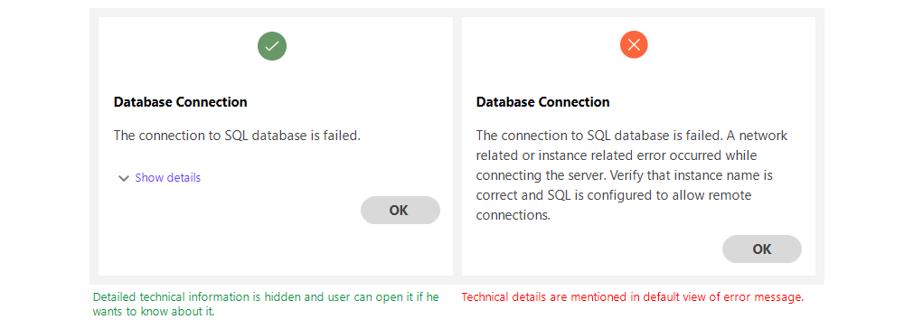

Progressive disclosure approach is good to hide additional details

Examples:

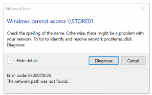

User may not be interested in knowing the details at first glance

## 11\. Use Proper Placement

It is very important to place an error message closer to the area from where it belongs to. User should not have to look here and there after reading the message that what it talks about.

For example, when user is filling information in a form, it is best experience to provide validation error along with the controls it relates to.

Otherwise user will first find the erroneous control and then resolve it.

An error message should be visible and noticeable. A message appearing on a screen should display in current view even user has scrolled the view to top or bottom.

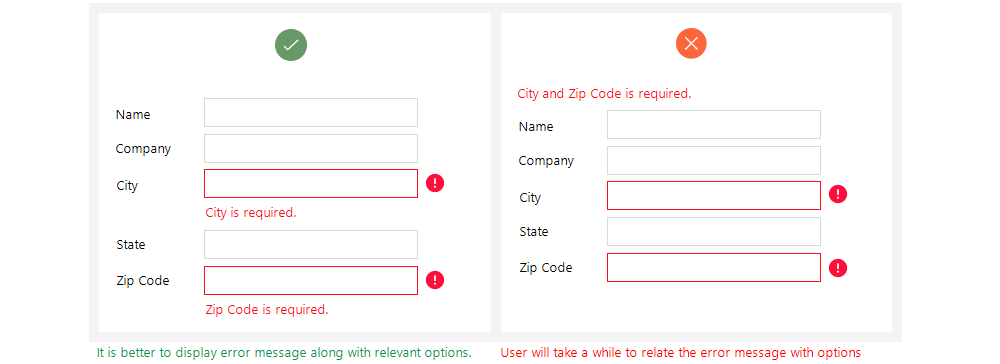

It is good experience to provide error details along with the control

NOTE: This article was originally posted [here](https://uxplanet.org/how-to-write-good-error-messages-858e4551cd4) by Saadia Minhas
