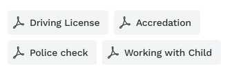

# Left Aligned CollectionView FlowLayout



### Integration

- Add [LeftAlignedCollectionViewFlowLayout.swift](LeftAlignedCollectionViewFlowLayout.swift) Class
- Create collection view
- Do data bindings and delegate integrations
- Bind Data Source `collectionView.dataSource = self`
- Create string array that showing in collection view
- Bind flow layout to the collection view
```
collectionView.collectionViewLayout = LeftAlignedCollectionViewFlowLayout(certificate: [String], font: UIFont(name: "WorkSans-SemiBold", size: 16) ?? UIFont.systemFont(ofSize: 16), cellHeight: 36, fixedSpacing: 50, callback: { (height) in
    // This returns collection view
})
```
- Bind Delegate `collectionView.delegate = self`
