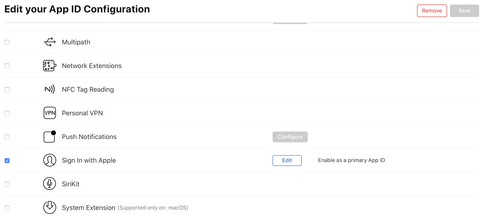
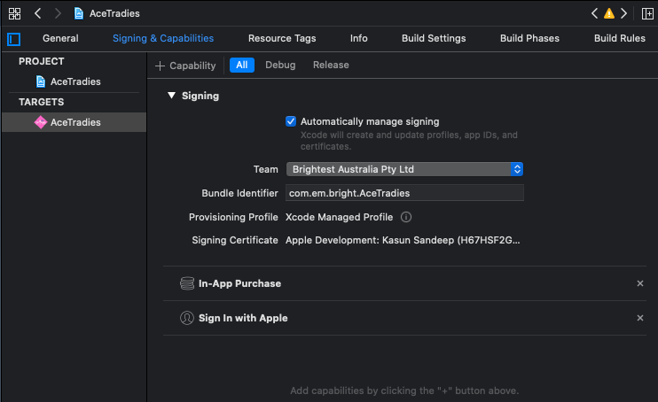

# Sign in with Apple

### Requirements

- Paid Apple Developer Membership \* Can't work on `Insoftware enterprice team` \*
- Minimum Xcode version is 11
- Minimum Development target iOS 13 or Availability checking for iOS 13
- Physical device running iOS 13 or greater 


### Enabling Apple Sign In

- Using Apple Developer Account

    - Go to [https://developer.apple.com](https://developer.apple.com)
    - `Select Certificates, Identifiers & Profiles -> Identifires -> Select your project App ID -> Tick Sign In with Apple Capability`
    - Picture of Sign In with Apple Capability: 

- Using Xcode

    - `Project Navigator -> Select Project -> Select Target -> Select Signing & Capabilities`
    - Add Capability by clicking the + button. Search for Sign In with Apple Capability in Capability Library
    - Picture of Select Signing & Capabilities: 

### Apple Entitlement

Add following key to plist

```
<key>com.apple.developer.applesignin</key>
<array>
<string>Default</string>
</array>
```

### Setup and Functionality

- Import library
```
import AuthenticationServices
```

- Create request with autorizations according to button action
```
if #available(iOS 13.0, *) {
    let request = ASAuthorizationAppleIDProvider().createRequest()
    request.requestedScopes = [.fullName, .email]
    
    let authorizationController: ASAuthorizationController = ASAuthorizationController(authorizationRequests: [request])
    authorizationController.delegate = self
    authorizationController.performRequests()
}
```

- Get responses from delegates
```
@available(iOS 13.0, *)
extension YourControllerClass: ASAuthorizationControllerDelegate {
    func authorizationController(controller: ASAuthorizationController, didCompleteWithAuthorization authorization: ASAuthorization) {
        guard let appleIDCredential = authorization.credential as?  ASAuthorizationAppleIDCredential else {
            // Authorization failure
            return
        }
        // Success Code
    }
    
    func authorizationController(controller: ASAuthorizationController, didCompleteWithError error: Error) {
        // Signin failure
    }
}
```
