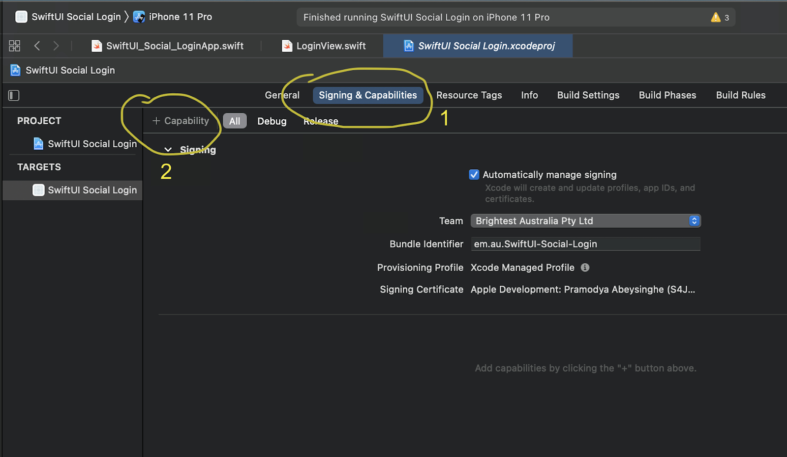
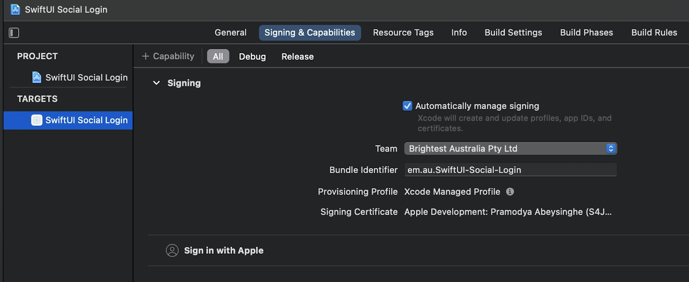
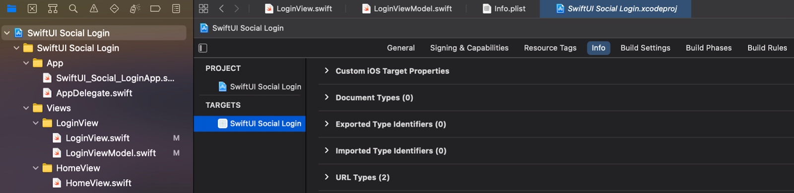
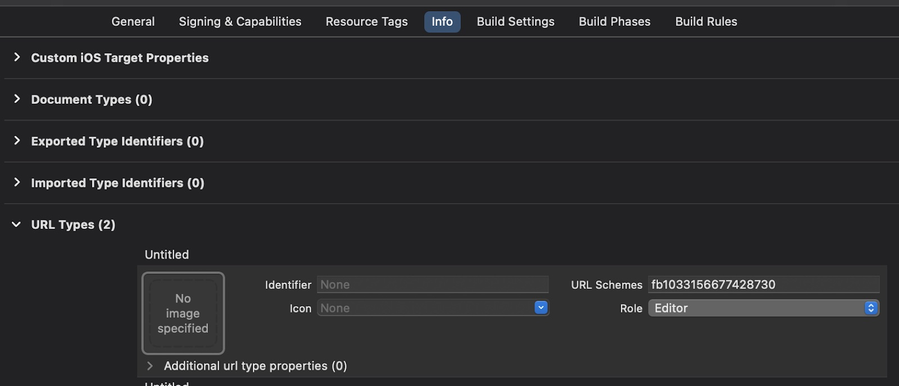
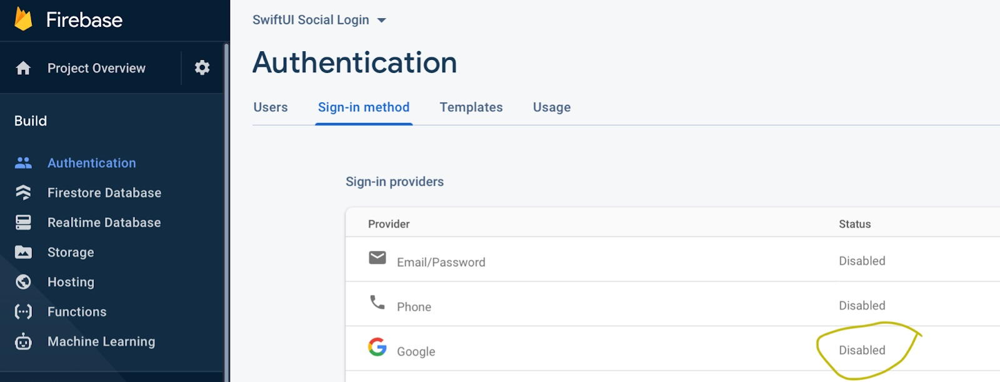
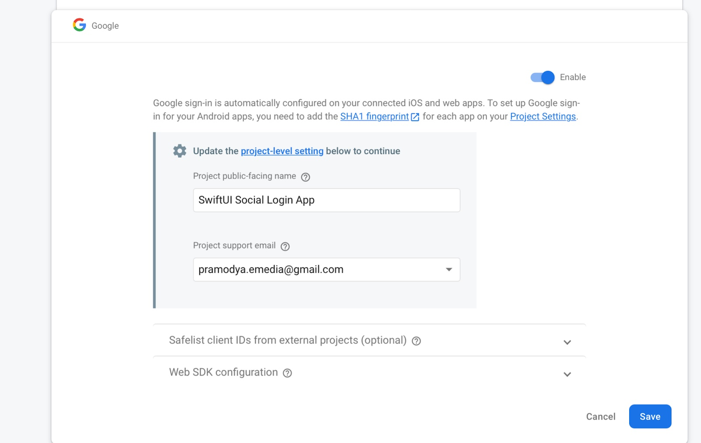
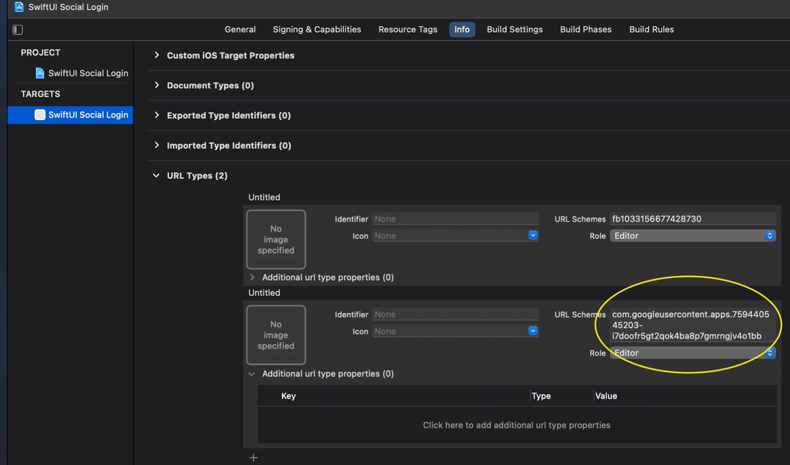

# Social Login implementations in SwiftUI

### Tested on


### Example code

[Find here](https://bitbucket.org/pramodya_emedia/swiftui-social-login/src/master/)

### Content

[App preparation](#app_preparation)

[Apple SignIn](#apple_signIn)

[Facebook SignIn](#facebook_signIn)

[Google SignIn](#google_signIn)

## App preparation

1. Install pods

```
pod 'GoogleSignIn'
pod 'Firebase/Analytics'
pod 'FBSDKLoginKit'
```

2. Files using are as follows
   
   - SwiftUI_Social_LoginApp.swift (depends on project. @main entry point)
   - AppDelegate.swift (for Facebook login)
   - LoginView.swift (for Login Buttons)
   - LoginViewModel.swift (for Login functionality)
   - HomeView.swift (to route after login)
   - CustomSocialLoginButton.swift (custom login button)
    
3. Below buttons will be used to trigger social logins in the **LoginView.swift**

```
GroupBox {
    CustomSocialButton(image: "ic_login_facebook",
                       text: "Sign in with Facebook",
                       color: "blue_dark",
                       action: {
                           vm.signIn(using: .facebook)
                       })
                       .padding(.top, 5)
                
    CustomSocialButton(image: "ic_login_google",
                       text: "Sign in with Google",
                       color: "blue_light",
                       action: {
                          vm.signIn(using: .google)
                       })
                       .padding(.top, 5)
                
    CustomSocialButton(image: "ic_login_apple",
                       text: "Sign in with Apple",
                       color: "black",
                       action: {
                        vm.signIn(using: .apple)
                       })
                       .padding(.top, 5)
}
```

4. An Enum is used to store three different social login providers. Defined in **LoginViewModel.swift**

```
enum SocialLoginType: String {
    case facebook, google, apple
}
```

5. In **LoginViewModel.swift**, signIn method used to perform particular login method as follows

## Apple SignIn

### Adding Capabilities

1. Go to Signing & Capabilities tab and Click on Add Capabilities



2. Search for **Sign in with Apple** and select it
   


3. Now you may see that it is added as follows

### SignIn functionality

In **LoginViewModel.swift**,

1. Import library for Apple Signin

``import AuthenticationServices``

2. Add this code. Remember to conform to **ASAuthorizationControllerDelegate**

```
extension LoginViewModel: ASAuthorizationControllerDelegate {
    func authorizationController(controller: ASAuthorizationController,
                                 didCompleteWithAuthorization authorization: ASAuthorization) {
        if let appleIdCredential = authorization.credential as? ASAuthorizationAppleIDCredential {
            guard let token = appleIdCredential.identityToken?.base64EncodedString()  else {
                return
            }
            
            // MARK: TODO
            /// 1. Set token here
            /// 2. Perform tasks to do after login
            self.token = token
        }
    }
    
    func authorizationController(controller: ASAuthorizationController, didCompleteWithError error: Error) {
        print(error)
    }
    
    private func performAppleSignIn() {
        let provider = ASAuthorizationAppleIDProvider()
        let request = provider.createRequest()
        request.requestedScopes = [.fullName, .email]
        let controller = ASAuthorizationController(authorizationRequests: [request])
        controller.delegate = self
        controller.performRequests()
    }
}
```

3. performAppleSignIn  method will trigger the Apple SignIn request to the Apple server. Here you can set parameters needed to get (Fullname or/and Email)

4. By setting the controller's delegate to self, you can trigger the protocol methods in this file itself.
   
    - didCompleteWithAuthorization
  
    - didCompleteWithError
    
5. Get the token and perform your next tasks as sending the token to the backend

## Facebook SignIn

### Setting up App ID

1. Get the APP_ID from the Facebook App created. (http://developers.facebook.com)

2. In **Info.plist** add the following keys with values

    - Key: **FacebookAppID** 
      
        Value: **APP_ID**
    
    - Key: **FacebookDisplayName**

        Value: **APP_NAME**
    
3. Then add URL Types

    - Go to Project -> Select Target -> Info tab -> Add a URL type by expanding

      
   
      
      
    - URL Schemes: **fb<APP_ID>**
    
### SignIn functionality

1. Create a new file **AppDelegate.swift** and add this code

```
import SwiftUI
import FBSDKLoginKit
 
class AppDelegate: NSObject, UIApplicationDelegate {
    func application(_ application: UIApplication,
                     didFinishLaunchingWithOptions launchOptions: [UIApplication.LaunchOptionsKey : Any]? = nil) -> Bool {
        ApplicationDelegate.shared.application(application, didFinishLaunchingWithOptions: launchOptions)
    }
    
    func application(_ app: UIApplication,
                     open url: URL,  options: [UIApplication.OpenURLOptionsKey : Any] = [:]) -> Bool {
        return ApplicationDelegate.shared.application(app, open: url, options: options)
    }
}
```

2. Add this code to @main file

``@UIApplicationDelegateAdaptor(AppDelegate.self) var appDelegate``

3. Import Facebook library as follows in the **LoginViewModel.swift**

``import FBSDKLoginKit``

4. Add this code

```
extension LoginViewModel {
    private func performFacebookSignIn() {
        let loginManager = LoginManager()
        loginManager.logIn(permissions: ["email", "public_profile"], from: nil) { result, error in
            if let fbLoginResult = result {
                
                if fbLoginResult.isCancelled {
                    return
                }
                
                guard let token = fbLoginResult.token?.tokenString else {
                    return
                }
                
                // MARK: TODO
                /// 1. Set token here
                /// 2. Perform tasks to do after login
                self.token = token
            }
        }
    }
}
```

Here you can set the permission that you need to access.
Check [here](https://developers.facebook.com/docs/permissions/reference/) for the available permission list.

## Google SignIn

### Enable Google SignIn

Go to the Firebase dashboard and enable Google SignIn as follows





### Add GoogleService-Info.plist

1. Download the **GoogleService-Info.plist** provided by Firebase dashboard

2. Drag and drop to the project

### Add URL Type

1. Copy the **REVERSED_CLIENT_ID** from **GoogleService-Info.plist**

2. Then add URL Types

    Go to Project -> Select Target -> Info tab -> Add a URL type by expanding as did when adding Facebook URL scheme

   

### Configure FirebaseApp

Add this code to @main file

``import GoogleSignIn``

```
init() {
    setupGoogleAuthentication()
}
```

```
private func setupGoogleAuthentication() {
    FirebaseApp.configure()
    GIDSignIn.sharedInstance().clientID = FirebaseApp.app()?.options.clientID
}
```

### SignIn functionality

1. Import **GoogleSignIn** library as follows in the **LoginViewModel.swift**

``import GoogleSignIn``

2. Set the delegate in the _init_ method as follows

```
override init() {
    super.init()
    
    GIDSignIn.sharedInstance().delegate = self
}
```

3. Add the code to perform the Google SignIn. Remember to conform to **GIDSignInDelegate**

```
extension LoginViewModel: GIDSignInDelegate {
    func sign(_ signIn: GIDSignIn!, didSignInFor user: GIDGoogleUser!, withError error: Error!) {
        if error == nil {
            guard let token = user.authentication.accessToken else {
                return
            }
            
            // MARK: TODO
            /// 1. Set token here
            /// 2. Perform tasks to do after login
            self.token = token
        } else {
            print(error.debugDescription)
        }
    }
    
    private func performGoogleSignIn() {
        if GIDSignIn.sharedInstance().currentUser == nil {
            GIDSignIn.sharedInstance().presentingViewController = UIApplication.shared.windows.first?.rootViewController
            GIDSignIn.sharedInstance().signIn()
        }
    }
}
```

