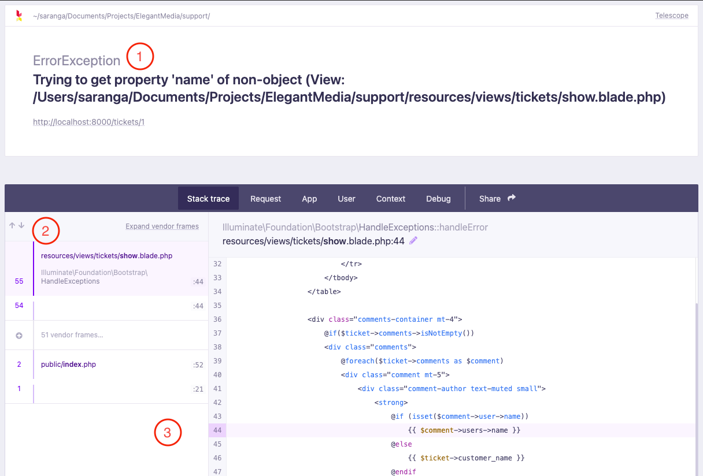
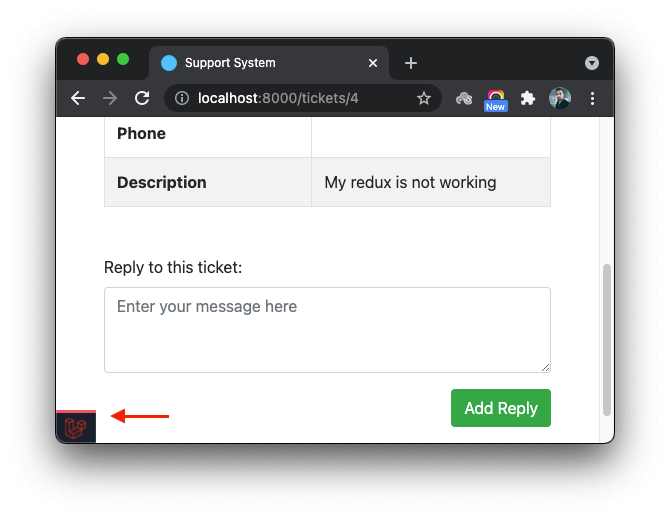
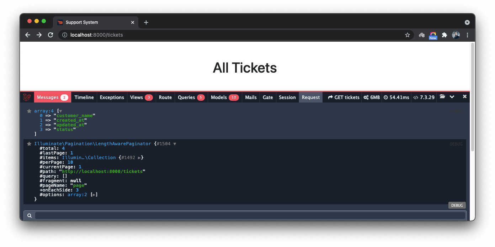

# Understanding, Troubleshooting And Fixing Issues

Errors are an inevitable element of software development. Many mistakes of developers can lead to errors. No matter whether they are at compile time or runtime, developers should be able to understand errors and fix them. This guide aims to discuss how to read the error messages and identify the specific information within them that helps developers to address them to the point. Also, it walks you through few tools that will help to detect and track errors.

## Understanding error messages

Look at the following Laravel error message:

```
Facade\Ignition\Exceptions\ViewException: Trying to get property 'name' of non-object (View: /resources/views/tickets/show.blade.php) in file /resources/views/tickets/show.blade.php on line 44

#0 /resources/views/tickets/show.blade.php(44): Illuminate\Foundation\Bootstrap\HandleExceptions->handleError(8, 'Trying to get p...', '/Users/saranga/...', 42, Array)
#1 /vendor/laravel/framework/src/Illuminate/Filesystem/Filesystem.php(107): require('/Users/saranga/...')
#2 /vendor/laravel/framework/src/Illuminate/Filesystem/Filesystem.php(108): Illuminate\Filesystem\Filesystem::Illuminate\Filesystem\{closure}()
#3 /vendor/laravel/framework/src/Illuminate/View/Engines/PhpEngine.php(58): Illuminate\Filesystem\Filesystem->getRequire('/Users/saranga/...', Array)
#4 /vendor/laravel/framework/src/Illuminate/View/Engines/CompilerEngine.php(61): Illuminate\View\Engines\PhpEngine->evaluatePath('/Users/saranga/...', Array)
#5 /vendor/facade/ignition/src/Views/Engines/CompilerEngine.php(37): Illuminate\View\Engines\CompilerEngine->get('/Users/saranga/...', Array)
#6 /vendor/laravel/framework/src/Illuminate/View/View.php(139): Facade\Ignition\Views\Engines\CompilerEngine->get('/Users/saranga/...', Array)
#7 /vendor/laravel/framework/src/Illuminate/View/View.php(122): Illuminate\View\View->getContents()
#8 /vendor/laravel/framework/src/Illuminate/View/View.php(91): Illuminate\View\View->renderContents()
#9 /vendor/laravel/framework/src/Illuminate/Http/Response.php(69): Illuminate\View\View->render()
#10 /vendor/laravel/framework/src/Illuminate/Http/Response.php(35): Illuminate\Http\Response->setContent(Object(Illuminate\View\View))
#11 /vendor/laravel/framework/src/Illuminate/Routing/Router.php(793): Illuminate\Http\Response->__construct(Object(Illuminate\View\View), 200, Array)
#12 /vendor/laravel/framework/src/Illuminate/Routing/Router.php(763): Illuminate\Routing\Router::toResponse(Object(Illuminate\Http\Request), Object(Illuminate\View\View))
#13 /vendor/laravel/framework/src/Illuminate/Routing/Router.php(695): Illuminate\Routing\Router->prepareResponse(Object(Illuminate\Http\Request), Object(Illuminate\View\View))
#14 /vendor/laravel/framework/src/Illuminate/Pipeline/Pipeline.php(128): Illuminate\Routing\Router->Illuminate\Routing\{closure}(Object(Illuminate\Http\Request))
#15 /vendor/laravel/framework/src/Illuminate/Routing/Middleware/SubstituteBindings.php(50): Illuminate\Pipeline\Pipeline->Illuminate\Pipeline\{closure}(Object(Illuminate\Http\Request))
#16 /vendor/laravel/framework/src/Illuminate/Pipeline/Pipeline.php(167): Illuminate\Routing\Middleware\SubstituteBindings->handle(Object(Illuminate\Http\Request), Object(Closure))
#17 /vendor/laravel/framework/src/Illuminate/Foundation/Http/Middleware/VerifyCsrfToken.php(78): Illuminate\Pipeline\Pipeline->Illuminate\Pipeline\{closure}(Object(Illuminate\Http\Request))
#18 /vendor/laravel/framework/src/Illuminate/Pipeline/Pipeline.php(167): Illuminate\Foundation\Http\Middleware\VerifyCsrfToken->handle(Object(Illuminate\Http\Request), Object(Closure))
#19 /vendor/laravel/framework/src/Illuminate/View/Middleware/ShareErrorsFromSession.php(49): Illuminate\Pipeline\Pipeline->Illuminate\Pipeline\{closure}(Object(Illuminate\Http\Request))
#20 /vendor/laravel/framework/src/Illuminate/Pipeline/Pipeline.php(167): Illuminate\View\Middleware\ShareErrorsFromSession->handle(Object(Illuminate\Http\Request), Object(Closure))
#21 /vendor/laravel/framework/src/Illuminate/Session/Middleware/StartSession.php(121): Illuminate\Pipeline\Pipeline->Illuminate\Pipeline\{closure}(Object(Illuminate\Http\Request))
#22 /vendor/laravel/framework/src/Illuminate/Session/Middleware/StartSession.php(64): Illuminate\Session\Middleware\StartSession->handleStatefulRequest(Object(Illuminate\Http\Request), Object(Illuminate\Session\Store), Object(Closure))
#23 /vendor/laravel/framework/src/Illuminate/Pipeline/Pipeline.php(167): Illuminate\Session\Middleware\StartSession->handle(Object(Illuminate\Http\Request), Object(Closure))
#24 /vendor/laravel/framework/src/Illuminate/Cookie/Middleware/AddQueuedCookiesToResponse.php(37): Illuminate\Pipeline\Pipeline->Illuminate\Pipeline\{closure}(Object(Illuminate\Http\Request))
#25 /vendor/laravel/framework/src/Illuminate/Pipeline/Pipeline.php(167): Illuminate\Cookie\Middleware\AddQueuedCookiesToResponse->handle(Object(Illuminate\Http\Request), Object(Closure))
#26 /vendor/laravel/framework/src/Illuminate/Cookie/Middleware/EncryptCookies.php(67): Illuminate\Pipeline\Pipeline->Illuminate\Pipeline\{closure}(Object(Illuminate\Http\Request))
#27 /vendor/laravel/framework/src/Illuminate/Pipeline/Pipeline.php(167): Illuminate\Cookie\Middleware\EncryptCookies->handle(Object(Illuminate\Http\Request), Object(Closure))
#28 /vendor/laravel/framework/src/Illuminate/Pipeline/Pipeline.php(103): Illuminate\Pipeline\Pipeline->Illuminate\Pipeline\{closure}(Object(Illuminate\Http\Request))
#29 /vendor/laravel/framework/src/Illuminate/Routing/Router.php(697): Illuminate\Pipeline\Pipeline->then(Object(Closure))
#30 /vendor/laravel/framework/src/Illuminate/Routing/Router.php(672): Illuminate\Routing\Router->runRouteWithinStack(Object(Illuminate\Routing\Route), Object(Illuminate\Http\Request))
#31 /vendor/laravel/framework/src/Illuminate/Routing/Router.php(636): Illuminate\Routing\Router->runRoute(Object(Illuminate\Http\Request), Object(Illuminate\Routing\Route))
#32 /vendor/laravel/framework/src/Illuminate/Routing/Router.php(625): Illuminate\Routing\Router->dispatchToRoute(Object(Illuminate\Http\Request))
#33 /vendor/laravel/framework/src/Illuminate/Foundation/Http/Kernel.php(166): Illuminate\Routing\Router->dispatch(Object(Illuminate\Http\Request))
#34 /vendor/laravel/framework/src/Illuminate/Pipeline/Pipeline.php(128): Illuminate\Foundation\Http\Kernel->Illuminate\Foundation\Http\{closure}(Object(Illuminate\Http\Request))
#35 /vendor/laravel/framework/src/Illuminate/Foundation/Http/Middleware/TransformsRequest.php(21): Illuminate\Pipeline\Pipeline->Illuminate\Pipeline\{closure}(Object(Illuminate\Http\Request))
#36 /vendor/laravel/framework/src/Illuminate/Foundation/Http/Middleware/ConvertEmptyStringsToNull.php(31): Illuminate\Foundation\Http\Middleware\TransformsRequest->handle(Object(Illuminate\Http\Request), Object(Closure))
#37 /vendor/laravel/framework/src/Illuminate/Pipeline/Pipeline.php(167): Illuminate\Foundation\Http\Middleware\ConvertEmptyStringsToNull->handle(Object(Illuminate\Http\Request), Object(Closure))
#38 /vendor/laravel/framework/src/Illuminate/Foundation/Http/Middleware/TransformsRequest.php(21): Illuminate\Pipeline\Pipeline->Illuminate\Pipeline\{closure}(Object(Illuminate\Http\Request))
#39 /vendor/laravel/framework/src/Illuminate/Foundation/Http/Middleware/TrimStrings.php(40): Illuminate\Foundation\Http\Middleware\TransformsRequest->handle(Object(Illuminate\Http\Request), Object(Closure))
#40 /vendor/laravel/framework/src/Illuminate/Pipeline/Pipeline.php(167): Illuminate\Foundation\Http\Middleware\TrimStrings->handle(Object(Illuminate\Http\Request), Object(Closure))
#41 /vendor/laravel/framework/src/Illuminate/Foundation/Http/Middleware/ValidatePostSize.php(27): Illuminate\Pipeline\Pipeline->Illuminate\Pipeline\{closure}(Object(Illuminate\Http\Request))
#42 /vendor/laravel/framework/src/Illuminate/Pipeline/Pipeline.php(167): Illuminate\Foundation\Http\Middleware\ValidatePostSize->handle(Object(Illuminate\Http\Request), Object(Closure))
#43 /vendor/laravel/framework/src/Illuminate/Foundation/Http/Middleware/PreventRequestsDuringMaintenance.php(86): Illuminate\Pipeline\Pipeline->Illuminate\Pipeline\{closure}(Object(Illuminate\Http\Request))
#44 /vendor/laravel/framework/src/Illuminate/Pipeline/Pipeline.php(167): Illuminate\Foundation\Http\Middleware\PreventRequestsDuringMaintenance->handle(Object(Illuminate\Http\Request), Object(Closure))
#45 /vendor/fruitcake/laravel-cors/src/HandleCors.php(38): Illuminate\Pipeline\Pipeline->Illuminate\Pipeline\{closure}(Object(Illuminate\Http\Request))
#46 /vendor/laravel/framework/src/Illuminate/Pipeline/Pipeline.php(167): Fruitcake\Cors\HandleCors->handle(Object(Illuminate\Http\Request), Object(Closure))
#47 /vendor/fideloper/proxy/src/TrustProxies.php(57): Illuminate\Pipeline\Pipeline->Illuminate\Pipeline\{closure}(Object(Illuminate\Http\Request))
#48 /vendor/laravel/framework/src/Illuminate/Pipeline/Pipeline.php(167): Fideloper\Proxy\TrustProxies->handle(Object(Illuminate\Http\Request), Object(Closure))
#49 /vendor/laravel/framework/src/Illuminate/Pipeline/Pipeline.php(103): Illuminate\Pipeline\Pipeline->Illuminate\Pipeline\{closure}(Object(Illuminate\Http\Request))
#50 /vendor/laravel/framework/src/Illuminate/Foundation/Http/Kernel.php(141): Illuminate\Pipeline\Pipeline->then(Object(Closure))
#51 /vendor/laravel/framework/src/Illuminate/Foundation/Http/Kernel.php(110): Illuminate\Foundation\Http\Kernel->sendRequestThroughRouter(Object(Illuminate\Http\Request))
#52 /public/index.php(52): Illuminate\Foundation\Http\Kernel->handle(Object(Illuminate\Http\Request))
#53 /server.php(21): require_once('/Users/saranga/...')
#54 {main}
```



Laravel exception page visualizes the above error message information in an easy-to-understand format. Let's try to analyze the details to understand the error before attempting to fix it or search for a solution.
Pay your attention to the following 3 pieces of information:

1. The error message
```
Trying to get property 'name' of non-object
```
This is where you need to start reading the error. It says what exactly went wrong. Also, it gives you specific information to understand what went wrong. In this particular error, it says your code is trying to access the value of `name` property of a non-object variable.  The referring variable could be holding another type of data or null.

2. The file or class the error occurred
The error message also shows you the exact file in your project which has the faulty code. In this case, the fault is in the view file `resources/views/tickets/show.blade.php`

3. The line of the code produces the error
It also points you to the exact line where the faulty code is. With the styled web UI, Laravel shows the faulty line in a code editor view. When you analyze an error message that appeared on a terminal, it indicates the number of the faulty line separated from the filename by a colon;
```
resources/views/tickets/show.blade.php:44
```

## Troubleshooting

Troubleshooting is the process of finding the reasons behind application errors. The process starts with understanding the error message, which we discussed above. There are many methods you can use to troubleshoot your Laravel application. Let's go through them one by one.

### Using PHP functions to check values of variables

Code troubleshooting or the debugging process starts with examining the values of the variables used in your code. If a variable does not contain the expected value at a certain place of the code, there is a higher chance it causes an error. You can use `var_dump()` and `print_r()` functions to check the value of a variable.

```php
<?php

$fruits = ['mango', 'banana', 'tangerine', 'grapes'];
$totalFruits = count($fruits);

var_dump($fruits);
```

Running this code your will get the output:

```
array(4) {
  [0]=>
  string(5) "mango"
  [1]=>
  string(6) "banana"
  [2]=>
  string(9) "tangerine"
  [3]=>
  string(6) "grapes"
}
```

Using `print_r()` instead of `var_dump()` would give you a similar result, with different formatting.

```
Array
(
    [0] => mango
    [1] => banana
    [2] => tangerine
    [3] => grapes
)
```

You may use `die()` function to stop the execution immediately. This is helpful when you don't want the output of `var_dump()` or `print_r()` disappear among other outputs produced by the PHP script.

```php
<?php

$fruits = ['mango', 'banana', 'tangerine', 'grapes'];
$totalFruits = count($fruits);

print_r($fruits); die();

foreach($fruits as $fruit) {
    echo $fruit . "\n";
}
```

Though their outputs look similar, there are few differences between `var_dump()` and `print_r()`. The `var_dump()` shows the data type of the values while `print_r()` doesn't. The output of `print_r()` is more human readable than `var_dump()`. Also, `print_r()` doesn't output anything on certain values such as **NULL**, **empty string** and **false**.
If you want a string representation of a variable, you can use `var_export()`.

`var_dump()` and `print_r()` are good for examining the simple values. Take look at the following output of calling `var_dump()` on an object with many properties and methods.

```
object(App\Models\Ticket)#1521 (28) { ["with":protected]=> array(2) { [0]=> string(8) "comments" [1]=> string(13) "comments.user" } ["connection":protected]=> string(5) "mysql" ["table":protected]=> string(7) "tickets" ["primaryKey":protected]=> string(2) "id" ["keyType":protected]=> string(3) "int" ["incrementing"]=> bool(true) ["withCount":protected]=> array(0) { } ["preventsLazyLoading"]=> bool(false) ["perPage":protected]=> int(15) ["exists"]=> bool(true) ["wasRecentlyCreated"]=> bool(false) ["attributes":protected]=> array(9) { ["id"]=> int(4) ["customer_name"]=> string(11) "Dan Abermov" ["email"]=> string(16) "dan@facebook.com" ["phone"]=> NULL ["description"]=> string(23) "My redux is not working" ["ref"]=> string(18) "2372462hwh73473sju" ["status"]=> int(0) ["created_at"]=> string(19) "2021-07-21 09:17:56" ["updated_at"]=> string(19) "2021-07-21 09:17:56" } ["original":protected]=> array(9) { ["id"]=> int(4) ["customer_name"]=> string(11) "Dan Abermov" ["email"]=> string(16) "dan@facebook.com" ["phone"]=> NULL ["description"]=> string(23) "My redux is not working" ["ref"]=> string(18) "2372462hwh73473sju" ["status"]=> int(0) ["created_at"]=> string(19) "2021-07-21 09:17:56" ["updated_at"]=> string(19) "2021-07-21 09:17:56" } ["changes":protected]=> array(0) { } ["casts":protected]=> array(0) { } ["classCastCache":protected]=> array(0) { } ["dates":protected]=> array(0) { } ["dateFormat":protected]=> NULL ["appends":protected]=> array(0) { } ["dispatchesEvents":protected]=> array(0) { } ["observables":protected]=> array(0) { } ["relations":protected]=> array(1) { ["comments"]=> object(Illuminate\Database\Eloquent\Collection)#1522 (1) { ["items":protected]=> array(0) { } } } ["touches":protected]=> array(0) { } ["timestamps"]=> bool(true) ["hidden":protected]=> array(0) { } ["visible":protected]=> array(0) { } ["fillable":protected]=> array(0) { } ["guarded":protected]=> array(1) { [0]=> string(1) "*" } }
```

It's not really helping to understand the values of the properties of the object. You need better tools than `var_dump()` and `print_r()` to debug complex scenarios.


### Using Laravel Tinker (PsySH) for debugging

[Laravel Tinker](https://github.com/laravel/tinker) is a powerful REPL (Read-Evaluate-Print-Loop) for the Laravel framework. It allows you to accesses classes in your project, interact with them, executes commands, and check the information related to the output. Tinker is built on [PsySH](https://psysh.org) which is a runtime developer console and interactive debugger for PHP.

Please read the [Guide To Laravel Tinker](guide-to-laravel-tinker.md) to understand how to use it for debugging.


### Monitor Laravel applications with Laravel Debug Bar

[Laravel Debugbar](https://github.com/barryvdh/laravel-debugbar) is a wrapper to the popular package [PHP Debug Bar](http://phpdebugbar.com). It includes a ServiceProvider to register the Debugbar and attach it to the output of the Laravel application.

Install it using `composer` to use it within your project.

```sh
composer require barryvdh/laravel-debugbar --dev
```

Then enable the debug mode in `.env`:

```
APP_DEBUG=true
```

When you refresh the page, you will see the debug bar icon at the bottom of the browser window.



Clicking on the icon will open the Debugbar.

Now the setup is over. Pass the variables to `debug()` helper to send them to the Debugbar.

```php
public function index(Request $request)
{
    $ticketsQuery = Ticket::query();

    $q = $request->query('q');
    $sortColumn = $request->query('sort', 'created_at');
    $sortDir = $request->query('sort_dir', 'desc');
    $sortableColumns = [
        'customer_name',
        'created_at',
        'updated_at',
        'status',
    ];

    debug($sortableColumns);

    // Searching
    if ($q) {
        $ticketsQuery->where('ref', 'LIKE', "%$q%");
    }

    // Sorting
    if (in_array($sortColumn, $sortableColumns)) {
        $ticketsQuery->orderBy($sortColumn, $sortDir);
    }

    $tickets = $ticketsQuery->paginate($request->query('per_page', 10));

    // eval(\Psy\sh());
    debug($tickets);

    return view('tickets.index', [
        'tickets' => $tickets,
    ]);
}
```

They will be displayed in the **Messages** tab.



Laravel Debugbar comes with several **Collectors** to collect information from different parts of the application. It uses tabs to show the details collected by the **Collectors**.

- **Timeline** - This shows the time taken by the application at each stage.
- **Exceptions** - This shows the details of the exceptions thrown during the application execution.
- **Views** - Lists the view files utilized to render the output.
- **Route** - Shows the details of resolving the route.
- **Queries** - Lists the database queries made by the application.
- **Models** - Lists the models used while processing the request.
- **Mails** - Shows the emails sent by the application.
- **Gate** - This shows the gate used to authorize the user.
- **Session** - Shows current session details.
- **Request** - Shows the current request information.

Make sure not to install the **Debugbar** when deploying your application to production as it exposes sensitive information about your application.

### Monitor Laravel applications with Telescope

Telescope is another great companion to your local Laravel development environment. Similar to Laravel Debugbar, Telescope provides insight into the requests coming into your application, exceptions, log entries, database queries, queued jobs, mail, notifications, cache operations, scheduled tasks, variable dumps, and more.

Telescope has **Watchers** in place of **Collectors** of Debugbar.

Please read the [Official Documentation Of Telescope](https://laravel.com/docs/8.x/telescope) to understand how to install and use it.

After the installation, Telescope is available on RUL `http://localhost:8000/telescope` if your application is running on `http://localhost:8000`. You can change this by setting the value of  `TELESCOPE_PATH` key on `.env`:

```
TELESCOPE_PATH=monitor
```

Unlike Laravel Debugbar, you can use Telescope even after the project is deployed to production. In order to ensure the security, you can [limit the access to Telescope dashboard](https://laravel.com/docs/8.x/telescope#dashboard-authorization) to a selected set of users in your application.

Telescope can be configured to access using a subdomain on production servers. Set the value for `TELESCOPE_DOMAIN` key on `.env` to do so:

  ```
  TELESCOPE_DOMAIN=telescope.example.com
  ```

Exercise: Install Telescope in a Laravel application and monitor the details recorded over time by performing various actions on project.


### Monitor Laravel applications with Sentry

Sentry is an error monitoring tool to monitor the applications in production. It is a SaaS solution that has an extension for Laravel. Sentry comes in between the exception handling process of Laravel and sends the exception details to its servers. Sentry makes sure developers get notified of application errors even when the application users do not report them manually.

[Sentry's documentation](https://docs.sentry.io/platforms/php/guides/laravel/) provides comprehensive details on how to install and use it. Please read the guide, install it and get yourself familiarise with it by throwing some test exceptions. You can create a free account and it should be sufficient for most of the cases.

- [Issues](https://docs.sentry.io/product/issues/)
- [Issue Details](https://docs.sentry.io/product/issues/issue-details/)
- [Issue Status](https://docs.sentry.io/product/issues/states-triage/)
- [Alerts](https://docs.sentry.io/product/alerts/)
- [Notifications](https://docs.sentry.io/product/alerts/notifications/)


## Using browser consoles and basic web inspector usage

Browser consoles are the best companions of web developers when it comes to troubleshooting front-end issues. Almost every web browser has a developer console.

### Log data to console

Web developers often log messages to the Console to make sure that their JavaScript is working as expected. To log a message, you insert an expression like `console.log('Hello, Console!')` into your JavaScript. For example, suppose that you're in the process of writing the HTML and JavaScript for a page:


```html
<!doctype html>
<html>
  <head>
    <title>Console Demo</title>
  </head>
  <body>
    <h1>Hello, World!</h1>
    <script>
      console.log('Loading!');
      const h1 = document.querySelector('h1');
      console.log(h1.textContent);
      console.assert(document.querySelector('h2'), 'h2 not found!');
      const artists = [
        {
          first: 'René',
          last: 'Magritte'
        },
        {
          first: 'Chaim',
          last: 'Soutine'
        },
        {
          first: 'Henri',
          last: 'Matisse'
        }
      ];
      console.table(artists);
      setTimeout(() => {
        h1.textContent = 'Hello, Console!';
        console.log(h1.textContent);
      }, 3000);
    </script>
  </body>
</html>
```

This is what the Console looks like after loading the page and waiting 3 seconds. Try to figure out which lines of code caused the browser to log the messages.


Web developers log messages for 2 general reasons:

- Making sure that code is executing in the right order.
- Inspecting the values of variables at a certain moment in time.

### Running JavaScript

The Console is also a REPL. You can run JavaScript in the Console to interact with the page that you're inspecting. For example, Image below shows the Console next to web page:


And this image shows the same page after using the Console to change the page's title.


Modifying the page from the Console is possible because the Console has full access to the page's `window`. DevTools has a few convenience functions that make it easier to inspect a page. For example, suppose that your JavaScript contains a function called `hideModal`. Running `debug(hideModal)` pauses your code on the first line of `hideModal` the next time that it's called. See [Console Utilities API Reference](https://developer.chrome.com/docs/devtools/console/utilities/) to see the full list of utility functions.

When you run JavaScript you don't have to interact with the page. You can use the Console to try out new code that's not related to the page. For example, suppose you just learned about the built-in JavaScript Array method `map()`, and you want to experiment with it. The Console is a good place to try out the function.

### Debugging JavaScript

Study the following guides provided by Google to understand how to use the Google Chrome Developer Tools to debug your JavaScript code.

- [Debug JavaScript](https://developer.chrome.com/docs/devtools/javascript/)
- [Pause your code with breakpoints](https://developer.chrome.com/docs/devtools/javascript/breakpoints/)
- [JavaScript debugging reference](https://developer.chrome.com/docs/devtools/javascript/reference/)
