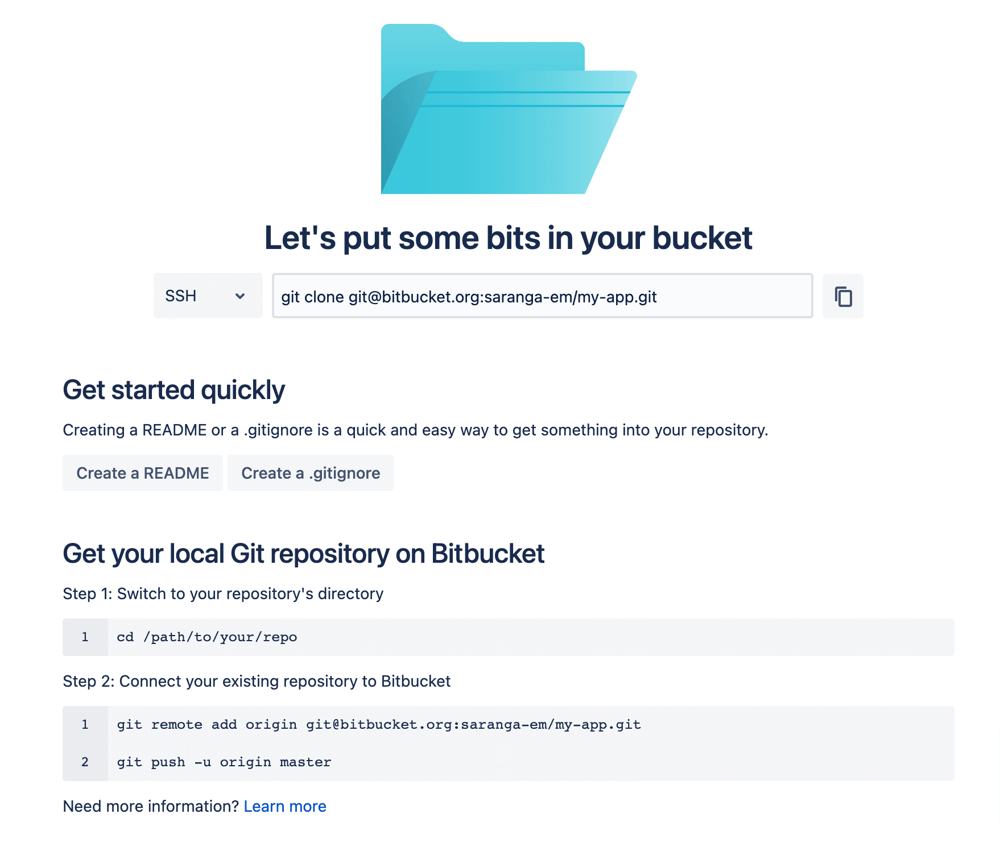

# Add A Laravel Project To BitBucket

Once after creating your Laravel project in your computer. You need to upload it to the [BitBucket](https://bitbucket.org/). BitBucket is a [GIT](https://en.wikipedia.org/wiki/Git) based source code management system.

## Setup access over SSL

Your computer need to communicate with BitBucket to upload project. In order to authorize this communication, you need to generate a secure key at your computer and share it with BitBucket. Follow the guide below to do this.

[Set up an SSH key for BitBUcket](https://support.atlassian.com/bitbucket-cloud/docs/set-up-an-ssh-key/)

## Create a new repository

Before you upload the code to BitBucket you need to create a repository. Follow [this guide from Bitbucket documentation](https://support.atlassian.com/bitbucket-cloud/docs/create-a-repository-in-bitbucket-cloud/) to create a new repository.

Once after you create your repository it will look like below:



## Prepare your project for uploading

Before uploading your project to the BitBucket it should be a GIT repository. To initialise a GIT repository, move to your project folder in a terminal and run:

```
cd my-app
git init
```

`git init` command will create an empty repository inside your project folder.

Add all files in your project to the GIT repository you created:

```
git add .
```

Do your first commit:

```
git commit -m "Initial Commit"
```

## Upload to BitBucket

Add your newly created BitBucket repository as a remote to your local GIT repository.

```
git remote add origin git@bitbucket.org:yourname/my-app.git
```

Note that the URL here `git@bitbucket.org:yourname/my-app.git` should be replaced with the URL of your BitBucket repository. You can copy it from the screen you get immediately after creating the repository. See above image.

Then push your code to BitBucket

```
git push -u origin master
```

Please read the following documents to learn more about GIT.

- [Learn Git with Bitbucket Cloud](https://www.atlassian.com/git/tutorials/learn-git-with-bitbucket-cloud)
