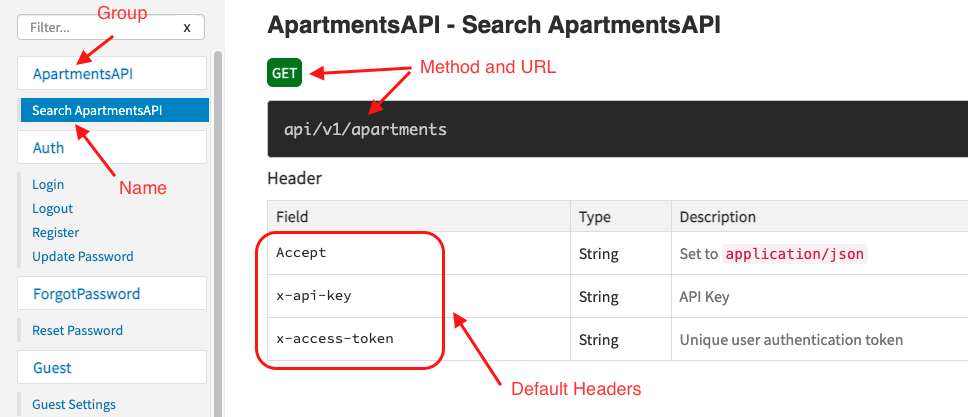
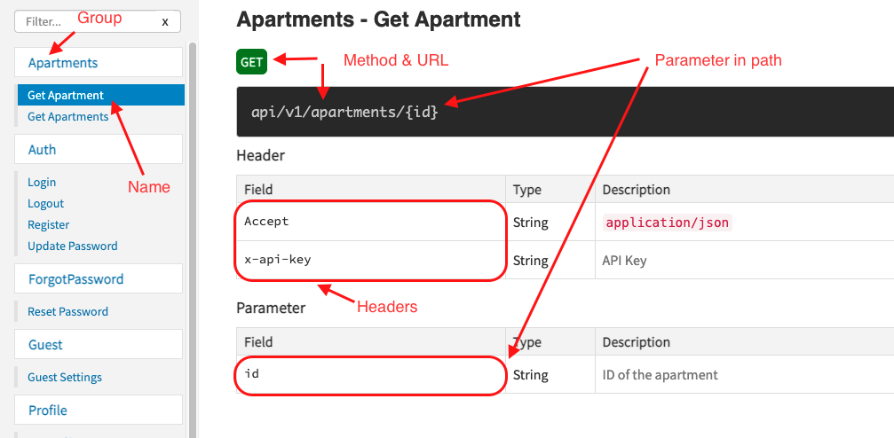

# API Development Guide

Developing APIs for mobile applications at Elegant Media is backed by the package [Laravel API Helpers](https://bitbucket.org/elegantmedia/laravel-api-helpers/src/master/). Please read the **readme.md** file of this package to understand how to install and use it with your project. This guide focuses on providing extensive details and guidelines on utilising this package to develop the API with minimum issues.

## Where To Start?

[Laravel API Helpers](https://bitbucket.org/elegantmedia/laravel-api-helpers/src/master/) is automatically installed when you create your [Oxygen](https://bitbucket.org/elegantmedia/oxygen-laravel/src/master/) project. Follow the steps below to get the API up on your project.

### Check your .env configurations

Open your project's `.env.` file and find the `API_ACTIVE` parameter. Set it to `true`

```
API_ACTIVE=true
```

Set API Key. This should be a random string contains letters, numbers and symbols with minimum length of 32 characters. If you have **OpenSSL** installed, run following command in a terminal to generate a random string.

```
$ openssl rand -base64 32
sB5ROi64SAEhZz3q0N2aTzgDtDDrB2ZF5b667Nr8efQ=
```

In case you don't have **OpenSSL** installed, you may type one :)

Now find the `API_KEY` parameter on the `.env` file and set it to the key you generated.

```
# One or more API Keys: Separate multiple keys with a ','
API_KEY="sB5ROi64SAEhZz3q0N2aTzgDtDDrB2ZF5b667Nr8efQ="
```

As the comment suggests, you may use more than one API keys separated by comma. it would be a good practice to use one API key for the staging and another API key for production.

You will also need to check the local URL of your project on `.env` file. See if value of the `APP_URL` parameter matches the URL you use to access your project locally. This could be something like `http://myproject.test` if you use the `artisan` built in server with command `php artisan serve`, or something like `http://myproject.test`, if you are using a virtual host with Apache. Set `APP_URL` accordingly.

```
APP_URL=http://myproject.test
```

### Prepare for deploying the project to *Sandbox* server

In order for documents to correctly generate the URLs of the API endpoints for the staging (sandbox) environment, you need to set the base URL of the staging server in `.env` file.

```
APP_SANDBOX_URL=https://myproject.sandbox10.preview.cx
```

**IMPORTANT:** The URL used above is only to provide you an example. The actual URL of the staging environment of your project can be obtained by deploying it to a one of the staging servers. Read [Sandbox Deployment Guide](../deployments/sandbox-deployment-guide.md) to learn more about deploying a project to sandbox.

## Generating The API Docs

When you are done with setting up the environment. Go ahead and try generating the API docs for the default API endpoints come with a fresh Oxygen project.

```
php artisan generate:docs
```

This will visit each and every API endpoint in your project and try to include their signature and response in multiple files that are useful when working with the API. These documents include:

- [Swagger 2.0 Specification](https://swagger.io/docs/specification/2-0/basic-structure/) of the API in YAML
- [Swagger 2.0 Specification](https://swagger.io/docs/specification/2-0/basic-structure/) of the API in JSON
- [Postman Environment](https://learning.postman.com/docs/sending-requests/managing-environments/) (LOCAL)
- [Postman Environment](https://learning.postman.com/docs/sending-requests/managing-environments/) (SANDBOX)
- [Postman Collection](https://learning.postman.com/docs/getting-started/importing-and-exporting-data/#importing-api-specifications) (JSON)
- [Postman Collection](https://learning.postman.com/docs/getting-started/importing-and-exporting-data/#importing-api-specifications) (YAML)

Outcome of successful generation of API documents on a fresh Oxygen project should looks like this:

```
% php artisan generate:docs
Sending POST request to http://myproject.test/api/v1/register...
Sending POST request to http://myproject.test/api/v1/login...
Sending POST request to http://myproject.test/api/v1/password/email...
Sending GET request to http://myproject.test/api/v1/guests...
Sending GET request to http://myproject.test/api/v1/logout...
Sending GET request to http://myproject.test/api/v1/profile...
Sending PUT request to http://myproject.test/api/v1/profile...
Sending POST request to http://myproject.test/api/v1/avatar...
Sending POST request to http://myproject.test/api/v1/password/edit...
Sending GET request to http://myproject.test/api/v1/settings...
Sending GET request to http://myproject.test/api/v1/settings/{key}...

API Doc Builder found 12 defined APICalls.
+-------------------------------+----------------------------------------------------+
| Generated File                | Path                                               |
+-------------------------------+----------------------------------------------------+
| APIDoc Files                  | /resources/docs/apidoc/auto_generated              |
| ---                           | ---                                                |
| Swagger v2 (YAML)             | /public_html/docs/swagger.yml                      |
| Swagger v2 (JSON)             | /public_html/docs/swagger.json                     |
| Postman Environment (LOCAL)   | /public_html/docs/postman_environment_local.json   |
| Postman Environment (SANDBOX) | /public_html/docs/postman_environment_sandbox.json |
| ---                           | ---                                                |
| Postman Collection (JSON)     | /public_html/docs/postman_collection.json          |
| Postman Collection (YAML)     | /public_html/docs/postman_collection.yml           |
+-------------------------------+----------------------------------------------------+


ApiDoc compiled. Done.
```

## Identifying API Endpoints To Add

Best place to start identifying the required API endpoints for a mobile application is to study the mobile app design with respect to the FRD (Functional Requirement Document / Milestone Document). Focus on following points to identify the APIs and their behaviour.


### Getting a list of items

Find out what sort of data is visible on the screen. If it shows a list of data you will need to implement an API endpoint to **get** a collection of  entities to build up the list.

Always use a `GET` request for retrieving data. When particular API endpoint returns a list of items, think of it as a collection. Collection always has a **plural** name. Use this understanding to select the URL for the endpoint.


Eg:
- **List of users:** `GET` */users*
- **List of orders:** `GET` */orders*
- **List of categories:** `GET` */categories*

Usually, when there is a collection of items in an app, there is high chance more items added to such collections later on by the application users. This means the size of the collection can grow with the time. In such cases, the API should be able to handle it. Usually this is handled by **pagination**. Laravel uses `page` and `per_page` [query parameters](https://en.wikipedia.org/wiki/Query_string) to handle [pagination](https://laravel.com/docs/8.x/pagination). Use the same for your API as well.

Eg:
- **List of users:** `GET` */users?page=3&per_page=20*

Above example shows the query string to get the items for third page with every page having 20 items.

Besides the pagination, these collections should be able to be searched, filtered or sorted. Your API should support these features. You may use query parameters `q`, `sort` and `sort_dir` respectively for passing search keywords, sorting field and sorting direction to the API request.

Eg:
- **List of users:** `GET` */users?q=smith&sort=age&sort_dir=desc*

Above example shows the query parameters to search users collection with the word `smith` while sorting the result by `age` field in descending order.

Moreover to this, if you allow filtering the items by a particular field or fields, you need to add them as additional query parameters. Feel free to add as many filters as it requires get the required outcome. Of course you need to handle all the filters when you retrieve the data fro the database inside your API controller.

Eg:
- `GET` */users?role=admin*
- `GET` */orders?payment=paid&from=2021-03-01*

In first example, we filter the users collection for the `admin` role. And in second example we filter for the paid orders created after the 1st of March 2021.

Putting it all together, the format of a real API request may look like this.


`GET` */users?page=3&per_page=20&q=smith&sort=age&sort_dir=desc&role=student*


### Getting a single item

If some screen shows the details of one entity, you might need to provide an API endpoint to retrieve a single object of that entity.

Eg:
- **User profile:** `GET` */users/24*
- **Order details:** `GET` */orders/5*

Note how it follows the pattern `/collection/{id}`. Basically what we are doing here is taking one item out of the collection. `/users` is the collection of users. To get the user with id `24`, we use the URL `/users/24`. Same goes for orders with `/orders/5`.

Read more about these URL patterns in [Routing & URLs](../laravel/best-practices/routing-and-urls.md)

However handy thing to keep in mind is that if the details of the single item is displayed after selecting an item from a list, getting the item from that list may save resources over loading it again with a new API endpoint.

It's unlikely you would use query parameters with a request to get a single item. Also do not use `POST` or `PUT` methods to retrieve data.

### Adding new data

Adding new data or creating new entities include the scenarios such as registering a new user, creating a post, adding a comment, creating an order, adding an item to a shopping cart etc. Most of these can be considered as adding an item to a collection. Use `POST` method with the input data in request body for this kind of API endpoints.

Eg:
- `POST` */register*
- `POST` */login*
- `POST` */users*
- `POST` */orders*

The data for these endpoints is sent in request body as `formdata` or in `json` format. Note that even though we are adding a single item to the collection URL still in plural format. `/users` is the access point for **users** collection and `POST` method indicates that we are adding data to this collection. Same goes for `/orders` too. Avoid routes such as `/users/create`, `/orders/add`, `/orders/new`. No need to add such suffixes to indicate the API endpoint is for creating data as `POST` method indicates it. However `/login` and `/register` are special cases. They do not represent collections. Still they accept data for creating something new. Which is the user session (access token) for `/login` and a new user account for `/register`.


### Updating data

Once new items are created, often it requires them to be edited or updated. Updating user details, editing a post or a comment, update product details or quantity are few such scenarios you need to update the existing data.

While this kind of changes are often carried out on a single item, their URL ends with a singular pattern. `PUT` method is used for updating data.

Eg:
- **Update user details:** `PUT` */users/6*
- **Update product details:** `PUT` */products/84*

Note how the URL is decided for updating user with the id `6` from the `/users` collection. Same goes for product with id `84` in `/products` collection.

### Delete data

Deleting an item is done with `DELETE` http method.

Eg:
- **Delete user:** `DELETE` */users/6*
- **Delete product:** `DELETE` */products/84*

If there are associated entities depend on the item being deleted, you might need to delete them as well. It is a good practice to handle it from the backend instead of expecting API consumer (mobile app) to delete one by one.

However if there is a requirement to delete multiple items, consider providing a separate API endpoint which uses `POST` method to submit a list of IDs to delete in request body.


## Inspect Existing APIs

Oxygen comes with the API endpoints required for user authentication of a mobile application. If you could get you project setup locally and generated the API docs using the instructions given earlier on this guide, visit the API documentation to understand default set of APIs come with Oxygen. Login with the Super Admin account to your project and visit **API** menu item from the sidebar. You will see the links to view the API documentation, Swagger 2.0 files and Postman files. Visit **API Documentation**.

Click on each item and try to understand the method of the request, data passed in header, data passed in body and parameters available. Cross check with the mobile application design and FRD to understand what modifications required to the existing APIs to cover the functionality of the mobile app.

## API Authorization

At Elegant Media, there are two levels where the API requests are authorized.

**API KEY**
: This is a key sent using `x-api-key` header with all API requests. This is the primary method of determining that the request is coming from a recognised API consumer. This is the key you set previously in `.env` as the value for `API_KEY` parameter. No API endpoint will be served by the server if this key is not set.

**ACCESS TOKEN**
: This is a key sent using `x-access-token` header with the API requests which requires user identification to be served. `Access Token` is generated as a result of successful login of a user using a call to `/login` API endpoint. The response of the API will be changed based on the access token passed to it.

Eg:
When the access token of John is passed to `/notifications` API endpoint, it will return the notifications sent to John.

## Update Default API Endpoints

Most of the times the default setup is enough to start with. However, based on the project requirements, you will need to update some API endpoints. Often we have noticed the `/register` API needs changes to accept more data when a new users registers with the app. This is a good point to start with and get yourself familiar with API development with Oxygen.

If you take a closer look at your newly created Oxygen project, you can see the controllers related to API are stored inside `app\Http\Controllers\API\V1` older. Here ,`V1` stands for the version 1 of the API. Probably there could be a version 2 in the future and in that case the files would be stored in `V2` folder. But, always stick to `V1` if you are working on a new project.

**TASK:** Try to add `phone` field to `/register` API. Read and understand the code related to `/register` API while focusing on following points:

- `routes/api.php` mentions the **controller** and **action** of the `/register` API
- Actual logic for the register process is in `EMedia\Oxygen\Http\Controllers\API\V1\Auth\AuthController`
- `getRegisterApiDocumentFunction()` contains the code required to generate the API docs
- `$fillable` array lists the fields that can be stored when a user register
- Response of the API is sent through `apiSuccess()` function.

## Adding New API Endpoints

You should understand how to plan your API endpoints to cover the requirements of the application by now. Next task is to write the actual logic and the documentation for the API endpoints.

Say your application displays an apartments list. Obviously you would have a `apartments` table in your database and a model to represent the `Apartment` entity and a repository to handle complex queries on `apartments` table with the name `ApartmentsRepository` inside `app/Entities/Apartments` folder. With all that set up, let's create a new API controller.

### Controller & Action

Response for your API endpoint is prepared by a controller action. This is not any different from usual Laravel web response. Only difference is output is in `json` format instead of `HTML` rendered through a view file.

Open your project folder in terminal and enter:

```
php artisan make:oxygen:api-controller Apartment
```

This will create a file called `ApartmentsAPIController.php` inside `app\Http\Controllers\API\V1`. Take a closer look at this file.

```php
namespace App\Http\Controllers\API\V1;

use App\Entities\Apartments\ApartmentsRepository;
use App\Entities\Apartments\Apartment;
use App\Http\Controllers\API\V1\APIBaseController;
use EMedia\Api\Docs\APICall;
use Illuminate\Http\Request;

class ApartmentsAPIController extends APIBaseController
{

	protected $repo;

	public function __construct(ApartmentsRepository $repo)
	{
		$this->repo = $repo;
	}

	protected function index(Request $request)
	{
		document(function () {
      return (new APICall())
  	    ->setParams([
          'q|Search query',
          'page|Page number',
        ])
        ->setSuccessPaginatedObject(Apartment::class);
    });

		$items = $this->repo->search();

		return response()->apiSuccess($items);
	}
}
```

Check out the `index()` function. There are 2 important things to notice inside this function. The `document()` function and the `search()` function.

`document()` accepts a closure which returns an object of `APICall` class. This will be used to generate the API documentation, Swagger files and Postman files. There are many functions in `APICall` class that we will discuss in a moment to get some understanding of how it works.

`search()` function of the `ApartmentsRepository` in the other hand adds two default features to our `/apartments` API.
- `q` query parameter to search the items
- `page` parameter to request for a particular page

**TASK:** Try to check for the implementations of these functions to understand the internal logic on how they work.
- What are the fields it searches for when something is passed to `q`?
- What is the default page size?
- What are the classes containing the definitions of `document()`, `setParams()`, `setSuccessPaginatedObject()` and `apiSuccess()` functions?

### Route

Once you are familiar with the code. Go ahead and add a route for this API endpoint. As you might have already guessed, it should be `/apartments` as it returns a list of items.

Open `routes/api.php` and look for the following code

```php
// Start Oxygen API routes
Route::group([
	'prefix' => 'v1',
	'middleware' => ['auth.api'],
	'namespace' => '\App\Http\Controllers\API\V1'
], function () {

	if (config('features.api_active')) {
		Route::post('/register', 'Auth\AuthController@register');
		Route::post('/login', 'Auth\AuthController@login');
		Route::post('/password/email', 'Auth\ForgotPasswordController@checkRequest');

		// guest (all-users) API routes
		Route::get('/guests', 'GuestController@index');

		// logged-in users
		Route::group(['middleware' => ['auth.api.logged-in']], function () {
			Route::get('/logout', 'Auth\AuthController@logout');
			Route::get('/profile', 'Auth\ProfileController@index');
			Route::put('/profile', 'Auth\ProfileController@update');
			Route::post('/avatar', 'Auth\ProfileController@updateAvatar');
			Route::post('/password/edit', 'Auth\ResetPasswordController@updatePassword');

			// TODO: add other logged-in user routes
		});
	}
});
// End Oxygen API routes
```

If you take a closer look at this code block, you can see all API routes are enclosed in the conditional check for `config('features.api_active')`. As you may have already guessed, this is the value of `API_ACTIVE` parameter you set previously in `.env` file. This is how you enable and disable your API.

Also pay your attention to the use of two middleware `auth.api` and `auth.api.logged-in`. Here `auth.api` checks for `x-api-key` in your request and `auth.api.logged-in` checks for `x-access-token`. Notice how `auth.api.logged-in` is inside the `auth.api` block. This means all API endpoints should carry a valid API key and an access token is required to access the API endpoints in `auth.api.logged-in` block.

So, where should our `/apartments` API endpoint go? That depends on the requirement to use this endpoint. Can apartments list be accessed by the users before they login? Then it should be inside `auth.api`, but outside of `auth.api.logged-in` block. If user needs to login to access the apartments list, then it should be inside `auth.api.logged-in` too. Decide this based on the requirement of the application. Do not expose API endpoints to low security levels if there is no good reason to do so.

Go ahead and add the route:

```php
Route::get('/apartments', 'ApartmentsAPIController@index');
```

Now generate the API docs:

```
php artisan generate:docs
```

Now inspect the generated files using the backend. Make sure your API response matches exactly what is described in `swagger.json`.

**Important points to pay your attention:**
- `swagger.json` has no errors when viewed in Swagger UI.
- Data type of every parameter in response match with the data type mentioned in the `swagger.json`
- Correct HTTP method is used for the API endpoints
- Query and input parameters are declared with the correct data type and location.


## Documenting the API

Documentation for every API endpoint is configured with an object of `EMedia\Api\Docs\APICall` class. The most important thing to understand here is that the `APICall` class serves only for generating the respective documentation and test files of an API. It does not add or change any functionality of the API endpoint. You need to make sure whatever the change you make to API endpoint is reflected in it's documentation.

Let's change the `document` block of the `/apartments` API to below and generate the API docs.

```php
document(function () {
	return (new APICall());
});
```

The resulting API docs will look like this:



Please pay your attention to following points:

**Group**

API endpoints can be grouped under different titles. Usually this is based on the resource name.

Set group name:

```php
document(function () {
	return (new APICall())
		->setGroup('Apartments');
});
```

**Name**

Every API endpoint has a name.

Set group name:

```php
document(function () {
	return (new APICall())
		->setName('Get Apartments');
});
```

**URL and Method**

The method and URL of the API are automatically detected using the route details.

**Parameters**

A request can carry data at following locations.

- **path**: The parameters included in the URL. Eg: `/apartments/34` which follows the route `/apartments/{id}` carries the `id` parameter in the `path`
- **query**: The parameters passed with the query string of the request. Eg: The `q` parameter of `/apartments?q=villa` is in the query string
- **header**: Request headers. Eg: 'Content-Type'
- **cookie**: Data sent with request as cookies.
- **body**: The data sent in request body. Eg: JSON data
- **formData**: The data sent as form data with request

Request parameters can be added to the documents using `setParams()` method. Each parameter is passed as an instance of `EMedia\Api\Docs\Param` class.

```php
document(function () {
	return (new APICall())
	->setParams([
			(new Param('q', 'String', 'Search query'))->optional(),
			(new Param('page', 'String', 'Number of the page to retrieve'))->setDefaultValue('1'),
	])
});
```

The `optional()` method can be used to indicate the optional parameters and `setDefaultValue()` can be used to mention a default value for testing.

Please refer to [README.MD](https://bitbucket.org/elegantmedia/laravel-api-helpers/src/master/README.md) of `emedia/api` package for more details on adding parameters.

**Headers**

The `emedia/api` package sets following header for all API endpoints by default.

- **x-api-key**: Used to send the `API KEY` with the request.
- **x-access-token**: Used to send the `ACCESS TOKEN` with the request.
- **Accept**: Indicated the data format client accepts. Defaults to `application/json`

You can remove the default headers using `noDefaultHeaders()` method.

```php
document(function () {
	return (new APICall())
		->noDefaultHeaders();
});
```

Use `setHeaders()` method to add required headers. Each header is an instance of the `EMedia\Api\Docs\Param` class.

```php
document(function () {
	return (new APICall())
	->setHeaders([
			(new Param('Accept', 'String', '`application/json`'))->setDefaultValue('application/json'),
			(new Param('x-api-key', 'String', 'API Key'))->setDefaultValue('123-123-123-123'),
			(new Param('x-access-token', 'String', 'Access Token'))->setDefaultValue('123-123-123-123'),
	])
});
```

Take a look at the document example below for the API endpoint for retrieving details of an apartment.




## API Helper Macros

The `emedia/api` package provides few macros to help formatting the output of the APIs.

### Getting a paginated list of items

The `/apartments` API we discussed above returns a collection of **Apartment** objects. However it does not return the pagination data. Pagination data is useful at client side to determine which page it is loading with the API call.

Without pagination data the response of `/apartments` API would look like this.


```json
{
  "payload": [
    {
      "id": 100,
      "name": "Apartment with 2 bed rooms"
    },
    {
      "id": 101,
      "name": "Luxury apartment in Baker street"
    }
  ],
  "message": "",
  "result": true
}
```

```json
{
  "payload": [
    {
      "id": 100,
      "name": "Apartment with 2 bed rooms"
    },
    {
      "id": 101,
      "name": "Luxury apartment in Baker street"
    },
    .
    .
    .
  ],
  "paginator": {
      "current_page": 3,
      "first_page_url": "https://myproject.test/api/v1/apartments?page=1",
      "from": 100,
      "last_page": 2,
      "last_page_url": "https://myproject.test/api/v1/apartments?page=4",
      "next_page_url": "https://myproject.test/api/v1/apartments?page=4",
      "path": "https://myproject.test/api/v1/apartments",
      "per_page": 50,
      "prev_page_url": "https://myproject.test/api/v1/apartments?page=2",
      "to": 150,
      "total": 180
  },
  "message": "",
  "result": true
}
```


## Common Issues

Following is a list of common issues you might get while working with the [Laravel API Helpers](https://bitbucket.org/elegantmedia/laravel-api-helpers/src/master/) package or generating the API for some project. Most of the time issue and the solution is mentioned in the error messages. You are strongly advised to read and pay attention to the error messages and fix them accordingly.

**Error 1**
```
% php artisan generate:docs
Sending GET request to http://myproject.test/api/user...

   Illuminate\Auth\AuthenticationException

  Unauthenticated.

  at vendor/emedia/oxygen/src/Http/Middleware/Authenticate.php:74
     70▕ 				'You need to login to access this data.' .
     71▕ 				'If you logged-in already, your session may have been expired. Please try to login again.'
     72▕ 			);
     73▕ 		} else {
  ➜  74▕ 			throw new AuthenticationException(
     75▕ 				'Unauthenticated.',
     76▕ 				$guards,
     77▕ 				$this->redirectTo($request)
     78▕ 			);

      +45 vendor frames
  46  artisan:37
      Illuminate\Foundation\Console\Kernel::handle(Object(Symfony\Component\Console\Input\ArgvInput), Object(Symfony\Component\Console\Output\ConsoleOutput))
```

This issue is noticed when trying to generate the API docs. Cause of this issue is the `/user` API endpoint in `routes/api.php`.

**Solution**
Look for the following code in `routes/api.php` file and comment it out or delete it.

```
Route::middleware('auth:api')->get('/user', function (Request $request) {
    return $request->user();
});
```

**Error 2**
```
% php artisan generate:docs
Sending GET request to http://myproject.test/api/user...
AN API_KEY not found on `.env` file
```

This issue is noticed when trying to generate the API docs while the API Key is not set in `.env`.

**Solution**
Set the value for `API_KEY`

**Error 3**
```
% php artisan generate:docs
Sending GET request to http://myproject.test/api/v1/settings...
Sending GET request to http://myproject.test/api/v1/settings/{key}...

API Doc Builder found 3 defined APICalls.
```

When generating API docs, it doesn't generate the docs for auth APIs such as `/login`, `/register`.

**Solution**
Enable the API in `.env` using `API_ACTIVE`
```
API_ACTIVE=true
```
