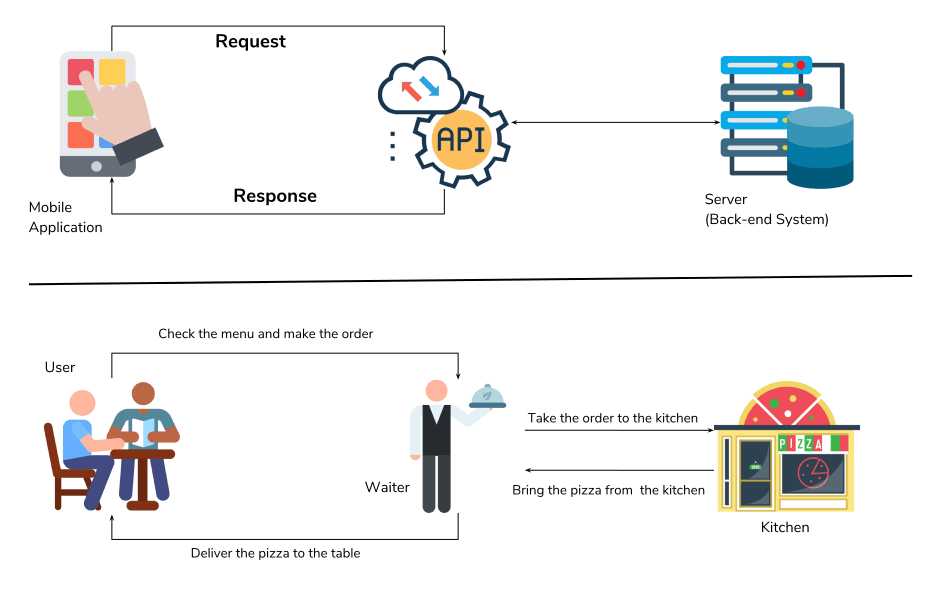

# REST API Basics

An **API** is a set of definitions and protocols for building and integrating application software. API stands for **Application Programming Interface**.

APIs let your product or service communicate with other products and services without having to know how they're implemented. This can simplify app development, saving time and money. When you're designing new tools and products—or managing existing ones—APIs give you flexibility; simplify design, administration, and use; and provide opportunities for innovation.

Take the following example to understand an API. A **waiter** in a restaurent talks to customers, take orders to kitchen, bring food fro mthe kitchen and deliver them to the customers. Here the **waiter** works as the interface between the **customers** and the **kitchen**. An **API** serves the same purpose in related to the software programmes. It serves as the information carreer between two or more software applications.



There are many **API** specifications and protocols.

- Remote Procedure Call (RPC)
- Service Object Access Protocol (SOAP)
- GraphQL
- Representational State Transfer (REST)

In this guide we focus only on **REST**.

## What is a REST API?

The term REST was introduced by computer scientist Roy Fielding in a dissertation in 2000. Unlike SOAP, which is a protocol, REST is a software architectural style with **six constraints** for building applications that work over **HTTP**, often web services. The **World Wide Web** is the most common realization and application of this architecture style.

Web APIs that comply with REST architectural constraints are called RESTful APIs. These APIs use HTTP requests (AKA methods or verbs) to work with resources: **GET, PUT, HEAD, POST, PATCH, CONNECT, TRACE, OPTIONS** and **DELETE**.

RESTful systems support messaging in different formats, such as **plain text, HTML, YAML, XML** and **JSON**. The ability to support multiple formats for storing and exchanging data is one of the reasons REST is a prevailing choice for building public APIs these days.

Among the above formats, **JSON** is widely used by many REST APIs. **JavaScript Object Notation** (JSON) is a lightweight and easy-to-parse text format for data exchange. Its syntax is based on a subset of the Standard ECMA-262 3rd Edition. Each JSON file contains collections of name/value pairs and ordered lists of values. Since these are universal data structures, the format can be used with any programming language.

**REST** APIs are governed by **six constraints**:

- Uniform Interface
- Stateless
- Cacheable
- Client-Server
- Layered System
- Code on Demand (Optional)

### Uniform Interface

It is a key constraint that differentiate between a REST API and Non-REST API. It suggests that there should be an uniform way of interacting with a given server irrespective of device or type of application (website, mobile app).

There are four guidelines principle of Uniform Interface are:

- Resource Based
- Manipulation of Resources Through Representations
- Self-descriptive Messages
- Hypermedia as the Engine of Application State (HATEOAS)


#### Resource-Based

Individual resources are identified in requests using URIs as resource identifiers. The resources themselves are conceptually separate from the representations that are returned to the client. For example, the server does not send its database, but rather, some HTML, XML or JSON that represents some database records expressed, for instance, in finnish and encoded in UTF-8, depending on the details of the request and the server implementation.

For example, consider **products** of an e-commerce platform. Product is a resource. There can be many products in the system. We can consider this as a **product collection**. Product collection can be represented in an API by the URI:

```
/products
```

This URL will not neccessarily return all products in the database. But a sub collection (sub set) depending on the state requested. To break down the entire collection in to chunks and access them, the URI might use query parameters.

```
/products?page=3&per_page=20
```

This concept is more popular as **pagination** where `page` is the chunk and `per_page` is the cunk size.

A single product can be represented by:

```
/products/PID
```

Where **PID** is the ID of the products.

#### Manipulation of Resources Through Representations

Client has representation of resource and it contains enough information to modify or delete the resource on the server, provided it has permission to do so.

Example: Usually user gets a product id when user requests for a list of products and then use that id to delete or modify that particular product.

#### Self-descriptive Messages

Each message includes enough information to describe how to process the message so that server can easily analyses the request.

#### Hypermedia as the Engine of Application State (HATEOAS)

It need to include links for each response so that client can discover other resources easily.

For example, a `/companies` URI might return a responce infollowing format.


```json
{
  "payload": [
    {
      "id": 100,
      "name": "Acme Software"
    },
    .
    .
    .
    {
      "id": 101,
      "name": "Wayn Industries"
    }
  ],
  "paginator": {
      "current_page": 3,
      "first_page_url": "https://myproject.test/api/v1/companies?page=1",
      "from": 100,
      "last_page": 2,
      "last_page_url": "https://myproject.test/api/v1/companies?page=4",
      "next_page_url": "https://myproject.test/api/v1/companies?page=4",
      "path": "https://myproject.test/api/v1/companies",
      "per_page": 50,
      "prev_page_url": "https://myproject.test/api/v1/companies?page=2",
      "to": 150,
      "total": 180
  },
  "message": "",
  "result": true
}
```

Note that it is a paginated list of companies and links to access other pages are also provided in `paginator`.


### Stateless

It means that the necessary state to handle the request is contained within the request itself and server would not store anything related to the session. In REST, the client must include all information for the server to fulfill the request whether as a part of query params, headers or URI. Statelessness enables greater availability since the server does not have to maintain, update or communicate that session state. There is a drawback when the client need to send too much data to the server so it reduces the scope of network optimization and requires more bandwidth.


### Cacheable

Every response should include whether the response is cacheable or not and for how much duration responses can be cached at the client side. Client will return the data from its cache for any subsequent request and there would be no need to send the request again to the server. A well-managed caching partially or completely eliminates some client–server interactions, further improving availability and performance. But sometime there are chances that user may receive stale data.


### Client-Server

REST application should have a client-server architecture. A Client is someone who is requesting resources and are not concerned with data storage, which remains internal to each server, and server is someone who holds the resources and are not concerned with the user interface or user state. They can evolve independently. Client doesn't need to know anything about business logic and server doesn't need to know anything about frontend UI.


### Layered System

An application architecture needs to be composed of multiple layers. Each layer doesn't know any thing about any layer other than that of immediate layer and there can be lot of intermediate servers between client and the end server. Intermediary servers may improve system availability by enabling load-balancing and by providing shared caches.


### Code on Demand (Optional)

Servers are able to temporarily extend or customize the functionality of a client by transferring logic to it that it can execute. Examples of this may include compiled components such as Java applets and client-side scripts such as JavaScript.

Complying with these constraints, and thus conforming to the REST architectural style, will enable any kind of distributed hypermedia system to have desirable emergent properties, such as performance, scalability, simplicity, modifiability, visibility, portability and reliability.

NOTE: The only optional constraint of REST architecture is code on demand. If a service violates any other constraint, it cannot strictly be referred to as RESTful.
