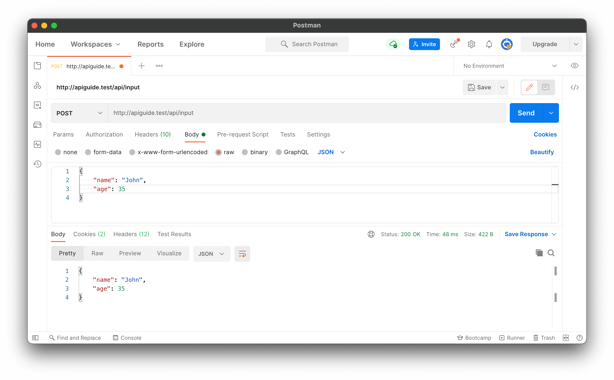
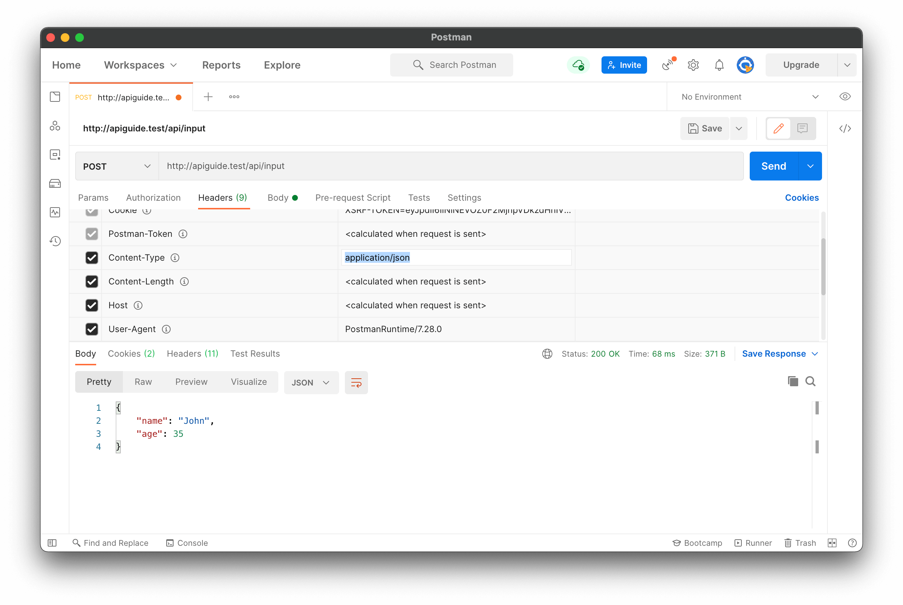

# REST API Best Practices

REST APIs are one of the most common kinds of web services available today. They allow various clients including mobile and browser apps to communicate with a server via the REST API. Therefore, it's very important to design REST APIs properly so that we won't run into problems down the road. We have to take into account security, performance, and ease of use for API consumers.

Read [REST API Basics](./rest-api-basics.md) to understand the basics.

This guide would focus on following topics to improve your REST API development practices.

- Accept and respond with JSON
- Use nouns instead of verbs in endpoint paths
- Name collections with plural nouns
- Nesting resources for hierarchical objects
- Handle errors gracefully and return standard error codes
- Allow filtering, sorting, and pagination
- Maintain Good Security Practices
- Cache data to improve performance
- Versioning our APIs

[Postman](https://www.postman.com) is a tool you can use to test APIs. If you don't have it already installed, [installing it](https://www.postman.com/downloads) would help to try out the examples given here.

## Accept and respond with JSON

REST APIs should accept JSON for request payload and also send responses to JSON. JSON is the standard for transferring data. Almost every networked technology can use it. JavaScript has built-in methods to encode and decode JSON either through the Fetch API or another HTTP client. Server-side technologies have libraries that can decode JSON without doing much work.

There are other ways to transfer data. XML isn't widely supported by frameworks without transforming the data ourselves to something that can be used, and that's usually JSON. We can't manipulate this data as easily on the client-side, especially in browsers. It ends up being a lot of extra work just to do normal data transfer. Also, compared to JSON, XML uses more bandwidth to transfer the same amount of data.

**Form data** is good for sending data, especially if we want to send files. But for text and numbers, we don't need form data to transfer those since—with most frameworks—we can transfer JSON by just getting the data from it directly on the client side. It's by far the most straightforward to do so.

To make sure that when our REST API app responds with JSON that clients interpret it as such, we should set **Content-Type** in the response header to `application/json` after the request is made. Many server-side app frameworks set the response header automatically. Some HTTP clients look at the **Content-Type** response header and parse the data according to that format.

Also from the client side, it can set the **Accept** header of the request to `application/json` to let the server know that the client is ready to accept JSON data.

The only exception is if we're trying to send and receive files between client and server. Then we need to handle file responses and send **form data** from client to server. But that is a topic for another time.

We should also make sure that our endpoints return **JSON** as a response. Many server-side frameworks have this as a built-in feature.

Let's take a look at an example API that accepts JSON payloads. This example will use the **Laravel** back end framework. Laravel uses `Illuminate\Http\Request` class to handle requests. This class detects the incoming data format using the value of the **Content-Type** header. The API controller and action could be something like this:

```php
namespace App\Http\Controllers\API;

use Illuminate\Http\Request;

class APIController extends Controller
{

	protected function input(Request $request)
	{
		return response()->json($request->all());
	}
}
```

here `$request->all()` takes all data from the request body and return it as a **JSON** response.



If you take a look at the headers of the request:



Note that the `Content-Type` header of the request is set to `application/json` to let the API know that request is sending some **JSON** data in its body. So without any additional work by the developer **Laravel** takes care of the **JSON** data comes with reqests to it's API endpoints.


## Use nouns instead of verbs in endpoint paths

We shouldn't use **verbs** in our endpoint paths. Instead, we should use the **nouns** which represent the entity that the endpoint we're retrieving or manipulating as the pathname.

This is because our HTTP request **method** already has the verb. Having verbs in our API endpoint paths isn't useful and it makes it unnecessarily long since it doesn't convey any new information. The chosen verbs could vary by the developer's whim. For instance, some like `get` and some like `retrieve`, so it's just better to let the HTTP **GET** verb tell us what an endpoint does.

The action should be indicated by the HTTP request method that we're making. The most common methods include **GET**, **POST**, **PUT**, and **DELETE**.

- **GET** retrieves resources.
- **POST** submits new data to the server.
- **PUT** updates existing data.
- **DELETE** removes data.

The verbs map to **[CRUD](https://en.wikipedia.org/wiki/Create,_read,_update_and_delete)** operations.

With the two principles we discussed above in mind, we should create routes like `GET /articles/` for getting news articles. Likewise, `POST /articles/` is for adding a new article , `PUT /articles/{id}` is for updating the article with the given id. `DELETE /articles/{id}` is for deleting an existing article with the given ID.

`/articles` represents a REST API resource. For instance, we can use **Resource Controller** in **Laravel** to handle **CRUD** of a resource.

Following artisan command in **Laravel** generates a **resource controller** for the **Article** resource (Entity/Model):

```
php artisan make:controller ArticleController --resource --model Article
```

Resulted controller would look like:

```php
namespace App\Http\Controllers;

use App\Models\Article;
use Illuminate\Http\Request;

class ArticleController extends Controller
{
    public function index() {} // GET /articles

    public function create() {} // Not useful in API context

    public function store(Request $request) {} // POST /articles

    public function show(Article $article) {} // GET /articles/{id}

    public function edit(Article $article) {} // Not useful in API context

    public function update(Request $request, Article $article) {} // PUT /articles/{id}

    public function destroy(Article $article) {} // DELETE /articles/{id}
}
```

Here. `create()` and `edit()` methods are not useful in API context as they are used in `web` applications to show the forms for creating and updating entities. Notice how `store()`, `show()`, `update()` and `destroy()` methods can be mapped to each action in **CRUD** while `index()` can be used to represent the resource collection itself.

You may use the following code to define the respective routes in `routes/api.php`:

```php
Route::resource('/articles', 'App\Http\Controllers\ArticleController')->except(['create', 'edit']);
```

We eliminate `create` and `edit` routes since we don't need them for the API.

Checking the routes now you can see how **Laravel** maps HTTP methods to each action, without using the verbs in the path.

```
php artisan route:list
```

Output:

```
+--------+-----------+----------------------+------------------+------------------------------------------------+------------+
| Domain | Method    | URI                  | Name             | Action                                         | Middleware |
+--------+-----------+----------------------+------------------+------------------------------------------------+------------+
|        | GET|HEAD  | /                    |                  | Closure                                        | web        |
|        |           |                      |                  |                                                | auth:api   |
|        | GET|HEAD  | articles             | articles.index   | App\Http\Controllers\ArticleController@index   | api        |
|        | POST      | articles             | articles.store   | App\Http\Controllers\ArticleController@store   | api        |
|        | GET|HEAD  | articles/{article}   | articles.show    | App\Http\Controllers\ArticleController@show    | api        |
|        | PUT|PATCH | articles/{article}   | articles.update  | App\Http\Controllers\ArticleController@update  | api        |
|        | DELETE    | articles/{article}   | articles.destroy | App\Http\Controllers\ArticleController@destroy | api        |
+--------+-----------+----------------------+------------------+-----------------------------------------------+-------------+
```

## Name collections with plural nouns

It is common that most of the applications manipulate multiple instances of various entities throughout the application process.

Eg:
- Products
- Users
- Orders
- Customers
- Articles

The responsibility of the **API** is to let applications access these data in a structured way. In order to do that API endpoints should be structured in a way it can indicate which resource is accessed by it. As we mentioned before, it is a good practice to think of the data as **resource collections**. So there is an API endpoint to access each of these collections and individual items inside them.

To get all articles:

```
GET /articles
```

And, to refer to an individual article:

```
GET /articles/{id}
```

It makes more sense this way.


## Nesting resources for hierarchical objects

When designing endpoints, it makes sense to group those that contain associated information. That is, if one object can contain another object, you should design the endpoint to reflect that. This is good practice regardless of whether your data is structured like this in your database. In fact, it may be advisable to avoid mirroring your database structure in your endpoints to avoid giving attackers unnecessary information, in case your API is public.

For example, if we want an endpoint to get the comments for a news article, we should append the `/comments` path to the end of the `/articles` path. So the path to get the comments of an article would be:

```
GET /articles/{article_id}/comments
```

In **Laravel** the respective route would be:

```php
Route::get('/articles/{article}/comments', 'App\Http\Controllers\ArticleController@comments');
```

The respective controller action:

```php
protected function comments(Request $request, $article)
{
    $comments = Comment::where('article_id', $article)->get();
    return response()->json($comments);
}
```

Also if the **Article** has a `HAS MANY` relationship to `comments` in **Article** model:

```php
protected function comments(Request $request, Article $article)
{
    return response()->json($article->comments);
}
```

Note that the data nesting is used when the nested data has no or less meaning when they are alone. Here **comment** has no meaning when it is not attached to an **article**. Only such data should be nested. If a resource deliver some meaningful information when they are taken alone, it is less likely you have to nest them in another API.


Also the nesting can occur inside the data returned in the response body. Consider the **author** of an article. This information can be nested in the **article** data itself.

Article **JSION** object with nested **author**:

```json
{
  "id": 23,
  "title": "How to develop APIs",
  "content": "... content of the article ...",
  "author": {
    "id": 5,
    "name": "John Doe"
  }
}
```

However it is not a good idea to nest the **comments** inside the **article** data. This is because, we cannot predict the number of comments and article would get. It is better to access such data using a separate API endpoint. That way you can implement **searching**, **sorting**, **filtering** and **paginating** on the particular API endpoint to deal with the large number of data it delivers.


## Handle errors gracefully and return standard error codes

To eliminate confusion for API users when an error occurs, we should handle errors gracefully and return HTTP response codes that indicate what kind of error occurred. This gives maintainers of the API enough information to understand the problem that's occurred. We don't want errors to bring down our system, so we can leave them unhandled, which means that the API consumer has to handle them.

Common error HTTP status codes include:

- **401 Unauthorized** – This means the user isn't not authorized to access a resource. It usually returns when the user isn't authenticated.
- **403 Forbidden** – This means the user is authenticated, but it's not allowed to access a resource.
- **404 Not Found** – This indicates that a resource is not found.
- **422 Unprocessable Entity** – This indicates that requested operation on an entity is not processesable. This is used in **Laravel** when the input validation fails.
- **500 Internal server error** – This is a generic server error. It probably shouldn't be thrown explicitly.
- **502 Bad Gateway** – This indicates an invalid response from an upstream server.
- **503 Service Unavailable** – This indicates that something unexpected happened on server side (It can be anything like server overload, some parts of the system failed, etc.).

Basically this means, "stop sending 500 as the HTTP status code for every error response".

With **Laravel** this can be achieved as follows:

```php
public function index()
{
  // other code
  return response()->json(['message' => 'You are not allowed to access this resource.'], 403);
}
```

Note that the `json()` method of the `Illuminate\Http\Response` class accepts **HTTP status code** as its second argument.

If you dig deeper, you can notice that **Laravel** itself is handling this for us without any additional code. Look at the following examples:

404 Not Found status code when an entity is not found:

```php
public function show($id)
{
  $article = Article::findOrFail($id);
  return response()->json($article);
}
```

Or even with imlicit model binding:

```php
public function show(Article $article)
{
  return response()->json($article);
}
```

when you pass a non-existing ID as the article ID this will raise an exception with the HTTP status code **404**.

Try it for **validation** and **authentication** too.

## Allow filtering, sorting, and pagination

The databases behind a REST API can get very large in terms of amount of data. Sometimes, there's so much data that it shouldn't be returned all at once because it's way too slow or will bring down our systems. Therefore, we need ways to **filter** items.

We also need ways to **paginate** data so that we only return a few results at a time. We don't want to tie up resources for too long by trying to get all the requested data at once.

Filtering and pagination both increase performance by reducing the usage of server resources. As more data accumulates in the database, the more important these features become.

Also from the client side it is helpfull when it knows how large is the dataset that it is getting from a particular API endpoint. Think of the situation that a mobile application receiving gigabytes of data for a single API call. Even megabytes sized data set can easily crash a mobile application when it tries to process it.

Here's a small example where an API can accept a query string with various query parameters to let us filter out items by their fields:

```
GET /articles?q=perfume&sort=-created_at,id&page=3&per_page=10
```

```php
public function index(Request $request)
{
    $articlesQuery = Article::query();

    // Searching
    if ($request->filled('q')) {
        $articlesQuery->where('title', 'LIKE', '%' . $request->query('q') . '%');
    }

    // Sorting
    if ($request->filled('sort')) {
        $sortFields = array_unique(explode(',', $request->query('sort')));

        foreach ($sortFields as $field) {
            $dir = substr($field, 0, 1);
            if (in_array($dir, ['+', '-'])) {
                $field = substr($field, 1);
            }

            $articlesQuery->orderBy($field, $dir == '-' ? 'desc' : 'asc');
        }
    }

    // Paginating
    return $articlesQuery->paginate($request->query('per_page', 20));
}
```

Here, query parameter `q` is used for **searching** the result set. One or multiple fields can be used for searching.

`sort` parameter is used for **sorting** the result set. Note how it uses `-` (minus) for sorting by `created_at` field in **descending** order. No prefixing sign or `+` sign used for **ascending** order. This works as a composite parameter to indicate the sorting by multiple fields.

Also the **pagination** is supported using `page` and `per_page` query parameters. `per_page` is used to indicate the number of items per page (page size) and `page` is used to indicate the page number. Note that **Laravel** paginator picks the `page` value from the request parameters though we do not explisitly mention it.

## Maintain Good Security Practices

Most communication between client and server should be private since we often send and receive private information. Therefore, using **SSL/TLS** for security is a must.

A SSL certificate isn't too difficult to load onto a server and the cost is free or very low. There's no reason not to make our REST APIs communicate over secure channels instead of in the open.

People shouldn't be able to access more information that they requested. For example, a normal user shouldn't be able to access information of another user. They also shouldn't be able to access data of admins. This is usually taken care by using an **access token**.

To enforce the principle of least privilege, we need to add role checks either for a single role, or have more granular roles for each user.

If we choose to group users into a few roles, then the roles should have the permissions that cover all they need and no more. If we have more granular permissions for each feature that users have access to, then we have to make sure that admins can add and remove those features from each user accordingly. Also, we need to add some preset roles that can be applied to a group users so that we don't have to do that for every user manually.

## Cache data to improve performance

We can add caching to return data from the local memory cache instead of querying the database to get the data every time we want to retrieve some data that users request. The good thing about caching is that users can get data faster. However, the data that users get may be outdated. This may also lead to issues when debugging in production environments when something goes wrong as we keep seeing old data.

There are many kinds of caching solutions like Redis, in-memory caching, and more. We can change the way data is cached as our needs change.

If you are using caching, you should also include `Cache-Control` information in your headers. This will help users effectively use your caching system.

Laravel supports caching using many methods including in memory caching and Redis. Read more about caching in Laravel [here](https://laravel.com/docs/8.x/cache).


## Versioning our APIs

We should have different versions of API if we're making any changes to them that may break clients. The versioning can be done according to semantic version (for example, 2.0.6 to indicate major version 2 and the sixth patch) like most apps do nowadays.

This way, we can gradually phase out old endpoints instead of forcing everyone to move to the new API at the same time. The **v1** endpoint can stay active for people who don't want to change, while the **v2**, with its shiny new features, can serve those who are ready to upgrade. This is especially important if our API is public. We should version them so that we won't break third party apps that use our APIs.

Versioning is usually done with `/v1/`, `/v2/`, etc. added at the start of the API path.
