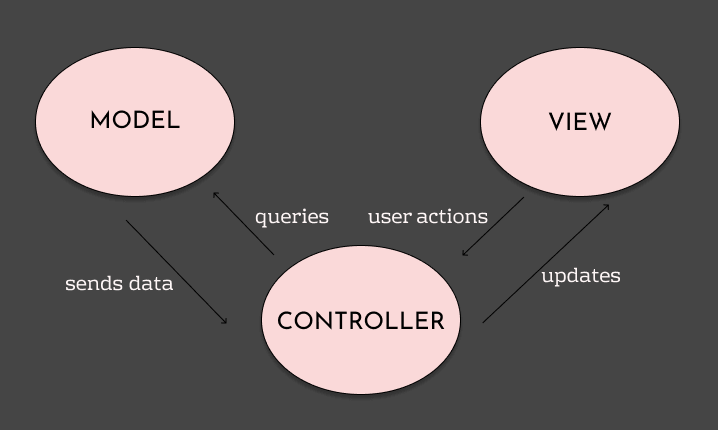
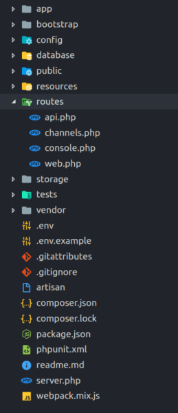
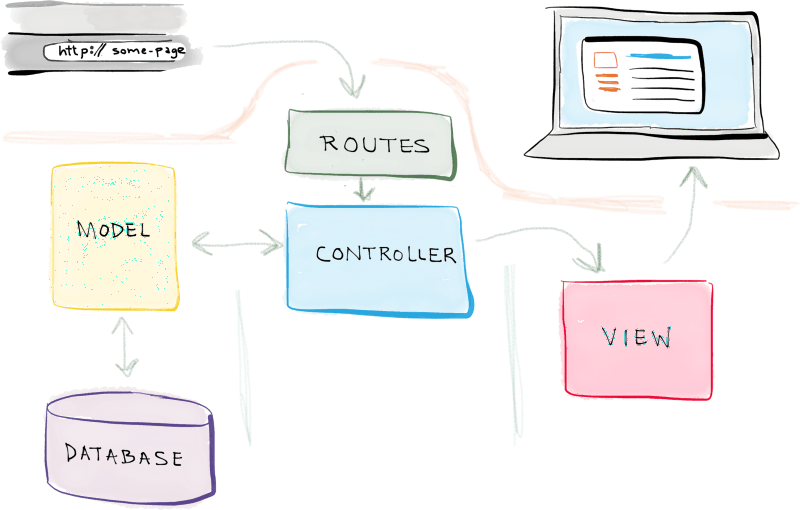
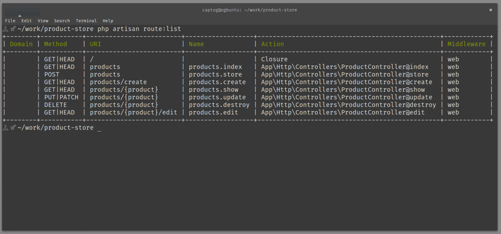
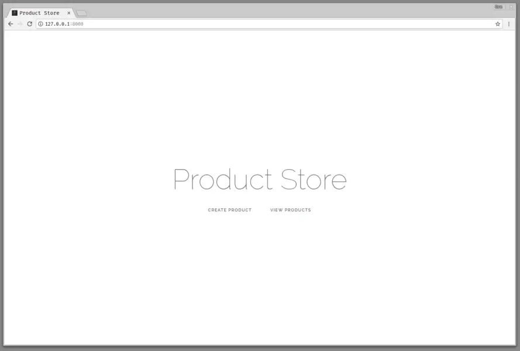
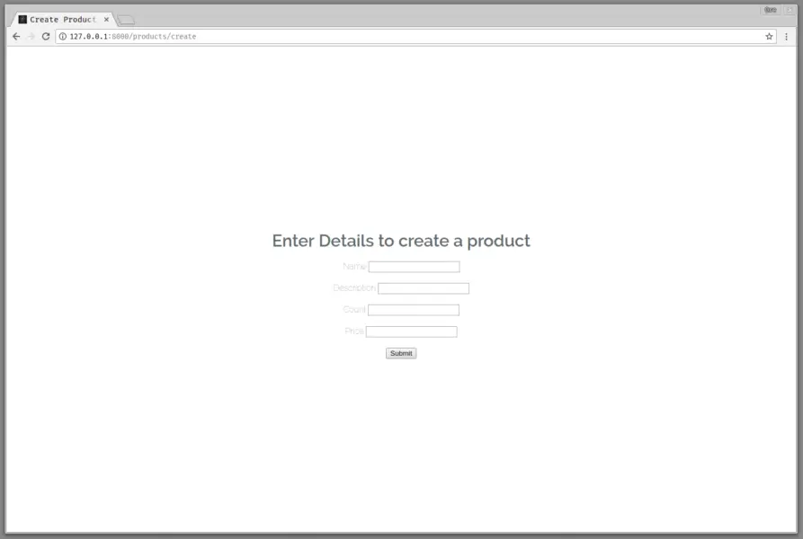
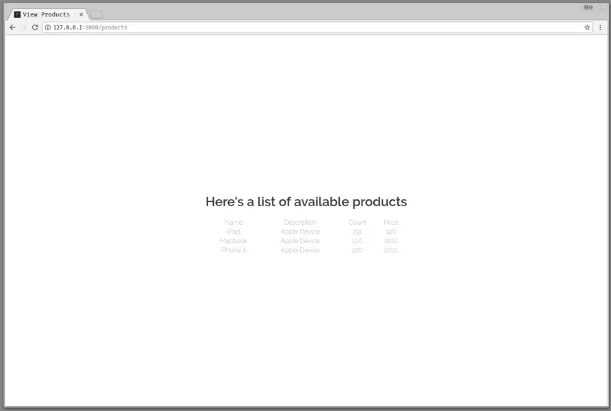

# MVC With Laravel

**Model–View–Controller** (usually known as **MVC**) is a software design pattern commonly used for developing various  applications. It divides the related program logic into three interconnected elements. The main advantage of using the MVC is clear separation of **data** (Model), **presentation** (View) and **business logic** (Controller) of the application.

**Model**
: The Model component corresponds to all the data-related logic that the user works with. This can represent either the data that is being transferred between the View and Controller components or any other business logic-related data. For example, a Customer object will retrieve the customer information from the database, manipulate it and update it data back to the database or use it to render data.

**View**
: The View component is used for all the UI logic of the application. For example, the Customer view will include all the UI components such as text boxes, dropdowns, etc. that the final user interacts with.

**Controller**
: Controllers act as an interface between Model and View components to process all the business logic and incoming requests, manipulate data using the Model component and interact with the Views to render the final output. For example, the Customer controller will handle all the interactions and inputs from the Customer View and update the database using the Customer Model. The same controller will be used to view the Customer data.

Following diagram shows the interactions between Model, View and Controller.



A `Model` is a representation of a real-life instance or object in our code base. The `View` represents the interface through which the user interacts with our application. When a user takes an action, the `Controller` handles the action and updates the `Model` if necessary.

Let’s look at a simple scenario.

If you go to an e-commerce website, the different pages you see are provided by the `View` layer. When you click on a particular product to view more, the `Controller` layer processes the user’s action. This may involve getting data from a data source using the `Model` layer. The data is then bundled up together and arranged in a `View` layer and displayed to the user. This process repeats as user interact with the website.

## MVC In Laravel

Before diving into how Laravel implements MVC let us take a look at how requests are handled in Laravel.

When you create a new Laravel project, the project has the following structure:



There is a file in the `routes/` directory called `web.php`. That file is where you handle the requests when users visit your app. The file looks like this:

```php
/*
|--------------------------------------------------------------------------
| Web Routes
|--------------------------------------------------------------------------
|
| [...]
|
*/

Route::get('/', function () {
    return view('welcome');
});
```

Say your application is at `http://myapp.test`. When you wisit this URL using the web browser, it will show you the content of `/resources/views/welcome.blade.php` file according the above route. But it does not get any data from the database nor process any data from the user or database.

This is the simplest form that a Laravel application can be. Go ahead and make changes to the HTML in `/resources/views/welcome.blade.php` file and refresh the web browser to see how content changes.

Now in order to make use of the **MVC** features in Laravel, we need to introduce **Controller** and **Model** in to this. Once we do that, our application would operate as shown below.




## Adding a Model

Let us create our first model, M in MVC, for our application. As we have noted before, the model usually, interfaces with a data storage like an SQL database. In Laravel, the Model is usually a class with properties that match the columns in the database.

In our database, a product will have the following properties:

- **Name** (`name`) – Name of product.
- **Short Description** (`description`) – Short description of a product.
- **Count** (`count`) – The number of products available.
- **Unit Price** (`price`) – How much a single product costs.

To create a model in Laravel, run the command in your terminal:

```
php artisan make:model Product --migration
```

When you run this command, Laravel will create a `Product.php` file in the `app/Models` directory and respective migration file in the `/database/migrations` folder (named similar to `2021_06_08_084605_create_products_table.php`).

Open the migration file and update the code in `up()` and `down()` function so that they look like below:

```php
public function up()
{
    Schema::create('products', function (Blueprint $table) {
        $table->increments('id');
        $table->string('name');
        $table->text('description');
        $table->integer('count');
        $table->integer('price');
        $table->softDeletes();
        $table->timestamps();
    });
}

public function down()
{
    Schema::dropIfExists('products');
}
```

And run the migration to create the `products` table:

```
php artisan migrate
```

We do not discuss the database migrations in detail here as we focus on the MVC behaviour of Laravel. Make sure your `products` table is created for now.

The `Product.php` file in the `app/Models` contains a PHP class with the name Product and it will be the model for our `products` table in the database.

In the `Product` model, add the `$fillable` property as shown below:

```php
namespace App;

use Illuminate\Database\Eloquent\Model;

class Product extends Model {

    protected $fillable = [
       'name',
       'count',
       'price',
       'description',
    ];

}
```

The fillable property is used to represent [mass assignable attributes](https://laravel.com/docs/8.x/eloquent#mass-assignment) for our model.

Notice that our model `extends` the `Illuminate\Database\Eloquent\Model` class. This make it inherit many functions to communicate with the `products` table in the database. On other words our model represents an entity in the data layer of our application.

Check out the [Laravel API](https://laravel.com/api/8.x/Illuminate/Database/Eloquent/Model.html) to understand the functions it inherits from `Illuminate\Database\Eloquent\Model`.

With that we are done adding the `Model` to our `MVC` application.

## Adding a Controller

Earlier we mentioned that controllers are responsible for completing user actions and the managing the business logic of our applications.

Let's create a [Resource Controller](https://laravel.com/docs/8.x/controllers#resource-controllers).

To create a resource controller in Laravel, run the following command:

```
php artisan make:controller ProductController --resource --model Product
```

The `--resource` flag makes it a [resource controller](https://laravel.com/docs/8.x/controllers#resource-controllers) and thus creates all the methods required for `CRUD` operation.

The `--model Product` flag will make our resource controller specific to work with `Produt` model we created before. This means the `CRUD` operations of the controller will be Creating, Reading, Updating and Deleting `Product` entities in our database.

When the command is run, Laravel will create a new file in the `app/Http/Controllers` directory called `ProductController.php`.

Before we start adding logic to the controller, go to the `routes/web.php` file and add the following route:

```php
Route::resource('/products', 'ProductController');
```

This tells Laravel to create all the routes necessary for a resource controller and map them to the `ProductController` class.

You can see the list of routes by running the command `php artisan route:list` in your terminal. You get the following result showing the routes and the request types to use when accessing the routes:



Looking at the image above, you can see the action that each URI is mapped to. This means when a user goes to `http://my-app.test/products/create`, the `create` function in the `ProductController` will process the user's request.

Now let’s go to the controller file and update the methods in them with the respective logic:

The `create` method:

```php
public function create()
{
   return view('products.create');
}
```

The above is for the create (C in CRUD). The controller loads a view (V in MVC) called create product and serves that as the response for anyone visits the route `/products/create` with a `GET` HTTP method.

The `store` method:

```php
public function store(Request $request) {
    \App\Product::create([
        'name' => $request->input('name'),
        'description' => $request->input('description'),
        'price' => $request->input('price'),
        'count' => $request->input('count'),
    ]);

    return redirect('/products');
}
```

The `store` method is called when a user sends a `POST` HTTP request to the `/products` endpoint. This logic above gets the data from the request and stores it in the database using the `Product` model. Notice that the **Controller** is not running any SQL queries to insert data into the database. Instead it gets **Model** to do that for it. This makes the controller independent of the logic to store data in the database.

The `index` method:

```php
public function index()
{
    $products = \App\Product::all();

    return view('products.index', ['allProducts' => $products]);
}
```

The `index` method is called when the `/products` route is loaded with a `GET` HTTP method. In this method, we fetch all the products available in the products table using the `Product` model and pass it on to the view as a variable. This means in the view, the `$allProducts` variable will be available. Notice that the **Controller** is not running any SQL queries to get data from the database. Instead it gets **Model** to do that for it. This makes the controller independent of the logic to access data in the database.

A resource controller usually have `edit`, `update` and `destroy` methods too. However we do not discuss them here as our focus at the moment is on understanding the MVC related to Laravel.


## Adding Views

In Laravel, all the views are stored in the `resources/views` directory. Your views usually store the HTML of your page and are the presentation layer of the MVC architecture.

Let’s create the home page view. Update the `welcome.blade.php` file in the `resources/views` directory to include the following code inside the body tag of the existing HTML:


```php
[...]

<div class="flex-center position-ref full-height">
  <div class="content">
    <div class="title m-b-md">Product Store</div>
    <div class="links">
      <a href="{{ config('app.url')}}/products/create">Create Product</a>
      <a href="{{ config('app.url')}}/products">View Products</a>
    </div>
  </div>
</div>

[...]
```

Laravel uses Blade as its templating engine. Blade is pretty much HTML but with some injectable PHP-like syntax. You can read more about [blade templates here](https://laravel.com/docs/8.x/blade).

If you go back to the routes/web.php you see it stated that the welcome view should be rendered to the user when the / is visited. If you visit the webpage URL `http://my-app.test` you will see this page:



Next, let’s make the ‘Create Product’ view. Create a folder `products` inside the `resources/views` folder. Then create a `create.blade.php` file in the `resources/views/products` directory of our project. In there add the following:

```php
<!doctype html>
<html lang="{{ app()->getLocale() }}">
  <head>
    <title>Create Product | Product Store</title>
    <!-- styling etc. -->
  </head>
  <body>
      <div class="flex-center position-ref full-height">
          <div class="content">
              <form method="POST" action="{{ config('app.url')}}/products">
                  {{ csrf_field() }}
                  <h1> Enter Details to create a product</h1>
                  <div class="form-input">
                      <label>Name</label> <input type="text" name="name">
                  </div>

                  <div class="form-input">
                      <label>Description</label> <input type="text" name="description">
                  </div>

                  <div class="form-input">
                      <label>Count</label> <input type="number" name="count">
                  </div>

                  <div class="form-input">
                      <label>Price</label> <input type="number" name="price">
                  </div>

                  <button type="submit">Submit</button>
              </form>
          </div>
      </div>
  </body>
</html>
```

This view above is a simple form that collects and submits requests to create products. When the form is submitted, a `POST` request is made to the `/products` route of the application which is handled by the `store` method in our `ProductController`. Important thing to notice here is that our **View** is not directly communicating with the database nor **Model** to ad new data to the database. Instead it hands over the data to **Controller** to take care of the reset of the process. Our view is totally independent of the logic to deal with storing data.

Here is how the `/products/create` route will look after adding the view and visiting the route:



The next view we want to add is the `index.blade.php` view. Create that file in the `resources/views/products` directory and add the following code to the file:

```php
<!doctype html>
<html lang="{{ app()->getLocale() }}">
  <head>
      <title>View Products | Product Store</title>
      <!-- Styles etc. -->
  </head>
  <body>
      <div class="flex-center position-ref full-height">
          <div class="content">
              <h1>Here's a list of available products</h1>
              <table>
                  <thead>
                      <td>Name</td>
                      <td>Description</td>
                      <td>Count</td>
                      <td>Price</td>
                  </thead>
                  <tbody>
                      @foreach ($allProducts as $product)
                          <tr>
                              <td>{{ $product->name }}</td>
                              <td class="inner-table">{{ $product->description }}</td>
                              <td class="inner-table">{{ $product->count }}</td>
                              <td class="inner-table">{{ $product->price }}</td>
                          </tr>
                      @endforeach
                  </tbody>
              </table>
          </div>
      </div>
  </body>
</html>
```

In the view above, the data that was sent from the controller, `$allProducts`, is iterated on and displayed to the user. **View** is not directly making queries to the database. Instead it simply renders the data provided by the **Controller**. Notice that our view is totally independent from the underlying logic of accessing data in database.

Now, if you visit the `/products` route you should see something like this:




Now you can try adding new products to the list using your form. Notice how they are displayed on the `/products` page afterwards.

Using this example you can understand how **Model**, **View** and **Controller** are used in laravel.
