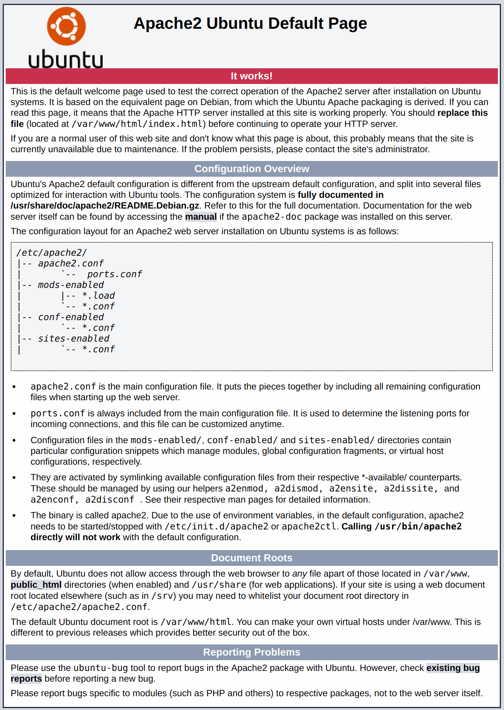

# Set-up Linux For Laravel Development

Laravel development environment needs to have **Apache**, **PHP**, **MySQL** and **Composer** installed mainly. This guide will walk you through setting up and configuring **Apache 2.4**, multiple **PHP** versions, **MySQL** and Apache virtual hosts.

This guide is for installing the above packages on Ubuntu 20.04, however if you are using a different version of Ubuntu or different flavour of Linux. Please search the internet or seek for senior attention on setting up your environment.


## Install Apache

Apache is a web server used for serving web applications. There is chance that the Apache is already installed in your Linux system. To check if it is already installed, open a terminal and run:

```
apache2 -v
```

If it gives an output like this, you have Apache installed. You may jump to installing PHP.

```
Server version: Apache/2.4.6 (Ubuntu)
Server built:   Aug  8 2019 11:41:18
```

But, if it gives an output like this:

```
apache2: command not found
```

This means don't have Apache installed in your system. Go ahead and follow the instructions below to install it.

Install Apache using Ubuntu’s package manager, `apt`:

```
sudo apt update
sudo apt install apache2
```

If this is the first time you’re using `sudo` within this session, you’ll be prompted to provide your user’s password to confirm you have the right privileges to manage system packages with `apt`. You’ll also be prompted to confirm Apache’s installation by pressing `Y`, then `ENTER`.

Once the installation is finished, open your web browser and visit `http://localhost`. This will open the default page of Apache web server.



If browser can't load this, probably your server is not running yet. Run below command to start the server:

```
sudo service apache2 start
```

In case you need to stop server, you can use:

```
sudo service apache2 stop
```


## Install PHP

Laravel 8.0 requires PHP 7.3 or later version. In this guide we will be installing PHP 7.4.

You have Apache installed to serve your content and MySQL installed to store and manage your data. PHP is the component of our setup that will process code to display dynamic content to the final user. In addition to the `php` package, you’ll need `php-mysql`, a PHP module that allows PHP to communicate with MySQL-based databases. You’ll also need `libapache2-mod-php` to enable Apache to handle PHP files. Core PHP packages will automatically be installed as dependencies.

```
sudo apt install php libapache2-mod-php php-mysql
```

Once the installation is finished, you can run the following command to confirm your PHP version:

```
php -v
```

Output:

```
PHP 7.4.3 (cli) (built: Mar 26 2020 20:24:23) ( NTS )
Copyright (c) The PHP Group
Zend Engine v3.4.0, Copyright (c) Zend Technologies
    with Zend OPcache v7.4.3, Copyright (c), by Zend Technologies
```


## Install MariaDB

MariaDB is an open-source relational database management system, commonly used as an alternative for MySQL as the database portion of the popular LAMP (Linux, Apache, MySQL, PHP) stack. It is intended to be a drop-in replacement for MySQL.

To install MariaDB, run:

```
sudo apt update
sudo apt install mariadb-server
```

These commands will install MariaDB, but will not prompt you to set a password or make any other configuration changes. Because the default configuration leaves your installation of MariaDB insecure, we will use a script that the `mariadb-server` package provides to restrict access to the server and remove unused accounts.

Default user account `root` and no password is good enough for development on your local computer. However if you wish to create a user account for accessing the databases, run:

```
sudo mysql_secure_installation
```

This will take you through a series of prompts where you can make some changes to your MariaDB installation’s security options. The first prompt will ask you to enter the current database root password. Since you have not set one up yet, press `ENTER` to indicate “none”.

You can use following command to start the database server:

```
sudo service mariadb start
```

In case you need to stop server, you can use:

```
sudo service mariadb stop
```

## Install Composer

[Composer](https://getcomposer.org/) is a [dependency manager](https://getcomposer.org/doc/00-intro.md#dependency-management) for PHP applications.

Install Composer in your computer using the instructions given [here](https://getcomposer.org/download/).
