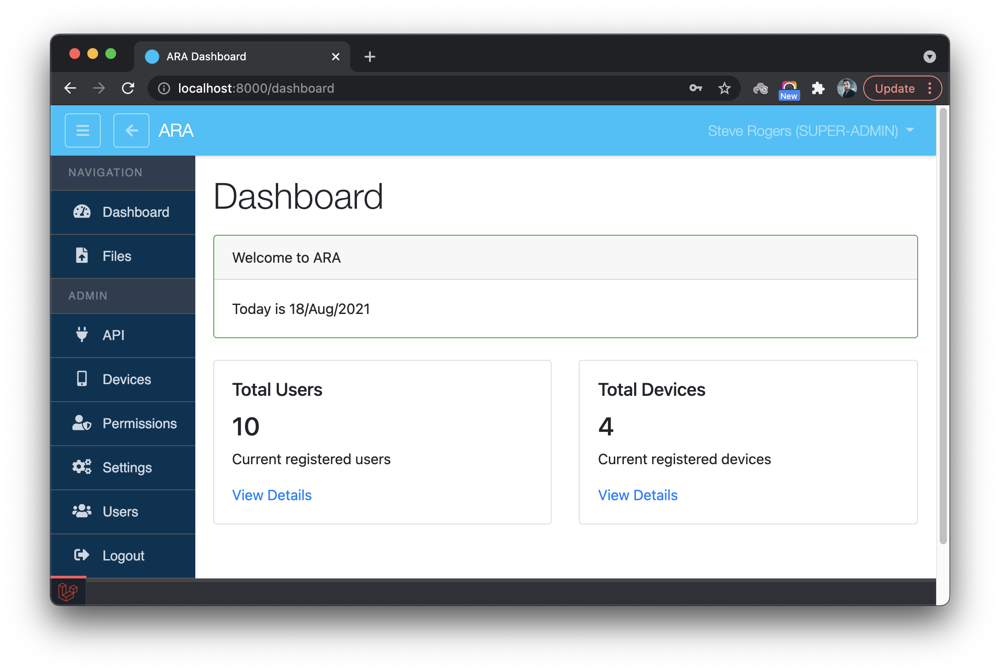
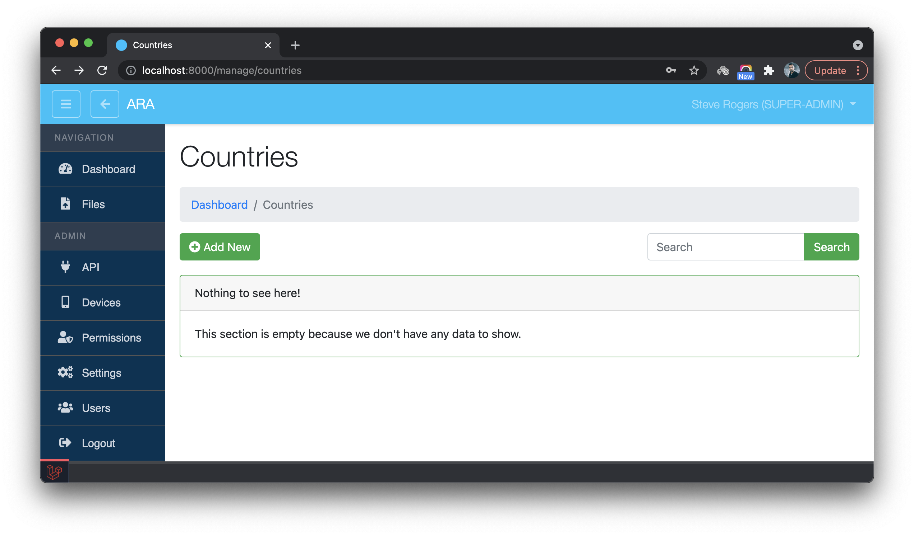
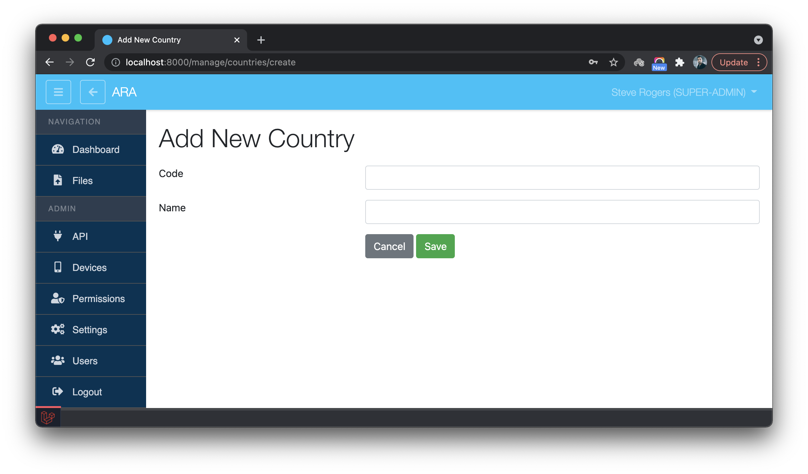
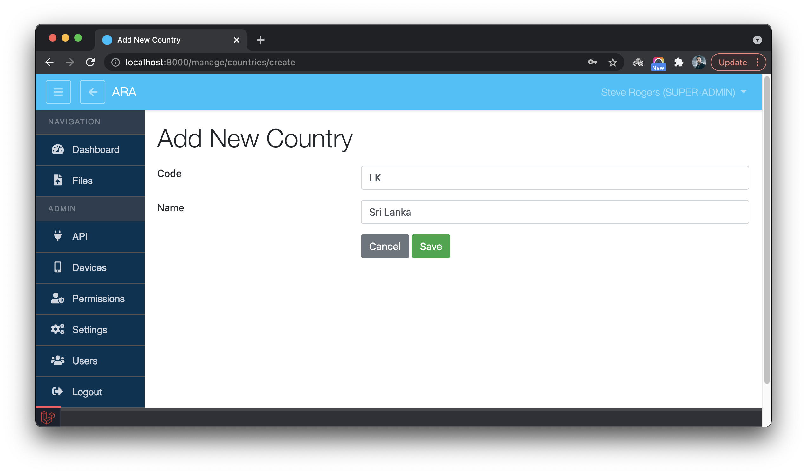
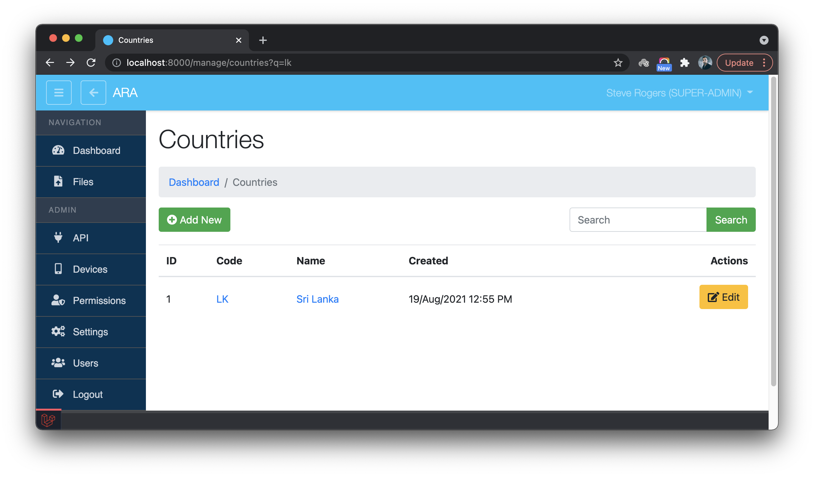
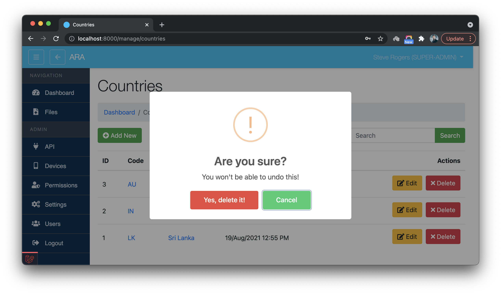
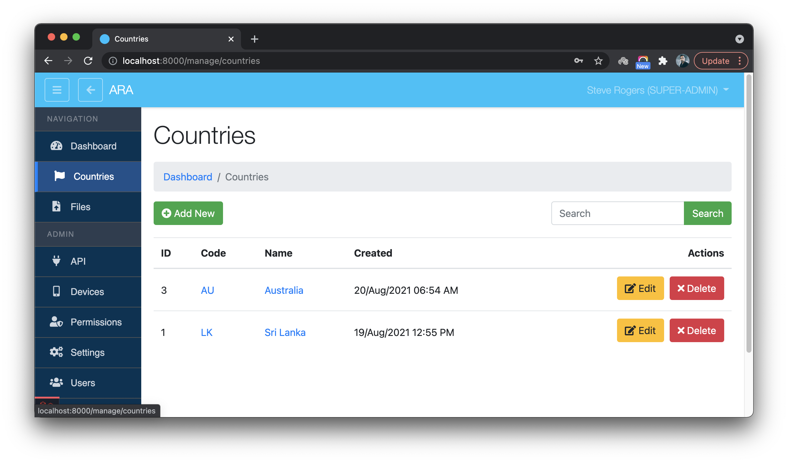

Develop An Apartment Rental Application With Oxygen - Part 1
===================================================

**[Oxygen](https://bitbucket.org/elegantmedia/oxygen-laravel)** is the core module of the backend of many mobile application projects developed by Elegant Media. It provides a set of common features required for a mobile backend.

This tutorial guides you through the process of developing a simple **Apartment Rental Application (ARA)** using **Oxygen**. It consists of two parts:

1. The admin panel
2. API

Please read the [user stories](./apartment-rental-application-user-stories.md) related to the **Apartment Rental Application** before you start writing any code.

Note that it lists only the user stories related to people looking for apartments and landlords. Also it has a limited number of user stories that are sufficient for us to get started on learning **Oxygen**.

## Identifying User Roles

If you read the user stories carefully, you will notice that there are two user roles involved in the application. The **user** and **landlord**. However, it is important to understand that **landlord** also an extended version of the **user** role. Any person who starts using the **ARA** application is a **user**. The same users can become **landlords** when they add their first apartment to the list for rent.


## Oxygen User Roles

**Oxygen** uses a Role Based Access Control (RBAC) system called [Bouncer](https://github.com/JosephSilber/bouncer). Also, it comes with a set of pre-defined roles. You can find these default roles in `database/seeders/Auth/RolesTableSeeder.php` file.

- users
- admins
- super-admins
- developers
- managers

We will assign the **users** role to all users register with the **ARA** app. A user account with **admins** role can be used by the owner of the **ARA** project (who is the client of EM). The **developers** roles will be used by the developers of the application to access the system. We will see these user roles in action later on this guide.


## Identifying Entities & Relationships

Other than the users, we can identify few other entities from the user stories.

- Apartment
  - name
  - description
  - city
  - owner

- City
  - name
  - country

- Country
  - name
  - code

- Inquiry
  - message
  - apartment
  - user

Also, few relationships:

- A user owns zero or more apartments
- An apartment belongs to a user
- An apartment belongs to a city
- A user has zero or more favourite apartments
- An apartment has many users interested in it (favourite)


## Creating a new Oxygen project

The [README](https://bitbucket.org/elegantmedia/oxygen-laravel/src/master/README.md) file of the **Oxygen** repository provides information on creating a new **Oxygen** project. There are two methods you can create a new **Oxygen** project.

1. [Create new project using Oxygen Installer](https://bitbucket.org/elegantmedia/oxygen-installer/src/master/README.md)
2. [Create new Oxygen project manually](https://bitbucket.org/elegantmedia/oxygen-laravel/src/5687e285a814232f4043c0e392376d814dfc6243/INSTALLATION.md)

Create a new project using the instructions given in the above guides. I named my instance `ara`. You can use any name. Please replace `ara` with your project name accordingly when following the examples in this guide.

In addition to creating the project, create a new database for your project and configure the `.env` file accordingly.


## Creating Models, Repositories & Migrations

The entities identified above in the **Identifying Entities & Relationships** section represent the  **Models** in the application. **Oxygen** stores entities in the `app/Entities` folder. Please note that the Laravel default folder for models (`app/Models`) is not used by **Oxygen** at the moment. Due to this difference compared to the default Laravel setup, the **Oxygen** comes with it's own `artisan` command to create models.

To create a new model, run:

```sh
php artisan make:oxygen:model Apartment
```

Note that this creates a file named `Apartment.php` inside `app/Entities/Apartments` folder. It creates the `Apartments` folder with a reason. The **Oxygen** uses repositories to access data. So the `Apartments` folder will be the host for both `Apartment` model and `ApartmentsRepository`.

Let's create the repository too:

```sh
php artisan make:oxygen:repository Apartment
```

Note that we only specify the name of the model to create the respective repository. This will create a file named `ApartmentsRepository.php` inside `app/Entities/Apartments` folder.

If you take a look at the code of the `ApartmentsRepository`, you can see that it utilizes the `Apartment` model.

```php
namespace App\Entities\Apartments;

use App\Entities\BaseRepository;

class ApartmentsRepository extends BaseRepository
{

	public function __construct(Apartment $model)
	{
		parent::__construct($model);
	}

}
```

Also note that it extends the `App\Entities\BaseRepository` class. if you take a look at the `App\Entities\BaseRepository` class, you can see that it extends the `ElegantMedia\OxygenFoundation\Entities\OxygenRepository` class. This is a class belongs to [elegantmedia/Oxygen-Foundation](https://github.com/elegantmedia/Oxygen-Foundation/) public package.

Take a quick look at the [OxygenRepository](https://github.com/elegantmedia/Oxygen-Foundation/blob/master/src/Entities/OxygenRepository.php) class. It extends the `ElegantMedia\SimpleRepository\SimpleBaseRepository` class from [elegantmedia/Laravel-Simple-Repository](https://github.com/elegantmedia/Laravel-Simple-Repository) package. The [README.MD](https://github.com/elegantmedia/Laravel-Simple-Repository/blob/master/README.md) of the **Laravel Simple Repository** package reasons the use of repositories and their advantages. Please read it thoroughly. Also, take a look at the code of the [SimpleBaseRepository](https://github.com/elegantmedia/Laravel-Simple-Repository/blob/master/src/SimpleBaseRepository.php) class to get yourself familiar with the functions available in it.


> **Exercise**: Create **models** and a **repositories** for the other entities.
```sh
php artisan make:oxygen:model Country
php artisan make:oxygen:repository Country
php artisan make:oxygen:model City
php artisan make:oxygen:repository City
php artisan make:oxygen:model Inquiry
php artisan make:oxygen:repository Inquiry
```

Next step is to create database migrations for the models. Let's create a migration for the **Apartment** model.

```sh
php artisan make:migration create_apartments_table
```

This will add a database migration to create `apartments` table. Open it and add the code to create the columns of `apartments` table.

```php
public function up()
{
    Schema::create('apartments', function (Blueprint $table) {
        $table->id();
        $table->string('name');
        $table->text('description');
        $table->unsignedBigInteger('city_id');
        $table->unsignedBigInteger('owner_id');
        $table->timestamps();
    });
}
```

We are using `string` and `text` columns for `name` and `description`. Note that we are adding two unsigned big integer columns `city_id` and `user_id`. These will be the foreign keys when building the relationships to `City` and `Owner` relationships.

> **Exercise**: Generate migrations for other entities. Add code for columns of each table. Pay attention to the fields that can be used to build the relationships with other tables.

> **Exercise**: Add relationships accordingly to all models. Adding relationships are not discussed here as it can be done with the Laravel development knowledge you already have.


## Manage Entities

Say your **Oxygen** application is running on `http://localhost:8000`. The admin panel for managing entities can be found at `http://localhost:8000/dashboard`. You need to login as an **admin** user to get access to the **admin panel**. The users in **super-admins**, **admins** and **developers** roles can access the admin panel.

Click **Login** on the home page and sign in with the default **super-admin** user account details. You can find them in the `database/seeders/Auth/RolesTableSeeder.php` file.

You will get this screen after login:



Click **Users** on the sidebar. You get a table of users in the system. Click **Edit** button on any user row of the table. You get a form to edit the user details. We need this kind of views for all other entities so that we can access and manage them. The **Oxygen** comes with tools to create all these easily with few lines of code.


### Create Oxygen Controllers

**Oxygen** makes use of two types of controllers.
1. Admin Controllers
2. API Controllers

The **Admin Controllers** are used for managing data at backend, while **API Controllers** are used for implementing the API.

Let's start with **countries**. To create an Oxygen Admin Controller for **countries**, run:

```sh
php artisan make:oxygen:admin-controller Country
```

This creates a file named `CountriesController.php` inside the `app/Http/Controllers/Manage` folder. The `Manage` folder contains the controllers managing data at backend.

Open the `CountriesController.php` file and inspect the code:

```php
namespace App\Http\Controllers\Manage;

use App\Entities\Countries\CountriesRepository;
use App\Http\Controllers\Controller;
use EMedia\Formation\Builder\Formation;
use ElegantMedia\OxygenFoundation\Http\Traits\Web\CanCRUD;
use ElegantMedia\OxygenFoundation\Http\Traits\Web\CanRead;
use ElegantMedia\OxygenFoundation\Http\Traits\Web\FollowsConventions;

class CountriesController extends Controller
{

	use FollowsConventions;

	// Uncomment this line if you're going to use Oxygen's Default Controller Methods
	// use CanCRUD;
	// use CanRead;

	protected $repo;

	public function __construct(CountriesRepository $repo)
	{
		$this->repo = $repo;

		$this->resourceEntityName = 'Country';
        $this->isDestroyAllowed = false;
	}

    protected function getResourcePrefix()
    {
        return 'manage.countries';
    }

	protected function getIndexRouteName($suffix = 'index'): string
	{
		return 'manage.countries.index';
	}

    /**
     *
     * This is the form shown when creating a new record.
     *
     * @param null $entity
     *
     * @return Formation
     */
    protected function getCreateForm($entity = null)
    {
        return new Formation($entity);
    }

    /**
     *
     * This is the form shown when editing an existing record.
     *
     * @param null $entity
     *
     * @return Formation
     */
    protected function getEditForm($entity = null)
    {
        return new Formation($entity);
    }

}
```

Note that it uses `FollowsConventions` trait. This is also a trait available in [elegantmedia/Oxygen-Foundation](https://github.com/elegantmedia/Oxygen-Foundation/) package. Please take a look at the code of this trait. It contains a set of methods to manage an entity. The entity referred as a **resource** in `FollowsConventions` trait. **Oxygen** manages its own convention of handling resources with it.

An instance of `CountriesRepository` is provided to the constructor of `CountriesController`. It is accessible within the controller using `$this->repo`. And as we mentioned before, the **Oxygen** controller uses the repositories to access entities.

You can add methods required for **CRUD** manually or you can use the `CanCRUD` and `CanRead` traits to do that for you. Using them is highly recommended unless there is a scenario that you want to implement them all by yourself. They are commented by default, uncomment them to use.

```php
// Uncomment this line if you're going to use Oxygen's Default Controller Methods
use CanCRUD;
use CanRead;
```

Also note that the controller uses [Formation](https://bitbucket.org/elegantmedia/formation/src/master/) to generate the `create` and `edit` forms automatically.


### Creating Admin Routes

Only the users with `super-admin`, `admin`, and `developers` roles should have access to the dashboard and managing entities. The **Oxygen** has the `auth.acl` middleware to handle this. Open the `routes/web.php` file and add following code at the bottom.

```php
// Application Admin Routes
Route::group([
	'prefix' => 'manage', 'as' => 'manage.',
	'middleware' => ['auth', 'auth.acl:roles[super-admins|admins|developers]'],
    'namespace' => 'App\Http\Controllers\Manage',
], function () {
	Route::resource('countries', 'ManageDevicesController');
});
```

Note how it uses the `auth.acl` middleware to allow only a selected set of roles to manage countries. Now, the routes are ready. But to make it complete we need add the view files.


### Generate Admin View Files

You can create the view files for managing countries with a single command. Run:

```sh
php artisan scaffold:views --path=manage.countries
```

And, the output would be:

```sh
View created - /Users/elegantmedia/ara/resources/views/manage/countries/index.blade.php
View created - /Users/elegantmedia/ara/resources/views/manage/countries/form.blade.php
```

It creates two view files. One for the list of countries which will be rendered through the `index()` method of the controller, and the other one for the create and edit form.

If you visit `http:://localhost:8000/manage/countries ` you can see them in action.



Great! Isn't it easy? You just created everything you need to manage a list of entities even without writing any code.

If you open the `resources/views/manage/countries/index.blade.php` view file, you can notice that it uses many partial view files and helper functions. The view file names starting with `oxygen::` can be found inside the `resources/views/vendor/oxygen` folder. Visit every partial used in the generated view file and try to understand the HTML contributed by them.

The `index.blade.php` also uses a helper called `lotus()`. This is coming from the package called [Lotus](https://bitbucket.org/elegantmedia/lotus/src/master/) (`emedia/lotus`). Please read the [README.MD](https://bitbucket.org/elegantmedia/lotus/src/master/README.md) file of the **Lotus** package to understand the elements available.

Let's go ahead and make some adjustments so that it matches our requirements.


### Edit Entities With Formation

[Formation](https://bitbucket.org/elegantmedia/formation/src/master/) is an associative package of **Oxygen** that adds automatic form generation support to the **Oxygen** admin panel.

If you open the `CountriesController`, you will find two methods inside it called `getCreateForm()` and `getEditForm()`. These methods generates a form for the editable attributes of the given entity model. You can use `$editable` property of the model to mention the attributes that **Formation** should consider when generating the form.

For `Country` model, we can set this to below:

```php
protected $editable = [
    'code',
    'name',
];
```
Also, do not forget to add those attributes to the `$fillable` property too.

```php
protected $fillable = [
    'code',
    'name'
];
```

Once this is done, go to the `/manage/countries` URL using browser and click **Add New** button. It gives you a form to create a country by entering `code` and `name` details.



Add a new country. I used `LK` and `Sri Lanka` for `code` and `name` attributes respectively.



Now, take a look at the countries list:


The [README.MD](https://bitbucket.org/elegantmedia/formation/src/master/README.md) file of the **Formation** package explains how to customize the fields on the generated form. Please give them a try to understand better.


### Modify The Entities Table

The entities table shows the `name` attribute by default. You can add or remove columns to the table by editing `resources/views/manage/countries/index.blade.php` file. Lets add `code` column to the table.

Open the view file and find:

```php
@include('oxygen::dashboard.partials.table-allItems', [
    'tableHeader' => [
        'ID', 'Name', 'Created', 'Actions|text-right'
    ]
])
```

Add `Code` header to the table:

```php
@include('oxygen::dashboard.partials.table-allItems', [
    'tableHeader' => [
        'ID', 'Code', 'Name', 'Created', 'Actions|text-right'
    ]
])
```

Then, find the table data for `name` column:

```html
<td>
    <a href="{{ entity_resource_path() . '/' . $item->id }}">{{ $item->name }}</a>
</td>
```

Add the table data for `code`, right above the table data for `name`:

```html
<td>
    <a href="{{ entity_resource_path() . '/' . $item->id }}">{{ $item->code }}</a>
</td>
<td>
    <a href="{{ entity_resource_path() . '/' . $item->id }}">{{ $item->name }}</a>
</td>
```




### Search By Multiple Fields

The search function on countries list searches by the `name`. If you search for a country code, it wont work. You can configure the model to allow searching by other attributes. Open the `Country` model and add `code` attribute to the `$searchable` property.

```php
protected $searchable = [
  	'code',
  	'name',
];
```

If you search after making the above change, you can search by both the `name` and `code`. First, add few more countries so that you can get a better view of search results.


### Editing Entities

Every row has an **Edit** button in **Actions** column, that you can click to edit the details of that item. Any additional actions can go inside the same column. Please take a look at the **users** list on the dashboard.


### Deleting Entities

The `resources/views/manage/countries/index.blade.php` view file has the HTML required to delete an item in the table. If you take a look at the table data related to **Actions** column, you can find the below code:

```html
@if (isset($isDestroyingEntityAllowed) && $isDestroyingEntityAllowed === true)
    <form action="{{ entity_resource_path() . '/' . $item->id }}"
          method="POST" class="form form-inline js-confirm-delete">
        {{ method_field('delete') }}
        {{ csrf_field() }}
        <button class="btn btn-danger js-tooltip"
                title="Delete"><em class="fa fa-times"></em> Delete</button>
    </form>
@endif
```

A **Delete** button will be visible on the table if the variable `$isDestroyingEntityAllowed` is set to true. You can set this on the controller. Open `CountriesController` and find the below line inside the `__construct` method:

```php
$this->isDestroyAllowed = false;
```

Set it to `true`:

```php
$this->isDestroyAllowed = true;
```

Save and refresh the countries table view. The **Delete** button appears next to the **Edit** button. Click it to get a confirmation message on deleting the item.




### Adding A Menu Item To Sidebar

We need to add a menu item to the sidebar to access the countries list. The sidebar of the **Oxygen** admin panel is rendered using the `resources/views/vendor/oxygen/dashboard/sidebar.blade.php` partial view file. At the top of this view file you can find a list of menu items added to the `Navigator` class using `addItem()` static method.

For example, below code adds the menu item for **Files**:

```php
\Navigator::addItem([
  'text' => 'Files', 'icon_class' => 'fas fa-file-upload', 'resource' => 'manage.files.index'
], 'default');
```

Add a similar code right above the code for **Files** menu item to add a link for **Countries**.

```php
\Navigator::addItem([
  'text' => 'Countries', 'icon_class' => 'fas fa-flag', 'resource' => 'manage.countries.index'
], 'default');
```

Refresh the dashboard in web browser to see the new menu item on sidebar:



> **Exercise**: Complete the management functions for other entities (**City**, **Apartment** and **Inquiry**).
