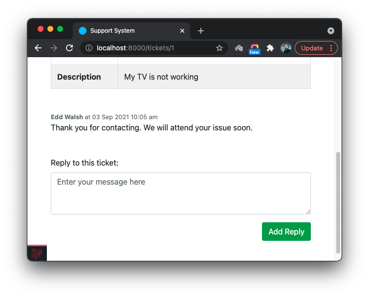
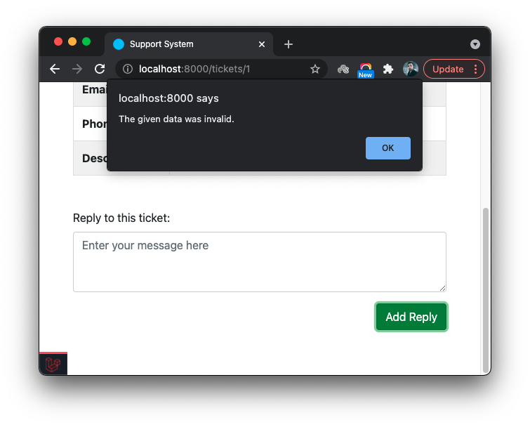
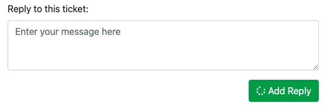

# Building A Support System - Part 4

This is the third part of a series of tutorials guiding to develop an **Online Support System**.
- [Part 1](./building-a-support-system-1.md)
- [Part 2](./building-a-support-system-2.md)
- [Part 3](./building-a-support-system-3.md)

In **Part 4** we focus on integrating some JavaScript to the application to improve the user experience the **support system** we developed in previous guides.

It is assumed that the developer has a basic understanding of the JavaScript, if not, follow this [JavaScript Tutorial](https://www.w3schools.com/js/default.asp).

## AJAX

**AJAX** is a method of updating content on a web page without reloading the entire page. Refer to the [AJAX guide from Mozilla](https://developer.mozilla.org/en-US/docs/Web/Guide/AJAX/Getting_Started) to understand it. Once you are familiar with the concept, please refer to the [jQuery documentation](https://api.jquery.com/jquery.ajax/) to understand how it implements **AJAX** and how to use it.


## Add comments with ajax

It is straightforward to submit the forms using HTML. We used such form when adding a comment to a ticket. However, each time you add a comment, the ticket view is reloaded. It can be annoying at some point, where you are at the bottom of the page and the browser jumps to the top of the page after adding a new comment.  A little JavaScript touch can improve the user experience a lot. Instead of submitting the form using HTML, you can use **AJAX** to submit the form. Let's see how we can do that.

Open the `resources/views/tickets/show.blade.php` and add an `id` to `comments` `<dev>` element.

```html
.
.
.
<div id="comments" class="comments">
    @foreach($ticket->comments as $comment)
    .
    .
    .
    @endforeach
</div>
.
.
.
```

Also, add an `id` to the comment form:

```html
.
.
.
<div class="comment-editor mt-5">
    <form id="comment-form" action="{{ route('comments.store', $ticket->id) }}" method="post">
        .
        .
        .
    </form>
</div>
.
.
.
```

We need to do two things to tranform the commenting function from full page reload to dynamic non page reload method:
1. Submit the form using **AJAX**
2. Update the comments list using **AJAX**

Let's write the code required to submit the form. Add following code to the `tickets/show.blade.php`, right above the `@endsection` directive.

```html
<script type="text/javascript">
    jQuery(document).ready(function($) {
        $('#comment-form').on('submit', function(evt) {
            evt.preventDefault();
            $form = $(this);
            $.ajax({
                url: $form.attr('action'),
                type: 'POST',
                data: $form.serialize(),
                success: function(data) {
                    let commentsHTML = $('<div>').append(data).find('#comments').html();
                    $('#comments').html(commentsHTML);
                    $form.find('[name="content"]').val('');
                },
                error: function(jqXHR) {
                    let data = JSON.parse(jqXHR.responseText);
                    if (data.message) {
                        alert(data.message);
                    } else {
                        alert('Oops! Something went wrong.');
                    }
                }
            });
        })
    });
</script>
```

We use jQuery in the above code. So, we need to add it to our project in order for above code to work. Let's add it to the `resources/views/layouts.blade.php` file, so that it is available for other views too. Add the following `<script>` tag right above the closing `</body>` tab of the `layouts.blade.php` file . It adds **jQuery** to our project using a [CDN](https://en.wikipedia.org/wiki/Content_delivery_network). There are other ways of importing **jQuery** to your project, please read [jQuery documentation](https://jquery.com/download/) for more details.

Let's turn to the code:

- `$('#comment-form')` selects the `<form>` element with the ID `comment-form` in the ticket view. Learn more about [jQuery selectors](https://api.jquery.com/category/selectors/) to understand how to select DOM elements for manipulations.
- `on()` function binds a handler to the `submit` event of the form.
- `evt.preventDefault()` prevents the default behavior of the submit event allowing the rest of the code in the handler function to take care of the submission.
- `$.ajax()` function makes a **HTTPRequest** call to the server using the URL in `action` attribute of the form.
- The `$form.serialize()` serializes and passes the form data to the request.
- The `success` function handles the response of the **AJAX** request. The code inside it picks the HTML code related to the comments and replace the existing HTML in `#comments` container with it.

Add a comment and notice that it quickly creates the comment and make it appear on the list.



The `error` callback function we passed to the `$.ajax()` is taking care of the errors. If it gets an error response from Laravel as a JSON string it parses the string and show the message. If not, it just shows a common message.




## Icons

Icons can be used to make your interface more meaningful and appealing. There are multiple freely availabe icon libraries you can use for yout project. [Font Awesome](https://fontawesome.com/) is one such library with an elegant set of icons that covers many icon needs of a web application.


## Loading indicator

We can add comments without reloading the page now. Hoever, when you click the **Add Reply** button page freezes for a moment, until it sends the **AJAX** request to the server and gets a response. On a slow internet connection this time can be longer.

Let's add a **loading indicator** icon to the button to make the user experience more appealing. We use **Font Awesome** for this. Let's start by adding it to our project. Open the `resources/views/layouts/app.blade.php` and add following line right below the `<link>` tag which we are using to add the **Bootstrap**.

```html
<link rel="stylesheet" href="https://pro.fontawesome.com/releases/v5.10.0/css/all.css" integrity="sha384-AYmEC3Yw5cVb3ZcuHtOA93w35dYTsvhLPVnYs9eStHfGJvOvKxVfELGroGkvsg+p" crossorigin="anonymous"/>
```

This will make the icons are availabe to be included in every view file of the application.

Then, open the `tickets/show.blade.php` and change the form submit button code to following:

```html
<button type="submit" name="button" class="btn btn-success">
    <i class="fa fa-spinner fa-spin"></i>
    Add Reply
</button>
```

Now it looks like this:



We need to show the loading indicator only when the form submit is in progress. Need a little help from JavaScript for that.

First, let's hide the icon:

```html
<button type="submit" name="button" class="btn btn-success">
    <i class="fa fa-spinner fa-spin d-none"></i>
    Add Reply
</button>
```

The `d-none` css class which comes with **Bootstrap** will hide the icon. Add the following code right before calling the `jQuery.ajax()`:

```html
$form.find('button i.fa').removeClass('d-none');
```

Then, add `complete` callback function to the `ajax` configurations. Complete code now looks like:

```html
<script type="text/javascript">
    jQuery(document).ready(function($) {
        $('#comment-form').on('submit', function(evt) {
            evt.preventDefault();
            $form = $(this);
            $form.find('button i.fa').removeClass('d-none');
            $.ajax({
                url: $form.attr('action'),
                type: 'POST',
                data: $form.serialize(),
                success: function(data) {
                    let commentsHTML = $('<div>').append(data).find('#comments').html();
                    $('#comments').html(commentsHTML);
                    $form.find('[name="content"]').val('');
                },
                error: function(jqXHR) {
                    let data = JSON.parse(jqXHR.responseText);
                    if (data.message) {
                        alert(data.message);
                    } else {
                        alert('Oops! Something went wrong.');
                    }
                },
                complete: function() {
                    $form.find('button i.fa').addClass('d-none');
                }
            });
        })
    });
</script>
```

The `complete` callback is executed always regardless of the success or fail status of the request. So, that is a good place to add the code for hiding the load indicator.

Try adding a new comment now. You'll see the loading indicator icon during only the request-response cycle of the AJAX call.
