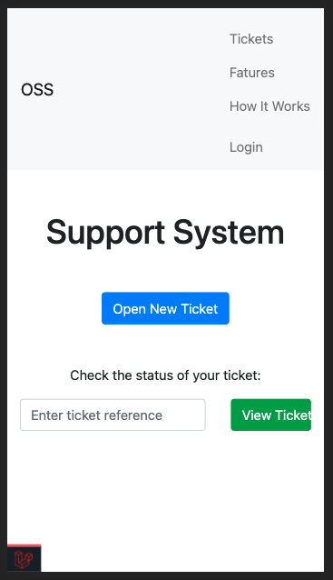
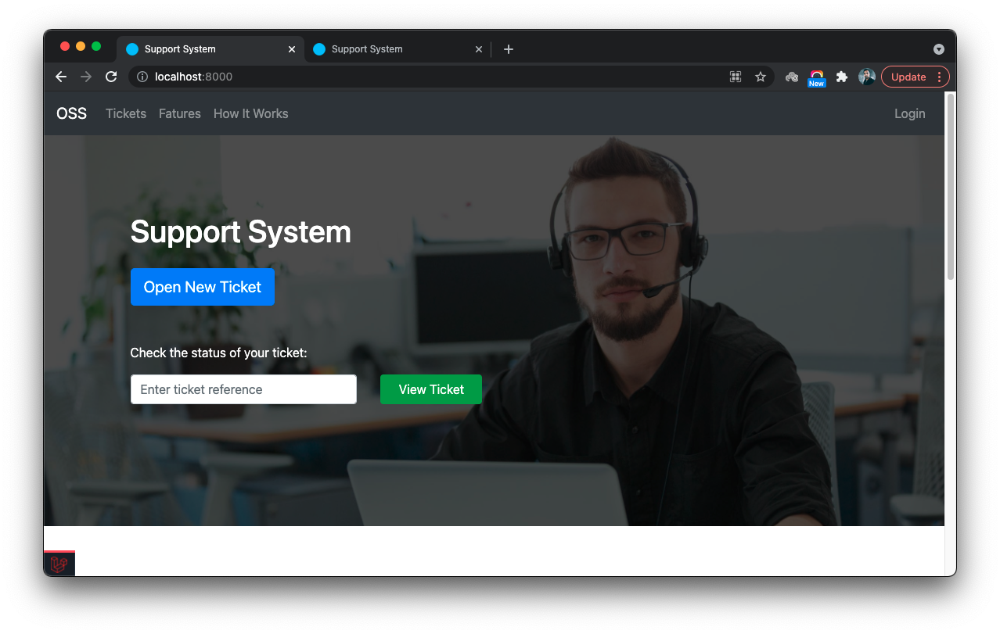
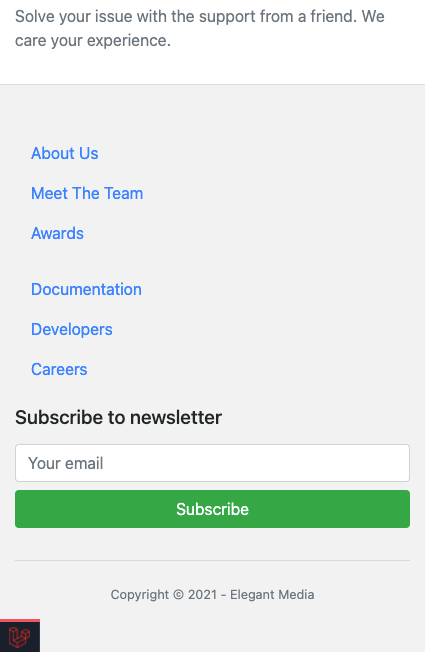

# Building A Support System - Part 5

This is the fifth part of a series of tutorials guiding to develop an **Online Support System**.
- [Part 1](./building-a-support-system-1.md)
- [Part 2](./building-a-support-system-2.md)
- [Part 3](./building-a-support-system-3.md)
- [Part 4](./building-a-support-system-4.md)

In **Part 5** we focus on developing a responsive home page for the **support system**. We will discuss how to use **Bootstrap** to make your web interface look better in all screen sizes.

It is assumed that the developer has a basic understanding of the CSS, if not, follow this [CSS Tutorial](https://www.w3schools.com/css/default.asp).

## Responsive web design

Responsive web design is designing your web application so that server always sends the same HTML content to the web browser and CSS makes sure that they are properly displayed to the user in all screen sizes. The users of your web application can be using devices with different screen sizes. If your web application adjust according to the screen size many users can use it without issues.


## Rethinking the home page

The **Home page** of our **support system** is pretty simple at the moment. We need to add few more components the home page.

- A navigation bar so that users can quickly jump to the other pages
- Improve the UI of top contents
- A list of features
- A footer with links to helpful pages

Let's take a look at the current home page in few screen sizes.

It looks ok in laptop screen, but not much appealing:


And, doesn't look that good in the mobile screen:


Ok, let's see how we can improve the home page.

We are using [Bootstrp 4.x](https://getbootstrap.com/docs/4.6/getting-started/introduction/) for this guide. **Bootstrap** supports designing your website to fit in 5 screen sizes. It utilizes 4 breakpoints using CSS media queries to do this. Lear more about them [here](https://getbootstrap.com/docs/4.1/layout/overview/#responsive-breakpoints).

Since **Bootsrap** provides CSS to cover most of the designing requirements, try to utilize it's CSS classes as much as possible instead of writing cusom CSS.

## Add a navigation bar

Bootstrap provides everything needs for us to add a decent [navigation bar](https://getbootstrap.com/docs/4.1/components/navbar/) to our web application.

Open the `resources/views/layouts.blade.php` and add this code right after the opening `<body>` tag.

```html
<nav class="navbar navbar-expand-lg navbar-light bg-light">
    <a class="navbar-brand" href="#">OSS</a>
    <button class="navbar-toggler" type="button" data-toggle="collapse" data-target="#navbar-toggle-menu" aria-controls="navbar-toggle-menu" aria-expanded="false" aria-label="Toggle navigation">
        <span class="navbar-toggler-icon"></span>
    </button>

    <div class="collapse navbar-collapse" id="navbar-toggle-menu">
        <ul class="navbar-nav mr-auto mt-2 mt-lg-0">
            <li class="nav-item">
                <a class="nav-link" href="{{ route('tickets.index') }}">Tickets</a>
            </li>
            <li class="nav-item">
                <a class="nav-link" href="#features">Fatures</a>
            </li>
            <li class="nav-item">
                <a class="nav-link" href="#how-it-works">How It Works</a>
            </li>
        </ul>
        <ul class="navbar-nav ml-auto mt-2 mt-lg-0">
            <li class="nav-item">
                @if(auth()->check())
                <a class="nav-link" href="{{ route('logout') }}">Logout</a>
                @else
                <a class="nav-link" href="{{ route('login') }}">Login</a>
                @endif
            </li>
        </ul>
    </div>
</nav>
```

There are fe things to notice. The **OSS** stands for **Online Support System**. It is the brand name of our application. There are few links next to it. On the right side of the nav bar we have two links for **Login** and **Logout**. The **Login** link will be visible only when the user is not logged in and the **Logout** link will appear otherwise.


There are multiple links on the navbar, they will look fine in bigger screens. However in small screens they need a better arrangement.



It makes more sense on a small screen to hide the navigation links and toggle them using a button when required. Similar to dropdown menu or pop-up menu. The `<button>` with `navbar-toggler` class will appear only in the small screens and it is used to toggle the menu. This is controlled by the `navbar-expand-lg` class. It makes the toggle button appear only in the screens below the `lg` size.

Play with it by changing the screen size. You can use **Chrome Dev Tools** for this. Learn how to switch between different screen sizes in guide [Simulate mobile devices with Device Mode](https://developer.chrome.com/docs/devtools/device-mode/) on Chrome documentation.

Change the `navbar-expand-lg` class to the `navbar-expand-md` and `navbar-expand-sm` to see the difference.


Hoever, when you tap the toggle button in mobile screen it doesn't do anything yet. In order for it work, the **Bootstrap** needs it's javascript counterpart to be loaded. Let's add it to the `resources/views/layouts/app.blade.php` file, right above the clasong `</body>` tag. Make sure you insert this line after the `<script>` tag that we added in **Part 4** to add **jQuery**. This is because **Bootstrap** uses **JQuery** in it's code.

```html
<script src="https://cdnjs.cloudflare.com/ajax/libs/jquery/3.6.0/jquery.min.js" integrity="sha512-894YE6QWD5I59HgZOGReFYm4dnWc1Qt5NtvYSaNcOP+u1T9qYdvdihz0PPSiiqn/+/3e7Jo4EaG7TubfWGUrMQ==" crossorigin="anonymous" referrerpolicy="no-referrer"></script>
```

Now, if you reload the home page in mobile screen and click the toggle button, it will toggle the navigation menu.

Looks good. That's enough for now. If you wish, you can use the dark version of the navigation bar too. Check the **Bootsrap** documentation to learn the other options you can use to improve the UI/UX of the navigation bar.


## Improve the UI of top content

We can improve the top content of the page a bit to make it look better and responsive. This is where the **Open New Ticket** button and **search form** are. Open the `resources/views/welcome.blade.php` file and move the HTML content in `content` section to a **Bootstrap** container. Learn more about cotainers [here](https://getbootstrap.com/docs/4.1/layout/overview/#containers). Also we will add a background image to this section.

```html
<section>
    <div class="hero-bg">
        <div class="shading">
            <div class="container text-center text-md-left pt-5">
                <h1>Support System</h1>
                <div class="mt-4">
                    <a href="{{ route('tickets.create') }}" class="btn btn-lg btn-primary">Open New Ticket</a>
                </div>
                <div class="mt-5">
                    <p>
                        Check the status of your ticket:
                    </p>
                    <form class="" action="{{ route('tickets.search') }}" method="get">
                        <div class="row">
                            <div class="col-md-6 col-lg-4">
                                <input type="text" name="reference" value="" class="form-control mb-2" placeholder="Enter ticket reference">
                            </div>
                            <div class="col-md-4 col-lg-2">
                                <button type="submit" name="view" class="btn btn-success w-100">View Ticket</button>
                            </div>
                        </div>
                    </form>
                </div>
            </div>
        </div>
    </div>
</section>
```

We have wrapped the entire thing inkside a `<section>` tag. Thre will be more sections added to the home page and this will help us segregate them from each other.

Pay your close attention to each CSS class used in the code inside the `<div>` with CSS class `container`. Check the **Bootstrap** documentation to understand their behaviour in each screen size.

- [Grid system](https://getbootstrap.com/docs/4.1/layout/grid/)
- [Spacing (Margins & Paddings)](https://getbootstrap.com/docs/4.1/utilities/spacing/)
- [Text](https://getbootstrap.com/docs/4.1/utilities/text/#text-alignment)

Out most two `<div>` tags are used for applying a background for the top content. The `hero-bg` and `shading` are custom css classes. We need to write few CSS lines to apply a backgound image and a shading for them. We don't have to add this CSS code to the layout view file as it is only used in the home page. Every view file can have it's own CSS code. Let's add a stack to the main layout file to deal with this situation.

Open the `resources/views/layouts/app.blade.php` view file and add the following code right above the closing `</head>` tag.

```html
@stack('styles')
```

Now, the head will look like:

```html
<head>
    <meta charset="utf-8">
    <meta name="viewport" content="width=device-width, initial-scale=1">
    <title>{{ config('app.name') }}</title>
    <link rel="stylesheet" href="https://maxcdn.bootstrapcdn.com/bootstrap/4.0.0/css/bootstrap.min.css" integrity="sha384-Gn5384xqQ1aoWXA+058RXPxPg6fy4IWvTNh0E263XmFcJlSAwiGgFAW/dAiS6JXm" crossorigin="anonymous">
    <link rel="stylesheet" href="https://pro.fontawesome.com/releases/v5.10.0/css/all.css" integrity="sha384-AYmEC3Yw5cVb3ZcuHtOA93w35dYTsvhLPVnYs9eStHfGJvOvKxVfELGroGkvsg+p" crossorigin="anonymous"/>

    @stack('styles')
</head>
```

We can pass view spcific CSS code from the view file and they will be stacked here when the view is rendered. You can push CSS (or any other HTML) from multiple view files to the same stack.

Let's push our CSS code for the home page. Add following content after the `@endsection` blade directive.

```html
@push('styles')
<style media="screen">
    .hero-bg {
        background-image: url({{ asset('images/hero-bg.jpg') }});
        background-size: cover;
        background-repeat: no-repeat;
        background-attachment: scroll;
        background-position: top right;
        color: white;
    }

    .hero-bg .shading {
        background-color: #000000aa;
        padding: 50px 0;
        min-height: 500px;
    }
</style>
@endpush
```

Now check the page in multiple screen sizes.

Laptop:



Tab:


Mobile:


Looks fine on all screen sizes. Great!!


## The features list

Let's add a features list to the home page, so that the visitors get an idea of what they can expect from the **Online Support System**. Open the `resources/views/welcome.blade.php` view file and add the following code right below the `<section>` tag of the top content.

```html
<section id="features">
    <div class="features-bg mt-5">
        <div class="container">
            <div class="row">
                <div class="col-md-4 mb-3">
                    <h3>Fast Response</h3>
                    <p class="text-muted">Our dedicated support team is available 24/7 to help you with technical issues.</p>
                </div>
                <div class="col-md-4 mb-3">
                    <h3>No Login Required</h3>
                    <p class="text-muted">Get help with a single click. Track your support ticklet with a tracking code.</p>
                </div>
                <div class="col-md-4 mb-3">
                    <h3>Friendly Service</h3>
                    <p class="text-muted">Solve your issue with the support from a friend. We care your experience.</p>
                </div>
            </div>
        </div>
    </div>
</section>
```

Again, we don't need any CSS for the layout. We have made the content fully responsive only with **Bootstrap**. Hoever, I changed the `font-size` of the `<h3>` headers. Since it's a good practice to reuse the same styles throughout the entire site, I decided to add CSS related to this to the `resources/css/app.css`. The Laravel **asset management** makes this CSS file public by copying it to the `public/css/app.css` file. Read more about [Laravel Asset Management](https://laravel.com/docs/8.x/mix) in the official documentation.

Let's add the `public/css/app.css` file to the main layout file. Open the `resources/views/layouts/app.blade.php` file and add this code right above the `@stack('styles')` line we added in previous section:

```html
<link rel="stylesheet" href="{{ asset('css/app.css') }}">
```

And, add following CSS to the `resources/css/app.css` file:

```css
h3 {
  font-size: 1.2rem;
}
```

You can use more styles to decoreate the content as you may prefer. The most important thing to notice here is that you don't need any custom CSS to make your page responsive. Try to use the minimum possible amount of custom CSS for layout. Use **Bootstap** as much as possible. This will keep you out of trouble that comes with poorly written CSS code.

Laptop:


Tab:


Mobile:


## Add a footer

Footer usually contains the useful links, contact form, copyright information, etc. Also, it is shared between all pages of the website.

**Exercise**: Please try to write the code to add a footer to the support system application. Use the following screen as a guide. Footer content should be fully responsive.

**Sample Screens**

Laptop:


Tab:


Mobile:




## Done

The completed home page:


